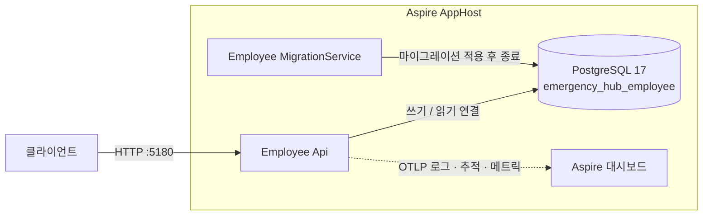
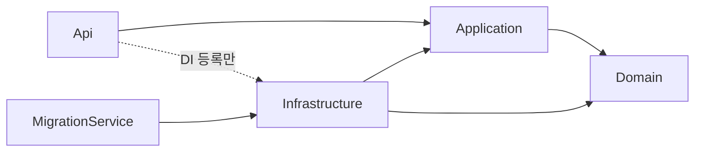

# Emergency Hub

재난이나 사고 같은 긴급 상황이 생겼을 때 직원에게 빠르게 알리고, 직원의 응답(안부)을 모아 집계하기 위한 **직원 긴급연락망 백엔드**입니다.

서비스 단위로 나눈 .NET 8 마이크로서비스 구조이고, 현재 릴리스 **`v0.2.0`** 은 연락망의 기준 데이터를 다루는 **Employee 서비스**(직원 연락처 일괄 등록 · 조회)를 제공합니다.

| 항목 | 내용 |
|---|---|
| 런타임 | .NET 8 / C# 12 |
| 구조 | MSA, 서비스마다 Clean Architecture + DDD + CQRS |
| 데이터베이스 | PostgreSQL 17 (EF Core 8 + Npgsql), 서비스별 Database |
| 로컬 실행 | .NET Aspire 9.5 AppHost (명령 하나로 DB · 마이그레이션 · API 기동) |
| 관측성 | Serilog + OpenTelemetry (OTLP, Aspire 대시보드) |
| CI | GitHub Actions (빌드 · 포맷 검사 · 단위 / 통합 테스트 · 커버리지) |

## 목차

- [주요 기능](#주요-기능)
- [아키텍처](#아키텍처)
- [기술 스택](#기술-스택)
- [시작하기](#시작하기)
- [API](#api)
- [테스트](#테스트)
- [저장소 구조](#저장소-구조)
- [개발 방식](#개발-방식)
- [로드맵](#로드맵)
- [문서](#문서)

## 주요 기능

현재 제공하는 기능입니다(`v0.2.0`).

- **직원 일괄 등록**: CSV(헤더 없음)나 JSON으로 최대 1,000명을 한 요청에 등록합니다. 파일 업로드(multipart), 폼 필드, 요청 본문(raw) 중 어느 방식으로 보내도 됩니다. 한 행이라도 잘못되면 전체를 저장하지 않고, 실패한 행 번호와 필드별 오류 코드를 모두 돌려줍니다.
- **직원 목록 조회**: 입사일 순으로 정렬해 페이지 단위로 조회합니다.
- **이름으로 직원 조회**: 이름이 같은 직원이 여럿이면 입사일이 가장 빠른 한 명을 돌려줍니다.
- **입력 검증**: 이름 · 이메일 · 전화번호 · 입사일 규칙은 도메인 Value Object가 판정합니다. 이메일은 대소문자를 구분하지 않고 중복을 막습니다.
- **개인정보 보호**: 로그, 오류 응답, 추적 데이터에 이름 · 이메일 · 전화번호 값을 남기지 않습니다(행 번호와 정수 코드로만 식별).

연락망 구성, 긴급 상황 전파, 알림 발송, 응답 집계, 인증 · 권한은 다음 단계에서 서비스로 추가합니다([로드맵](#로드맵)).

## 아키텍처

### 실행 구성

로컬에서는 Aspire AppHost가 모든 리소스를 띄우고 시작 순서를 맞춥니다.



- 시작 순서: `postgres` → `employee-db` → `employee-migrations`(마이그레이션 적용 후 종료) → `employee-api`(`/health/ready` 정상).
- DB 비밀번호는 AppHost가 처음 실행할 때 만들어 user-secrets에 저장합니다. 미리 설정할 값은 없습니다.

### 서비스 내부 구조

각 서비스는 Domain · Application · Infrastructure · Api 네 레이어로 나누고, 의존은 안쪽(Domain)으로만 향합니다. 이 규칙은 아키텍처 테스트가 빌드마다 검사합니다.



요청 하나는 아래 순서로 처리됩니다.

```text
Controller → ISender → 로깅 → 검증(FluentValidation) → 트랜잭션(Command만) → Handler → Repository
```

- **Mediator 직접 구현**: 데코레이터 파이프라인으로 로깅, 검증, 트랜잭션을 Handler 밖에서 처리합니다.
- **CQRS**: Command와 Query는 연결 문자열과 DbContext를 따로 씁니다(지금은 같은 DB). Query는 읽기 전용 프로젝션을 씁니다.
- **실패 처리**: 예상 가능한 실패는 예외 대신 `Result`로 돌려주고, HTTP에서는 `application/problem+json`(ProblemDetails)과 정수 오류 코드로 응답합니다.
- **정수 코드**: 상태값, 오류 코드, API 응답의 코드값은 모두 정수입니다. 문자열 코드는 쓰지 않습니다.
- **기본 키**: UUID v7을 애플리케이션에서 생성합니다.
- **공통 기반(BuildingBlocks)**: Domain · Application · Infrastructure · Api 공통 코드를 서비스와 공유합니다. 서비스끼리는 서로 참조하지 않습니다.

설계 결정과 그 이유는 [아키텍처 결정 기록(ADR)](wiki/03-architecture/adr/README.md)에 모두 남아 있습니다.

## 기술 스택

| 영역 | 사용 기술 |
|---|---|
| 웹 API | ASP.NET Core Controller, Swashbuckle(OpenAPI, Development 환경만) |
| 애플리케이션 | 직접 구현한 Mediator 파이프라인, FluentValidation, Scrutor(규칙 기반 DI 자동 등록) |
| 데이터 | PostgreSQL 17, EF Core 8 + Npgsql, EFCore.NamingConventions(snake_case), UUIDNext(UUID v7) |
| 로컬 인프라 | .NET Aspire 9.5.2 AppHost · ServiceDefaults |
| 로깅 · 관측성 | Serilog(콘솔 텍스트 · 파일 JSON · OTLP), OpenTelemetry(추적 · 메트릭) |
| 테스트 | xUnit v3, AwesomeAssertions, NSubstitute, Testcontainers(PostgreSQL), Respawn, NetArchTest, coverlet + ReportGenerator |
| CI | GitHub Actions |

패키지 버전과 라이선스는 [패키지 버전 · 라이선스](wiki/03-architecture/package-versions.md)에 있습니다. 상용 라이선스 패키지는 쓰지 않습니다.

## 시작하기

### 사전 준비

| 도구 | 조건 |
|---|---|
| .NET SDK | 8.0.400 이상 8.0.x (`global.json`) |
| Docker | Docker Desktop 실행 중. Engine API 1.44 이상 권장 |
| Git | Windows에서는 짧은 경로에 clone합니다(예: `C:\eh`). 깊은 경로에서는 MAX_PATH 때문에 빌드가 실패할 수 있습니다 |

자세한 설치 방법은 [사전 준비 사항](wiki/01-getting-started/prerequisites.md)을 봅니다.

### 실행

```bash
git clone https://github.com/thkim-ezabele/task_20260926.git emergency-hub
cd emergency-hub
dotnet tool restore
dotnet run --project src/Aspire/EmergencyHub.AppHost --launch-profile http
```

- 첫 실행은 `postgres:17` 이미지를 내려받느라 오래 걸릴 수 있습니다.
- 콘솔에 나오는 로그인 URL(`http://localhost:15180/login?t=<토큰>`)로 Aspire 대시보드를 엽니다. `employee-migrations`가 Finished(종료 코드 0)이고 `employee-api`가 Healthy이면 준비된 것입니다.
- Employee Api 주소는 `http://localhost:5180`, Swagger UI는 `http://localhost:5180/swagger`입니다.
- 개발 인증서를 신뢰했다면 `--launch-profile http` 없이 기본(https) 프로필로 실행해도 됩니다. 신뢰하지 않은 상태로 https 프로필을 쓰면 대시보드에 로그 · 추적이 보이지 않습니다.
- 중지는 실행한 콘솔에서 `Ctrl+C`입니다. 데이터는 Docker 볼륨 `emergency-hub-postgres-data`에 남습니다.

단계별 설명과 초기화 방법은 [로컬 개발 환경 구성](wiki/01-getting-started/local-setup.md), 문제가 생기면 [트러블슈팅](wiki/01-getting-started/troubleshooting.md)을 봅니다.

## API

| 메서드 | 경로 | 설명 | 성공 |
|---|---|---|---|
| `POST` | `/api/employee` | CSV / JSON 일괄 등록(최대 1,000행, 1 MiB) | `201` `{ "count", "ids" }` |
| `GET` | `/api/employee?page={page}&pageSize={pageSize}` | 목록 조회(입사일 순, 기본 20건, 최대 100건) | `200` `{ items, totalCount, page, pageSize }` |
| `GET` | `/api/employee/{name}` | 이름 조회(동명이인이면 입사일이 빠른 1명) | `200` 직원 |
| `GET` | `/health/live` · `/health/ready` | 프로세스 · DB 연결 상태 | `200` `Healthy` |

직원 필드는 `name` · `email` · `tel` · `joined`(`yyyy-MM-dd`)이고, CSV 열 순서도 같습니다. 인증은 아직 없습니다.

```bash
# CSV 본문으로 등록 → 201
curl -i -X POST http://localhost:5180/api/employee \
  -H 'Content-Type: text/csv' \
  --data-binary $'김철수,chulsoo.kim@example.com,010-1234-5678,2020-03-02\n이영희,younghee.lee@example.com,010-2345-6789,2021-07-15'

# CSV 파일 업로드로 등록 → 201
curl -i -X POST http://localhost:5180/api/employee -F "file=@employees.csv"

# JSON으로 등록 → 201
curl -i -X POST http://localhost:5180/api/employee \
  -H 'Content-Type: application/json' \
  --data-binary '[{"name":"박민준","email":"minjun.park@example.com","tel":"010-3456-7890","joined":"2019-11-04"}]'

# 목록 조회 → 200
curl -i 'http://localhost:5180/api/employee?page=1&pageSize=10'

# 이름 조회(퍼센트 인코딩한 "김철수") → 200
curl -i http://localhost:5180/api/employee/%EA%B9%80%EC%B2%A0%EC%88%98
```

실패하면 ProblemDetails에 정수 `code`와 경로별 `errors`가 담깁니다. 예를 들어 2행의 이메일 형식이 틀리면 `400`, `code` 1001, `errors["rows[2].email"]` 21004입니다. 이미 등록된 이메일은 `409`, 크기 초과는 `413`, 지원하지 않는 Content-Type은 `415`입니다.

- 전체 명세(입력 방식, 형식 판별, CSV · JSON 규칙, 오류 경로, curl 예시): [직원 API](wiki/05-api/employee-api.md)
- 오류 코드 전체: [에러 코드](wiki/05-api/error-codes.md)
- 공통 응답 규칙: [API 설계 가이드](wiki/04-development/api-guidelines.md)

> Windows Git Bash에 들어 있는 `curl`은 명령줄의 한글을 CP949로 보내므로, 한글을 인라인으로 보내는 예시는 `C:\Windows\System32\curl.exe`를 쓰거나 UTF-8 파일로 보냅니다([직원 API · curl 예시](wiki/05-api/employee-api.md#curl-예시)).

## 테스트

```bash
dotnet test EmergencyHub.sln
```

| 종류 | 대상 | 방식 |
|---|---|---|
| 단위 테스트 | Domain · Application · Api · Infrastructure, BuildingBlocks, Aspire 구성 | xUnit v3 + NSubstitute, TDD로 먼저 작성 |
| 통합 테스트 | Employee API 전 구간(HTTP → DB), 성능 · 개인정보 · 요청 한도 | Testcontainers로 실제 PostgreSQL, Respawn으로 테스트마다 초기화 |
| 아키텍처 테스트 | 레이어 의존 규칙, 프로젝트 · 패키지 참조, 명명 · 주입 규칙 | NetArchTest |

- 통합 테스트에는 Docker가 필요합니다. Docker Engine API가 1.43 이하라면 [트러블슈팅](wiki/01-getting-started/troubleshooting.md)을 봅니다.
- `v0.2.0` 기준: 테스트 2,544건 통과(건너뜀 1), 커버리지(BuildingBlocks 4개 + Employee Domain · Application) 라인 99.3% · 분기 96.8%.
- 성능(통합 테스트, CI 측정): 1,000행 CSV 등록 281ms, 직원 10,000명에서 목록 · 이름 조회 각 10ms 이내.

CI와 같은 순서(빌드 → 포맷 검사 → 테스트 + 커버리지 → 보고서)로 로컬에서 실행하는 방법은 [테스트 전략 · CI](wiki/04-development/testing-strategy.md#ci)에 있습니다.

## 저장소 구조

```text
.
├── src
│   ├── Aspire
│   │   ├── EmergencyHub.AppHost            # 로컬 오케스트레이션 (PostgreSQL, 마이그레이션, API)
│   │   └── EmergencyHub.ServiceDefaults    # 공통 관측성 · 헬스체크 · 회복성 설정
│   ├── BuildingBlocks                      # 서비스 공통 코드
│   │   ├── EmergencyHub.BuildingBlocks.Domain
│   │   ├── EmergencyHub.BuildingBlocks.Application
│   │   ├── EmergencyHub.BuildingBlocks.Infrastructure
│   │   └── EmergencyHub.BuildingBlocks.Api
│   └── Services
│       └── Employee
│           ├── EmergencyHub.Employee.Domain
│           ├── EmergencyHub.Employee.Application
│           ├── EmergencyHub.Employee.Infrastructure
│           ├── EmergencyHub.Employee.Api
│           └── EmergencyHub.Employee.MigrationService
├── tests                                   # src와 같은 구조의 단위 테스트, 통합 테스트, 아키텍처 테스트
├── wiki                                    # 설계 · 개발 · 운영 문서 (Obsidian vault)
├── scripts                                 # 문서 점검 스크립트
├── .github/workflows/ci.yml                # CI
├── Directory.Build.props                   # 공통 빌드 설정 (경고 = 오류, 분석기)
├── Directory.Packages.props                # 패키지 버전 중앙 관리
└── global.json                             # .NET SDK 버전
```

## 개발 방식

- **브랜치**: Git Flow. `main`은 릴리스(태그 `vX.Y.Z`), `develop`은 통합 브랜치입니다. 작업은 `feature/*` 브랜치에서 하고 PR을 Merge commit으로 병합합니다([Git 워크플로우](wiki/04-development/git-workflow.md)).
- **커밋**: Conventional Commits(`feat(employee): ...`, `docs(api): ...`).
- **품질 기준**: 경고는 모두 오류로 처리하고, `dotnet format` 검사와 모든 테스트를 통과해야 병합합니다. 도메인 · 애플리케이션 로직은 테스트를 먼저 씁니다([TDD 가이드](wiki/04-development/tdd-guide.md)).
- **작업 단위**: 요구사항 문서(PRD) 하나를 스프린트 여러 개로 나눠 진행하고, 끝나면 회고와 함께 릴리스를 하나 냅니다([개발 관리](wiki/10-delivery/README.md)).
- **결정 기록**: 기술 선택과 설계 결정은 ADR로 남깁니다. 한 번 승인한 ADR은 고치지 않고 새 ADR로 대체합니다.

| 릴리스 | 내용 |
|---|---|
| `v0.1.0` | 공통 기반: 솔루션 구조, BuildingBlocks, Aspire 로컬 인프라, 마이그레이션 서비스, 테스트 체계, CI |
| `v0.2.0` | Employee 서비스: 연락처 모델, CSV / JSON 일괄 등록, 목록 · 이름 조회 |

## 로드맵

| 단계 | 내용 | 상태 |
|---|---|---|
| 기반 구축 | 솔루션 구조, 공통 기반, 로컬 인프라, CI | 완료(`v0.1.0`) |
| 직원 연락처 | Employee 서비스 일괄 등록 · 조회 | 완료(`v0.2.0`) |
| 인증 · 조직 관리 | 사용자 인증, 역할 · 권한, 직원 · 부서 관리 | 예정 |
| 연락망 구성 | 연락망 그룹, 전파 순서(Call Tree) | 예정 |
| 긴급 상황 전파 · 알림 | 긴급 상황 등록, 대상자 전파, SMS / 푸시 / 이메일 발송, 서비스 간 통합 이벤트 | 예정 |
| 응답 수집 · 집계 | 직원 안부 응답 수집과 현황 집계 | 예정 |
| 배포 · 운영 | 컨테이너 이미지, 환경별 설정, 로그 · 추적 수집, CD | 예정 |

예정 단계의 범위와 순서는 확정되지 않았습니다. 자세한 내용은 [로드맵](wiki/00-overview/roadmap.md)에 있습니다.

## 문서

모든 설계 · 개발 · 운영 문서는 [`wiki/`](wiki/README.md)에 한국어로 있습니다.

| 문서 | 내용 |
|---|---|
| [프로젝트 개요](wiki/00-overview/project-overview.md) | 목적, 범위, 주요 기능 |
| [로컬 개발 환경 구성](wiki/01-getting-started/local-setup.md) | 실행 · 초기화 · 동작 확인 |
| [Clean Architecture & 솔루션 구조](wiki/03-architecture/clean-architecture.md) | 레이어, 의존성 규칙, CQRS |
| [아키텍처 결정 기록](wiki/03-architecture/adr/README.md) | 기술 선택과 설계 결정 |
| [기술 스택](wiki/03-architecture/tech-stack.md) | 확정 · 보류 항목 |
| [코딩 컨벤션](wiki/04-development/coding-conventions.md) | 명명, 레이어별 규칙 |
| [데이터베이스](wiki/04-development/database.md) | 스키마, 마이그레이션, 명명 규칙 |
| [테스트 전략](wiki/04-development/testing-strategy.md) | 테스트 종류, 커버리지, CI |
| [로깅 & 관측성](wiki/04-development/logging-observability.md) | 로그 형식, 추적, 헬스체크 |
| [직원 API](wiki/05-api/employee-api.md) · [에러 코드](wiki/05-api/error-codes.md) | API 명세 |
