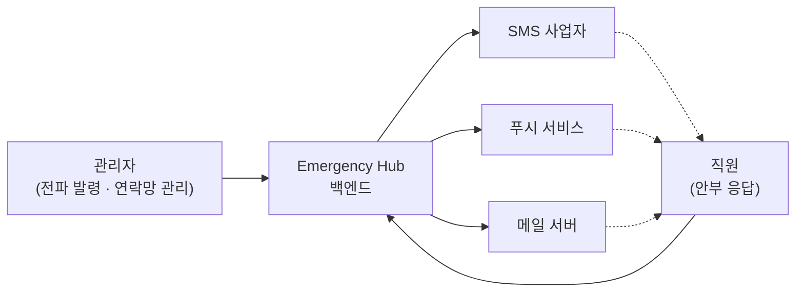
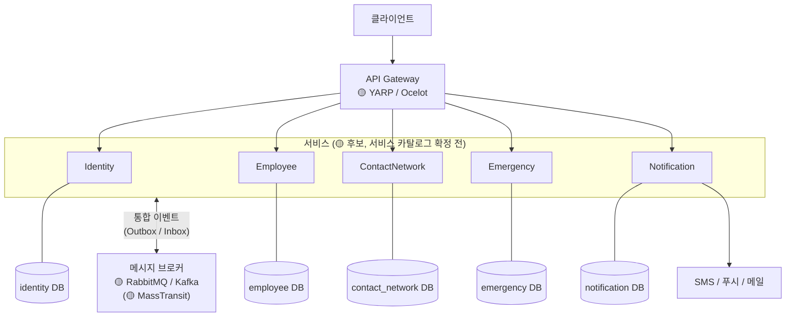
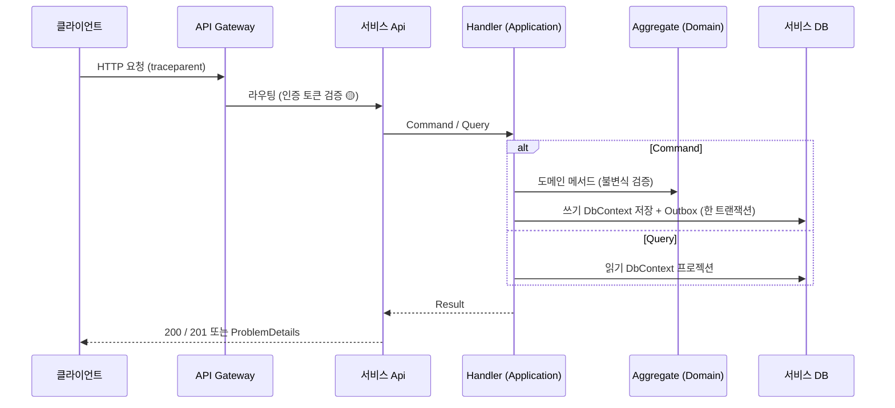
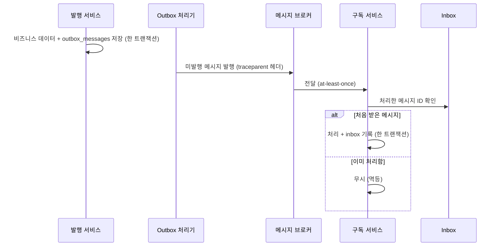

# 아키텍처 개요

> 시스템 전체 구성과 컴포넌트 간 관계를 설명합니다. 세부 규칙은 아래 링크한 아키텍처 문서와 ADR을 따릅니다.
>
> [위키 홈](../README.md)

## 시스템 구성도 (Mermaid)

### 시스템 컨텍스트

- 프론트엔드는 범위 밖입니다(확정 전). 클라이언트는 API Gateway의 HTTP API만 사용합니다.
- 외부 발송 사업자는 🟡 미정입니다.

### 컨테이너 구성

| 구성 요소 | 역할 | 상태 |
|---|---|---|
| API Gateway | 외부 진입점, 라우팅, 인증 토큰 검증, 요청 제한 | 🟡 YARP / Ocelot |
| Identity | 인증 / 권한 (권한은 비트 마스킹, [ADR-0008](adr/0008-integer-codes-and-bitmask.md)) | 🟡 검토 중 |
| Employee | 직원 / 조직 관리 | 🟡 검토 중 |
| ContactNetwork | 연락망 구성(전파 순서, Call Tree) | 🟡 검토 중 |
| Emergency | 긴급 상황 발령, 응답(안부) 수집 · 집계 | 🟡 검토 중 |
| Notification | 채널별 알림 발송(SMS / 푸시 / 이메일) | 🟡 검토 중 |
| 메시지 브로커 | 서비스 간 통합 이벤트 전달 | 🟡 RabbitMQ / Kafka |
| PostgreSQL | 서비스별 Database (Database per Service) | 🟢 [ADR-0005](adr/0005-use-postgresql.md) |

서비스 목록과 책임은 [서비스 카탈로그](service-catalog.md)가 원본입니다.

## 아키텍처 원칙 (MSA / Clean Architecture / DDD / EDA)

| 원칙 | 내용 | 근거 |
|---|---|---|
| 바운디드 컨텍스트 단위 서비스 | 서비스는 독립 배포 · 독립 DB. 다른 서비스 DB에 접근하지 않는다 | [ADR-0002](adr/0002-adopt-msa.md) |
| 안쪽으로만 향하는 의존 | Domain은 프레임워크 비의존, 레이어 규칙은 아키텍처 테스트로 검증 | [ADR-0003](adr/0003-clean-architecture-and-ddd.md), [Clean Architecture](clean-architecture.md) |
| 상태 전파는 비동기 이벤트 | 서비스 간 상태 변화는 통합 이벤트로 알린다. Outbox로 발행을 보장하고 Inbox로 멱등 처리 | [ADR-0004](adr/0004-adopt-event-driven-architecture.md), [EDA](event-driven-architecture.md) |
| 명령과 조회 분리 | Command는 Aggregate를 거치고, Query는 Read Repository 프로젝션 | [ADR-0007](adr/0007-adopt-cqrs.md) |
| 읽기 / 쓰기 연결 분리 | 연결 문자열 · DbContext를 나눈다(현재 같은 DB) | [ADR-0009](adr/0009-separate-read-write-db-context.md) |
| 정수 코드 | 코드값은 DB · API · 이벤트 모두 정수, 조합은 비트 마스킹 | [ADR-0008](adr/0008-integer-codes-and-bitmask.md) |
| 규칙 기반 DI | 마커 인터페이스 + 어셈블리 검색, Scoped | [ADR-0010](adr/0010-convention-based-di-registration.md) |
| 테스트 먼저 | 도메인 / 애플리케이션은 TDD | [ADR-0006](adr/0006-adopt-tdd.md) |

## 요청 처리 흐름

- 예상 가능한 실패는 `Result`로 반환하고 Api가 RFC 9457 `ProblemDetails`로 바꿉니다. 세부 규칙은 [API 설계 가이드](../04-development/api-guidelines.md)를 따릅니다.
- 서비스 간 동기 호출은 최소화합니다([서비스 간 통신](service-communication.md)).

## 이벤트 처리 흐름

상세 규칙(봉투 필드, 버저닝, 재시도, DLQ)은 [이벤트 기반 아키텍처](event-driven-architecture.md)에 있습니다.

## 외부 시스템 연동 (SMS / 푸시 / 이메일)

- 외부 발송은 **Notification 서비스만** 담당합니다. 다른 서비스는 발송 요청을 통합 이벤트로 보냅니다.
- 채널은 비트 플래그(`NotificationChannels`: SMS / Push / Email)로 표현합니다.
- 외부 사업자 호출은 Infrastructure의 어댑터(`IService` 상속 포트 구현)로 감싸고, 타임아웃 · 재시도 · 회로 차단을 적용합니다(🟡 Polly).
- 발송 결과는 정수 결과 코드로 기록하고, 메시지 본문과 수신자 연락처는 로그에 남기지 않습니다([로깅 & 관측성](../04-development/logging-observability.md)).
- 🟡 사업자 선정, 발송 실패 시 채널 대체(예: 푸시 실패 → SMS) 정책은 해당 PRD에서 정합니다.

## 비기능 요구사항 (가용성 / 성능 / 확장성)

| 품질 속성 | 목표 / 방향 | 수단 |
|---|---|---|
| **긴급 전파 속도** | 발령부터 발송 요청까지 지연 최소화 (🟡 수치는 PRD에서 확정) | 비동기 이벤트, Notification 서비스 수평 확장, 채널별 병렬 발송 |
| **가용성** | 한 서비스 장애가 전파 전체를 멈추지 않음 | 서비스 격리, Outbox로 발행 보장, 재시도 · DLQ, 헬스체크(`/health/live`, `/health/ready`) |
| **개인정보** | 직원 연락처 보호 | 로그 개인정보 금지 · 마스킹, 서비스별 DB 계정 분리, 🟡 [보안 & 개인정보](../07-operations/security.md) |
| **추적성 / 증빙** | 요청 · 이벤트 · 로그를 하나로 추적, 개발 과정 증빙 | W3C `traceparent` 전파, 구조화 로그(JSON), ADR · worklog · 스프린트 기록 |
| **확장성** | 조회 부하 증가 시 확장 | CQRS + 읽기 / 쓰기 연결 분리(복제본 도입 대비), 무상태 서비스 |

## 관련 문서

- 아키텍처: [서비스 카탈로그](service-catalog.md) · [Clean Architecture & 솔루션 구조](clean-architecture.md) · [이벤트 기반 아키텍처](event-driven-architecture.md) · [서비스 간 통신](service-communication.md) · [기술 스택](tech-stack.md)
- ADR: [0001](adr/0001-use-dotnet8.md) · [0002](adr/0002-adopt-msa.md) · [0003](adr/0003-clean-architecture-and-ddd.md) · [0004](adr/0004-adopt-event-driven-architecture.md) · [0005](adr/0005-use-postgresql.md) · [0006](adr/0006-adopt-tdd.md) · [0007](adr/0007-adopt-cqrs.md) · [0008](adr/0008-integer-codes-and-bitmask.md) · [0009](adr/0009-separate-read-write-db-context.md) · [0010](adr/0010-convention-based-di-registration.md)

---

## 변경 이력

| 날짜 | 작성자 | 내용 |
|---|---|---|
| 2026-09-27 | - | 문서 생성 |
| 2026-09-27 | - | 초안 작성: 시스템 컨텍스트 · 컨테이너 구성도, 아키텍처 원칙, 요청 · 이벤트 처리 흐름, 외부 연동, 품질 속성 |
