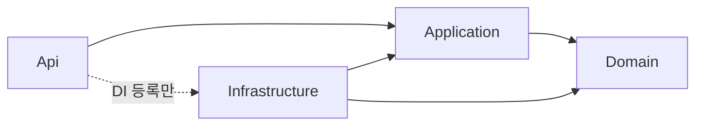

# Clean Architecture & 솔루션 구조

> 서비스 내부 레이어 구조, 의존성 규칙, .NET 솔루션 / 프로젝트 구성을 정의합니다. 실제 솔루션은 기반 구축 토픽에서 이 구조대로 만듭니다.
> 결정 근거: [ADR-0003 Clean Architecture + DDD](adr/0003-clean-architecture-and-ddd.md), [ADR-0002 MSA](adr/0002-adopt-msa.md)
>
> [위키 홈](../README.md)

## 레이어 구성 (Domain / Application / Infrastructure / Api)

| 레이어 | 책임 | 담는 것 | 참조 가능 |
|---|---|---|---|
| **Domain** | 업무 규칙 | Aggregate, Entity, Value Object, 강타입 ID, 코드 enum, 도메인 이벤트, Repository 인터페이스, 도메인 오류 | BuildingBlocks.Domain |
| **Application** | 유스케이스 | Command / Query / Handler / Validator, 응답 DTO, 포트 인터페이스(외부 연동), 통합 이벤트 정의 | Domain, BuildingBlocks.Application |
| **Infrastructure** | 기술 구현 | EF Core DbContext · 매핑 · 마이그레이션, Repository 구현, Query 구현, Outbox, 메시징, 외부 연동 어댑터 | Application, Domain, BuildingBlocks.Infrastructure |
| **Api** | 진입점 | 엔드포인트, 요청 → Command / Query 변환, `Result` → HTTP 응답, DI 구성, 미들웨어 | Application, Infrastructure (DI 등록용) |

## 의존성 규칙



- 의존은 **안쪽(Domain)으로만** 향한다. Domain은 아무것도 참조하지 않는다(BuildingBlocks.Domain 제외).
- Domain은 EF Core, ASP.NET Core, 직렬화 라이브러리 등 **프레임워크에 의존하지 않는다**.
- Application은 Infrastructure를 모른다. DB · 외부 시스템은 Application(또는 Domain)에 정의한 인터페이스로만 사용한다.
- Api는 Infrastructure를 DI 등록에만 쓰고, 엔드포인트에서 직접 쓰지 않는다.
- 서비스와 Repository는 마커 인터페이스 / 기반 클래스를 상속하고, 초기화 코드는 **어셈블리 검색으로 자동 등록(Scoped)**한다. 구현 타입을 하나씩 등록하지 않는다([코딩 컨벤션 · DI 규칙](../04-development/coding-conventions.md#의존성-주입-di-규칙)).
- **서비스끼리는 프로젝트를 참조하지 않는다.** 공유는 BuildingBlocks만 허용하며, 서비스 간 데이터 교환은 API / 통합 이벤트로 한다.
- 이 규칙은 [아키텍처 테스트](../04-development/testing-strategy.md#아키텍처-테스트)로 빌드마다 검증한다.

## CQRS 적용

**적용한다.** 읽기 전용 DB(복제본)는 두지 않지만, **연결 문자열과 DbContext는 읽기 / 쓰기로 나눠** 두고 지금은 둘 다 같은 Database를 가리킵니다([데이터베이스 · 읽기 / 쓰기 연결 분리](../04-development/database.md#읽기--쓰기-연결-분리)).

| 흐름 | 경로 |
|---|---|
| Command | Api(Controller) → Command → (로깅 → 검증 → 트랜잭션 파이프라인) → Handler → Write Repository(쓰기 DbContext) → **Aggregate(도메인 규칙)** → 트랜잭션 데코레이터가 Unit of Work 커밋([ADR-0014](adr/0014-command-transaction-boundary-and-unit-of-work.md)) → Outbox(도입 보류, [ADR-0023](adr/0023-deferred-adoptions.md)) |
| Query | Api → Query → Handler → **Read Repository(읽기 DbContext) 프로젝션** → 응답 `record` (도메인 모델을 거치지 않음) |

- Query Handler는 Application에 두고, 조회는 Application에 정의한 **Read Repository 인터페이스**(`IEmployeeReadRepository`)로 한다. 구현은 Infrastructure에 둔다.
- Write Repository 인터페이스는 Domain, Read Repository 인터페이스는 Application에 둔다.
- 코드 규칙은 [코딩 컨벤션 · CQRS 규칙](../04-development/coding-conventions.md#cqrs-규칙)을 따른다.

## 저장소 디렉터리 구조

```
emergency-hub/
├── EmergencyHub.sln
├── global.json                  # SDK 버전 고정 (8.0.x)
├── Directory.Build.props        # 공통 빌드 설정
├── Directory.Packages.props     # 중앙 패키지 버전 관리
├── .editorconfig
├── src/
│   ├── BuildingBlocks/
│   │   ├── EmergencyHub.BuildingBlocks.Domain/
│   │   ├── EmergencyHub.BuildingBlocks.Application/
│   │   └── EmergencyHub.BuildingBlocks.Infrastructure/
│   ├── Aspire/
│   │   └── EmergencyHub.ServiceDefaults/   # 헬스체크 · OTel · Serilog · 서비스 디스커버리 · 복원력 (S03-T03)
│   ├── Services/
│   │   └── <Service>/           # Employee, Identity, ContactNetwork, Emergency, Notification
│   │       ├── EmergencyHub.<Service>.Domain/
│   │       ├── EmergencyHub.<Service>.Application/
│   │       ├── EmergencyHub.<Service>.Infrastructure/
│   │       ├── EmergencyHub.<Service>.Api/
│   │       └── EmergencyHub.<Service>.MigrationService/  # 마이그레이션 적용 Worker (ADR-0012)
│   └── Gateway/
│       └── EmergencyHub.Gateway/
├── tests/
│   ├── EmergencyHub.ArchitectureTests/
│   ├── Aspire/
│   │   └── EmergencyHub.ServiceDefaults.UnitTests/
│   └── Services/
│       └── <Service>/
│           ├── EmergencyHub.<Service>.Domain.UnitTests/
│           ├── EmergencyHub.<Service>.Application.UnitTests/
│           ├── EmergencyHub.<Service>.MigrationService.UnitTests/
│           └── EmergencyHub.<Service>.IntegrationTests/
├── deploy/                      # docker compose 등
└── wiki/
```

> 서비스 목록은 [서비스 카탈로그](service-catalog.md)가 확정되면 맞춥니다(현재 🟡 검토 중).

## 서비스별 프로젝트 구성

```
EmergencyHub.Employee.Domain/
├── Employees/                   # Aggregate 단위 폴더
│   ├── Employee.cs              # Aggregate Root
│   ├── EmployeeId.cs
│   ├── EmployeeStatus.cs        # 코드 enum (short)
│   ├── EmployeeErrors.cs
│   ├── IEmployeeRepository.cs   # Write Repository 인터페이스 (IRepository 상속)
│   └── Events/
└── ValueObjects/                # 여러 Aggregate가 쓰는 Value Object

EmergencyHub.Employee.Application/
├── Employees/
│   ├── Commands/<UseCase>/      # Command, Handler, Validator
│   ├── Queries/<UseCase>/       # Query, Handler, Response
│   └── IEmployeeReadRepository.cs  # Read Repository 인터페이스 (IReadRepository 상속)
├── Abstractions/                # 포트 인터페이스 (IService 상속)
└── EmployeeApplicationAssembly.cs  # 어셈블리 검색용 마커

EmergencyHub.Employee.Infrastructure/
├── Persistence/
│   ├── EmployeeDbContext.cs          # 쓰기 (ConnectionStrings:Write)
│   ├── EmployeeReadDbContext.cs      # 읽기 전용 (ConnectionStrings:Read)
│   ├── Configurations/               # IEntityTypeConfiguration<T> (두 DbContext 공유)
│   ├── Repositories/                 # Write Repository (RepositoryBase 상속)
│   ├── ReadRepositories/             # Read Repository (ReadRepositoryBase 상속)
│   └── Migrations/                   # 쓰기 DbContext 기준
├── Outbox/
└── EmployeeInfrastructureAssembly.cs  # 어셈블리 검색용 마커

EmergencyHub.Employee.Api/
├── Controllers/                 # [ApiController] Controller (ISender만 주입)
├── Program.cs
└── appsettings.json
```

- 루트 네임스페이스: `EmergencyHub.<Service>.<Layer>`
- 폴더는 기술 종류(Entities, Services)가 아니라 **Aggregate / 기능 단위**로 나눈다.

> **API 스타일은 Controller**입니다([ADR-0016](adr/0016-use-controllers-for-api.md)). Controller는 `public sealed class`, `ControllerBase` 상속, `ISender`만 주입받고 요청 → Command / Query 변환, `Result` → HTTP 응답 변환만 합니다. 공통 API 처리 위치는 S02-T06에서 정합니다.

## 공통 빌딩 블록 (BuildingBlocks / Shared Kernel)

| 프로젝트 | 담는 것 |
|---|---|
| `BuildingBlocks.Domain` | `Entity<TId>`, `AggregateRoot<TId>`(도메인 이벤트 수집), `IDomainEvent`, `Result` / `Result<T>`, `Error`(정수 코드), 마커 `IRepository` |
| `BuildingBlocks.Application` | `ICommand` / `IQuery` / Handler 인터페이스, 파이프라인 동작(검증 · 로깅 · 트랜잭션), `IUnitOfWork`, 통합 이벤트 기반 타입, 마커 `IReadRepository` / `IService` |
| `BuildingBlocks.Infrastructure` | EF Core 공통 설정(snake_case, 감사 컬럼, 강타입 ID 변환), `RepositoryBase` / `ReadRepositoryBase` / 읽기 전용 DbContext 기반 클래스, **`AddConventionalServices`(어셈블리 검색 자동 등록)**, 공통 인프라 등록(`TimeProvider` 등), Outbox / Inbox, 메시징 연결 |

- BuildingBlocks에는 **업무 개념을 넣지 않는다.** 여러 서비스가 쓰는 업무 개념이 생기면 먼저 서비스 경계를 다시 본다.
- BuildingBlocks의 변경은 모든 서비스에 영향을 주므로, 변경 작업은 스프린트 계획에서 별도 작업으로 드러낸다.

## 공통 빌드 설정 (Directory.Build.props / Directory.Packages.props)

`Directory.Build.props` 기본값

| 속성 | 값 |
|---|---|
| `TargetFramework` | `net8.0` |
| `LangVersion` | 기본값(C# 12) |
| `Nullable` | `enable` |
| `ImplicitUsings` | `enable` |
| `TreatWarningsAsErrors` | `true` |
| `AnalysisLevel` | `latest-recommended` |
| `EnforceCodeStyleInBuild` | `true` (`.editorconfig` 규칙을 빌드에서 검사) |

- 패키지 버전은 `Directory.Packages.props`에서 **중앙 관리**한다(`ManagePackageVersionsCentrally`). 프로젝트 파일에는 버전을 적지 않는다.
- SDK 버전은 `global.json`으로 고정한다.

---

## 변경 이력

| 날짜 | 작성자 | 내용 |
|---|---|---|
| 2026-09-27 | - | 문서 생성 |
| 2026-09-27 | - | 기본 구조 초안: 레이어 책임, 의존성 규칙, CQRS 적용, 저장소 · 프로젝트 구조, BuildingBlocks, 공통 빌드 설정 |
| 2026-09-27 | - | 읽기 / 쓰기 DbContext 분리, Read Repository로 Query 구현 위치 확정, DI 자동 등록 구조 반영 |
| 2026-09-27 | developer | ADR 0014 · 0016 · 0023 반영: Api `Endpoints/` → `Controllers/`, API 스타일 확정, Command 흐름의 커밋 주체 · Outbox 보류 (S01-T04). 저장소 구조 전체 갱신은 S04-T02 |
| 2026-09-27 | developer | 저장소 구조에 `src/Aspire/EmergencyHub.ServiceDefaults`, `<Service>.MigrationService`와 테스트 프로젝트 추가 (S03-T03) |
