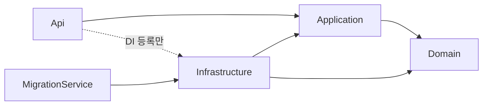

# Clean Architecture & 솔루션 구조

> 서비스 내부 레이어 구조, 의존성 규칙, .NET 솔루션 / 프로젝트 구성을 정의합니다. 기반 구축 토픽(PRD-001)에서 만든 솔루션의 실제 구성과 맞춰 둡니다.
> 결정 근거: [ADR-0003 Clean Architecture + DDD](adr/0003-clean-architecture-and-ddd.md), [ADR-0002 MSA](adr/0002-adopt-msa.md)
>
> [위키 홈](../README.md)

## 레이어 구성 (Domain / Application / Infrastructure / Api)

| 레이어 | 책임 | 담는 것 | 참조 가능 |
|---|---|---|---|
| **Domain** | 업무 규칙 | Aggregate, Entity, Value Object, 강타입 ID, 코드 enum, 도메인 이벤트, Repository 인터페이스, 도메인 오류 | BuildingBlocks.Domain |
| **Application** | 유스케이스 | Command / Query / Handler / Validator, 응답 DTO, 포트 인터페이스(외부 연동), 통합 이벤트 정의 | Domain, BuildingBlocks.Application |
| **Infrastructure** | 기술 구현 | EF Core DbContext · 매핑 · 마이그레이션, Repository 구현, Query 구현, 외부 연동 어댑터. Outbox · 메시징은 도입 보류([ADR-0023](adr/0023-deferred-adoptions.md)) | Application, Domain, BuildingBlocks.Infrastructure |
| **Api** | 진입점 | Controller, 요청 → Command / Query 변환, `Result` → HTTP 응답, DI 구성, 미들웨어 | Application, Infrastructure (DI 등록용), BuildingBlocks.Api, ServiceDefaults |
| **MigrationService** | 마이그레이션 적용 | 쓰기 DbContext로 `MigrateAsync`만 실행하고 종료하는 Worker([ADR-0012](adr/0012-migration-apply-and-pre-production-reset.md)) | Infrastructure, ServiceDefaults |

## 의존성 규칙



- 의존은 **안쪽(Domain)으로만** 향한다. Domain은 아무것도 참조하지 않는다(BuildingBlocks.Domain 제외).
- Domain은 EF Core, ASP.NET Core, 직렬화 라이브러리 등 **프레임워크에 의존하지 않는다**.
- Application은 Infrastructure를 모른다. DB · 외부 시스템은 Application(또는 Domain)에 정의한 인터페이스로만 사용한다.
- Api는 Infrastructure를 DI 등록에만 쓰고, Controller에서 직접 쓰지 않는다.
- 서비스와 Repository는 마커 인터페이스 / 기반 클래스를 상속하고, 초기화 코드는 **어셈블리 검색으로 자동 등록(Scoped)**한다. 구현 타입을 하나씩 등록하지 않는다([코딩 컨벤션 · DI 규칙](../04-development/coding-conventions.md#의존성-주입-di-규칙)).
- **서비스끼리는 프로젝트를 참조하지 않는다.** 공유는 BuildingBlocks만 허용하며, 서비스 간 데이터 교환은 API / 통합 이벤트로 한다.
- 이 규칙은 [아키텍처 테스트](../04-development/testing-strategy.md#아키텍처-테스트)로 빌드마다 검증한다.

### 의존성 규칙 표

[ADR-0024 의존성 규칙 표](adr/0024-building-blocks-api-for-common-http-handling.md#의존성-규칙-표-초안)를 아키텍처 테스트 구현(S02-T05 · S03-T04)에 맞춰 옮긴 표입니다. **규칙 목록의 원본은 `tests/EmergencyHub.ArchitectureTests`**(`Rules/DependencyRules.cs`, `References/DeclaredReferenceRules.cs`)이고, 오른쪽 열은 그 규칙 이름입니다. 형식 의존 규칙 10개가 모두 한 번 이상 나옵니다.

| 프로젝트 | 참조 가능 | 참조 금지 (형식 의존 포함) | 아키텍처 테스트 규칙 |
|---|---|---|---|
| BuildingBlocks.Domain | (없음) | 다른 모든 프로젝트 · 패키지, 프레임워크, 직렬화 라이브러리(`System.Text.Json` · `System.Runtime.Serialization` · `System.Xml.Serialization`) | `DomainDependsOnlyOnSystemAndDomain` |
| BuildingBlocks.Application | BuildingBlocks.Domain, FluentValidation, `Microsoft.Extensions.*.Abstractions` | Infrastructure 계열, Api 계열, EF Core, Npgsql, Scrutor, ASP.NET Core | `ApplicationDoesNotDependOnInfrastructure`, `ApplicationDoesNotDependOnApi`, `ApplicationDoesNotDependOnFrameworks` |
| BuildingBlocks.Infrastructure | BuildingBlocks.Application · Domain, EF Core, Npgsql, Scrutor (그 밖에 UUIDNext · FluentValidation DI 확장 · EFCore.NamingConventions 등 다른 ADR이 승인한 패키지) | Api 계열, ASP.NET Core(`Microsoft.AspNetCore.*` · Swashbuckle · `Microsoft.OpenApi`) | `InfrastructureDoesNotDependOnApi`, `InfrastructureDoesNotDependOnAspNetCore` |
| BuildingBlocks.Api | BuildingBlocks.Application · Domain, ASP.NET Core, Swashbuckle | Infrastructure 계열, EF Core, Npgsql | `BuildingBlocksApiDoesNotDependOnInfrastructureOrDatabase` |
| `<Service>.Domain` | BuildingBlocks.Domain | 그 밖의 모든 프로젝트 · 패키지(다른 서비스 Domain 포함) | `DomainDependsOnlyOnSystemAndDomain`, `ServicesDoNotDependOnOtherServices` |
| `<Service>.Application` | `<Service>.Domain`, BuildingBlocks.Application · Domain, FluentValidation | Infrastructure 계열, Api 계열, EF Core, Npgsql, Scrutor, ASP.NET Core | `ApplicationDoesNotDependOnInfrastructure`, `ApplicationDoesNotDependOnApi`, `ApplicationDoesNotDependOnFrameworks` |
| `<Service>.Infrastructure` | `<Service>.Application` · Domain, BuildingBlocks.Infrastructure · Application · Domain | `<Service>.Api`, BuildingBlocks.Api, ASP.NET Core | `InfrastructureDoesNotDependOnApi`, `InfrastructureDoesNotDependOnAspNetCore` |
| `<Service>.Api` | `<Service>.Application`, `<Service>.Infrastructure`(DI 등록만), BuildingBlocks.Api, ServiceDefaults | Controller에서 Infrastructure 계열 형식 · Repository(`IRepository` / `IReadRepository` 파생) 사용. 레이어 단위 선언 참조 금지는 없음 | `ControllersDoNotUseInfrastructureOrRepositories` |
| `<Service>.MigrationService` | `<Service>.Infrastructure`, ServiceDefaults | Api 계열(`<Service>.Api`, BuildingBlocks.Api) | `MigrationServiceDoesNotDependOnApi` |
| 모든 서비스 프로젝트 | 자기 서비스, BuildingBlocks, ServiceDefaults | 다른 서비스(`EmergencyHub.<Other>.*`) | `ServicesDoNotDependOnOtherServices`(형식, 서비스 2개 이상일 때), 선언 참조 규칙(서비스 수와 관계없이) |

- "Infrastructure 계열" · "Api 계열"은 BuildingBlocks와 서비스의 같은 레이어 어셈블리 전부입니다(`ArchitectureAssemblies.NamesIn`).
- 형식 의존 규칙과 별도로, **선언 참조 규칙**(`DeclaredReferenceRules`, 테스트 `DeclaredReferences_OfProductProject_ExcludeForbiddenProjectsAndPackages`)이 csproj의 프로젝트 · 패키지 참조를 같은 "참조 금지" 열로 막습니다(쓰지 않는 참조도 금지). Domain은 "참조 가능" 열을 허용 목록으로 씁니다.
- 규칙 대상은 `ArchitectureAssemblies.All`(BuildingBlocks 4개 + Employee 5개)입니다. ServiceDefaults · AppHost는 대상이 아니며, 그 둘 밖의 `src` 제품 프로젝트가 목록에 빠지면 `ArchitectureAssemblyCoverageTests`가 실패합니다.

## CQRS 적용

**적용한다.** 읽기 전용 DB(복제본)는 두지 않지만, **연결 문자열과 DbContext는 읽기 / 쓰기로 나눠** 두고 지금은 둘 다 같은 Database를 가리킵니다([데이터베이스 · 읽기 / 쓰기 연결 분리](../04-development/database.md#읽기--쓰기-연결-분리)).

| 흐름 | 경로 |
|---|---|
| Command | Api(Controller) → Command → (로깅 → 검증 → 트랜잭션 파이프라인) → Handler → Write Repository(쓰기 DbContext) → **Aggregate(도메인 규칙)** → 트랜잭션 데코레이터가 Unit of Work 커밋([ADR-0014](adr/0014-command-transaction-boundary-and-unit-of-work.md)) → Outbox(도입 보류, [ADR-0023](adr/0023-deferred-adoptions.md)) |
| Query | Api → Query → Handler → **Read Repository(읽기 DbContext) 프로젝션** → 응답 `record` (도메인 모델을 거치지 않음) |

- Query Handler는 Application에 두고, 조회는 Application에 정의한 **Read Repository 인터페이스**(`IEmployeeReadRepository`)로 한다. 구현은 Infrastructure에 둔다.
- Write Repository 인터페이스는 Domain, Read Repository 인터페이스는 Application에 둔다.
- 코드 규칙은 [코딩 컨벤션 · CQRS 규칙](../04-development/coding-conventions.md#cqrs-규칙)을 따른다.

## 저장소 디렉터리 구조

트리의 경로는 모두 저장소에 실제로 있습니다(S04-T02, `git ls-files` · `test -e` 대조). 빌드 산출물(`bin/` · `obj/` · `TestResults/` · `coveragereport/`)은 `.gitignore` 대상이라 적지 않습니다.

```
emergency-hub/
├── EmergencyHub.sln
├── global.json                  # SDK 버전 고정 (8.0.400 + rollForward latestFeature)
├── Directory.Build.props        # 공통 빌드 설정 (아래 표)
├── Directory.Build.targets      # 설계 시점 · 분석기 · 테스트 도구 패키지 PrivateAssets 일괄 적용
├── Directory.Packages.props     # 중앙 패키지 버전 관리
├── coverlet.runsettings         # 커버리지 수집 설정 (NFR-03 대상 6개 어셈블리)
├── .editorconfig
├── .gitattributes
├── .gitignore
├── .config/
│   └── dotnet-tools.json        # 로컬 도구 매니페스트 (ReportGenerator)
├── .github/
│   └── workflows/
│       └── ci.yml               # PR CI (빌드 · format · 테스트 · 커버리지 보고)
├── scripts/
│   └── check-docs.js            # 위키 링크 · 앵커 · frontmatter · 표 점검
├── src/
│   ├── BuildingBlocks/
│   │   ├── EmergencyHub.BuildingBlocks.Domain/
│   │   ├── EmergencyHub.BuildingBlocks.Application/
│   │   ├── EmergencyHub.BuildingBlocks.Infrastructure/
│   │   └── EmergencyHub.BuildingBlocks.Api/      # 공통 HTTP 처리 (ADR-0024)
│   ├── Aspire/
│   │   ├── EmergencyHub.AppHost/                 # 로컬 오케스트레이션 (ADR-0011)
│   │   │   └── postgres-init/                    # employee_app 롤 생성 init 스크립트
│   │   └── EmergencyHub.ServiceDefaults/         # 헬스체크 · OTel · Serilog · 서비스 디스커버리 · 복원력 (S03-T03)
│   └── Services/
│       └── Employee/
│           ├── EmergencyHub.Employee.Domain/
│           ├── EmergencyHub.Employee.Application/
│           ├── EmergencyHub.Employee.Infrastructure/
│           ├── EmergencyHub.Employee.Api/
│           └── EmergencyHub.Employee.MigrationService/  # 마이그레이션 적용 Worker (ADR-0012)
├── tests/
│   ├── EmergencyHub.ArchitectureTests/
│   ├── Aspire/
│   │   ├── EmergencyHub.AppHost.UnitTests/
│   │   └── EmergencyHub.ServiceDefaults.UnitTests/
│   ├── BuildingBlocks/
│   │   ├── EmergencyHub.BuildingBlocks.Domain.UnitTests/
│   │   ├── EmergencyHub.BuildingBlocks.Application.UnitTests/
│   │   ├── EmergencyHub.BuildingBlocks.Infrastructure.UnitTests/
│   │   └── EmergencyHub.BuildingBlocks.Api.UnitTests/
│   └── Services/
│       └── Employee/
│           ├── EmergencyHub.Employee.Domain.UnitTests/
│           ├── EmergencyHub.Employee.Application.UnitTests/
│           ├── EmergencyHub.Employee.Infrastructure.UnitTests/
│           ├── EmergencyHub.Employee.Api.UnitTests/
│           ├── EmergencyHub.Employee.MigrationService.UnitTests/
│           └── EmergencyHub.Employee.IntegrationTests/
├── .claude/                     # 에이전트 · 스킬 · hook (개발 흐름)
├── CLAUDE.md
└── wiki/
```

- 새 서비스는 `src/Services/<Service>/`와 `tests/Services/<Service>/`에 Employee와 같은 구성으로 추가하고, 아키텍처 테스트 대상 목록(`ArchitectureAssemblies`)에 레이어별로 넣습니다. 서비스 후보 목록은 [서비스 카탈로그](service-catalog.md)가 원본입니다(검토 중).
- API Gateway 프로젝트는 두지 않습니다(도입 보류, [ADR-0023](adr/0023-deferred-adoptions.md)). docker compose(`deploy/`)는 쓰지 않고 로컬 실행은 Aspire AppHost로 합니다([ADR-0011](adr/0011-use-aspire-local-orchestration.md)). 배포 산출물은 Phase 4에서 정합니다.

## 서비스별 프로젝트 구성

Employee 서비스의 실제 구성입니다(주요 파일만, 경로는 모두 존재).

```
EmergencyHub.Employee.Domain/
└── Employees/                   # Aggregate 단위 폴더
    ├── Employee.cs              # Aggregate Root (Register는 VO 4개만 받음, 상태 Active 고정)
    ├── EmployeeId.cs            # 강타입 ID (record struct)
    ├── EmployeeStatus.cs        # 코드 enum (short)
    ├── Name.cs                  # Value Object (sealed record, Create → Result)
    ├── Email.cs                 # Value Object (입력 표기 Value + NormalizedEmail)
    ├── PhoneNumber.cs           # Value Object
    ├── JoinedOn.cs              # Value Object (DateOnly)
    ├── EmployeeErrors.cs
    ├── IEmployeeRepository.cs   # Write Repository 인터페이스 (IRepository 상속)
    └── Events/

EmergencyHub.Employee.Application/
├── Employees/
│   ├── EmployeeLogs.cs               # [LoggerMessage]
│   └── IEmployeeReadRepository.cs    # Read Repository 인터페이스 (IReadRepository 상속, 멤버는 S05-T06)
└── EmployeeApplicationAssembly.cs    # 어셈블리 검색용 마커

EmergencyHub.Employee.Infrastructure/
├── Persistence/
│   ├── EmployeeDbContext.cs          # 쓰기 (ConnectionStrings:Write)
│   ├── EmployeeReadDbContext.cs      # 읽기 전용 (ConnectionStrings:Read)
│   ├── EmployeeDbContextFactory.cs   # 설계 시점 팩터리 (dotnet ef)
│   ├── EmployeeDbNames.cs            # 제약 · 인덱스 이름 상수
│   ├── EmployeeModelDefinition.cs    # 두 DbContext가 공유하는 모델 정의
│   ├── Configurations/               # IEntityTypeConfiguration<T>
│   ├── Repositories/                 # Write Repository (RepositoryBase 상속)
│   ├── ReadRepositories/             # Read Repository (ReadRepositoryBase 상속)
│   └── Migrations/                   # 쓰기 DbContext 기준, *.Sealed.cs 선언 포함
├── EmployeeInfrastructureServiceCollectionExtensions.cs
└── EmployeeInfrastructureAssembly.cs  # 어셈블리 검색용 마커

EmergencyHub.Employee.Api/
├── Logging/
├── EmployeeApiAssembly.cs
├── Program.cs
└── appsettings.json

EmergencyHub.Employee.MigrationService/
├── MigrationWorker.cs
├── Program.cs
└── appsettings.json
```

- PRD-002에서 Domain `Employees/`에 Value Object 4개(`Name` · `Email` · `PhoneNumber` · `JoinedOn`)를 두었고(S05-T03, Aggregate가 한 곳에서만 써서 `ValueObjects/`가 아니라 Aggregate 폴더), S05-T04에서 Aggregate가 이 Value Object를 속성으로 가지게 했다(이메일은 `Email` VO + `NormalizedEmail` 문자열, [ADR-0026](adr/0026-employee-bulk-import-input-processing.md) 8절, [ADR-0027](adr/0027-case-insensitive-unique-email-with-normalized-column.md)).
- S05-T04에서 PRD-001 샘플(`EmployeeEmail.cs`, Application `Commands/RegisterEmployee/` · `Queries/GetEmployeeById/`, Api `Controllers/` · `Employees/` Request / Response)을 지웠다. 그래서 지금 Application에는 기능 폴더가 없고 Api에는 Controller가 없다(HTTP 엔드포인트는 헬스 경로뿐). 일괄 등록 기능 폴더 · Validator는 S06-T04, `/api/employee` Controller는 S06-T05에서 생긴다. 이 트리는 코드가 바뀌는 작업에서 실제 구성으로 갱신한다.
- 루트 네임스페이스: `EmergencyHub.<Service>.<Layer>`
- 폴더는 기술 종류(Entities, Services)가 아니라 **Aggregate / 기능 단위**로 나눈다.
- Application 기능 폴더 규칙(`Commands/<기능>/` · `Queries/<기능>/`)은 [코딩 컨벤션](../04-development/coding-conventions.md#cqrs-규칙)의 "기능 폴더 구조"가 원본이다.
- 필요해지면 추가하는 폴더: 여러 Aggregate가 쓰는 Value Object(Domain `ValueObjects/`), 포트 인터페이스(Application `Abstractions/`, `IService` 상속). Outbox는 도입 보류([ADR-0023](adr/0023-deferred-adoptions.md))라 Infrastructure에 `Outbox/`를 두지 않는다.

> **API 스타일은 Controller**입니다([ADR-0016](adr/0016-use-controllers-for-api.md)). Controller는 `public sealed class`, `ControllerBase` 상속, `ISender`만 주입받고 요청 → Command / Query 변환, `Result` → HTTP 응답 변환만 합니다. 공통 API 처리(ProblemDetails 변환, 바인딩 오류 1001, 전역 예외 처리, Swashbuckle 설정)는 BuildingBlocks.Api에 둡니다([ADR-0024](adr/0024-building-blocks-api-for-common-http-handling.md), S02-T06).

## 공통 빌딩 블록 (BuildingBlocks / Shared Kernel)

| 프로젝트 | 담는 것 |
|---|---|
| `BuildingBlocks.Domain` | `Entity<TId>`, `AggregateRoot<TId>`(도메인 이벤트 수집), `IDomainEvent`, `IStronglyTypedId<TSelf>`, `Result` / `Result<T>`, `Error`(정수 코드) · `ValidationError` · `CommonErrors` · `ErrorType`, 마커 `IRepository` |
| `BuildingBlocks.Application` | `ICommand` / `IQuery` / Handler 인터페이스, `ISender`, 파이프라인 데코레이터(로깅 → 검증 → 트랜잭션), `IUnitOfWork`, `IIdGenerator`, `IExceptionClassifier`, Validator 공통 기반 **`RequestValidator<T>`**(FluentValidation `AbstractValidator<T>` 파생, `RuleLevelCascadeMode = Stop`) · `WithError` 확장, 마커 `IReadRepository` / `IService`, `AddBuildingBlocksApplication`(`ISender` · `TimeProvider`) |
| `BuildingBlocks.Infrastructure` | EF Core 공통 설정(snake_case, 감사 컬럼, 강타입 ID 변환, enum 체크 제약), `WriteDbContextBase` / `ReadDbContextBase`, `RepositoryBase` / `ReadRepositoryBase`, `UnitOfWork<TContext>`(실행 전략 · 트랜잭션, [ADR-0014](adr/0014-command-transaction-boundary-and-unit-of-work.md)), 영속성 예외 분류(23505 → `Result`), `IPreCommitHook`, UUID v7 `IIdGenerator` 구현, **`AddConventionalServices`(어셈블리 검색 자동 등록)**, `AddBuildingBlocksInfrastructure`. Outbox / Inbox · 메시징 연결은 도입 보류([ADR-0023](adr/0023-deferred-adoptions.md), 확장 지점은 커밋 전 `IPreCommitHook`) |
| `BuildingBlocks.Api` | `Result` / `Error` → `ProblemDetails` 변환, 바인딩 오류 1001 응답, 전역 `IExceptionHandler`(9001), Controller · JSON(정수 enum) 기본 설정, Swashbuckle 필터, `AddBuildingBlocksApi` · `UseBuildingBlocksApi`([ADR-0024](adr/0024-building-blocks-api-for-common-http-handling.md)) |

- BuildingBlocks에는 **업무 개념을 넣지 않는다.** 여러 서비스가 쓰는 업무 개념이 생기면 먼저 서비스 경계를 다시 본다.
- BuildingBlocks의 변경은 모든 서비스에 영향을 주므로, 변경 작업은 스프린트 계획에서 별도 작업으로 드러낸다.

## 공통 빌드 설정 (Directory.Build.props / Directory.Packages.props)

`Directory.Build.props` 기본값

| 속성 | 값 |
|---|---|
| `TargetFramework` | `net8.0` |
| `LangVersion` | 기본값(C# 12) |
| `Nullable` | `enable` |
| `ImplicitUsings` | `enable` |
| `TreatWarningsAsErrors` | `true` |
| `AnalysisLevel` | `latest-recommended` |
| `EnforceCodeStyleInBuild` | `true` (`.editorconfig` 규칙을 빌드에서 검사) |
| `Deterministic` | `true` |
| `NuGetAudit` · `NuGetAuditMode` · `NuGetAuditLevel` | `true` · `all` · `low` (.NET 8 SDK 기본값은 직접 참조만 감사하므로 전이 참조까지, [패키지 버전 · 스크래치 검증](package-versions.md#스크래치-restore-검증)) |
| `IsTestProject` | 프로젝트 이름이 `Tests`로 끝나면(`*.UnitTests` · `*.IntegrationTests` · `*.ArchitectureTests`) `true`, 아니면 `false`. csproj 본문보다 먼저 평가되므로 이름 규칙으로 정한다 |
| 테스트 프로젝트(`IsTestProject=true`) | `OutputType=Exe`(xUnit v3, VSTest 경로), `IsPackable=false` ([ADR-0021](adr/0021-test-tooling-xunit-v3-and-awesomeassertions.md)) |
| `GenerateDocumentationFile` | BuildingBlocks 제품 프로젝트만 `true`(public API XML 문서 필수, CS1591은 `TreatWarningsAsErrors`로 오류) |
| `EmergencyHubPostgresImageTag` | PostgreSQL 이미지 태그의 저장소 유일 원본(`17`). csproj에 `EmergencyHubUsesPostgresImage=true`를 둔 프로젝트(AppHost, 통합 테스트)에 어셈블리 메타데이터로 들어간다 |
| `InternalsVisibleTo` | 테스트 프로젝트가 아닌 모든 프로젝트에 `$(AssemblyName).UnitTests`와 `DynamicProxyGenAssembly2`(NSubstitute) 일괄 적용 |

`Directory.Build.targets`(csproj 본문 뒤에 평가): `Microsoft.EntityFrameworkCore.Design` · `xunit.runner.visualstudio` · `coverlet.collector` · `NSubstitute.Analyzers.CSharp` 참조에 `PrivateAssets=all`을 `Update`로 일괄 적용해 참조 프로젝트 밖으로 전이되지 않게 한다.

- 패키지 버전은 `Directory.Packages.props`에서 **중앙 관리**한다(`ManagePackageVersionsCentrally`). 프로젝트 파일에는 버전을 적지 않는다.
- SDK 버전은 `global.json`으로 고정한다(`8.0.400`, `rollForward: latestFeature`).
- 로컬 도구(ReportGenerator)는 `.config/dotnet-tools.json` 매니페스트로 고정하고 `dotnet tool restore`로 설치한다([ADR-0022](adr/0022-respawn-and-coverage-tooling.md)).
- `.gitattributes`로 줄바꿈을 저장소와 작업 트리 모두 LF로 정규화하고(`* text=auto eol=lf`, `.editorconfig`와 같은 기준), 바이너리 확장자를 `binary`로 지정한다.

---

## 변경 이력

| 날짜 | 작성자 | 내용 |
|---|---|---|
| 2026-09-27 | - | 문서 생성 |
| 2026-09-27 | - | 기본 구조 초안: 레이어 책임, 의존성 규칙, CQRS 적용, 저장소 · 프로젝트 구조, BuildingBlocks, 공통 빌드 설정 |
| 2026-09-27 | - | 읽기 / 쓰기 DbContext 분리, Read Repository로 Query 구현 위치 확정, DI 자동 등록 구조 반영 |
| 2026-09-27 | developer | ADR 0014 · 0016 · 0023 반영: Api `Endpoints/` → `Controllers/`, API 스타일 확정, Command 흐름의 커밋 주체 · Outbox 보류 (S01-T04). 저장소 구조 전체 갱신은 S04-T02 |
| 2026-09-27 | developer | 저장소 구조에 `src/Aspire/EmergencyHub.ServiceDefaults`, `<Service>.MigrationService`와 테스트 프로젝트 추가 (S03-T03) |
| 2026-09-28 | developer | 저장소 구조를 실제 경로로 갱신(AppHost · BuildingBlocks.Api · `tests/BuildingBlocks/*` · 루트 설정 파일 추가, Gateway · `deploy/` 제거), 레이어 표에 MigrationService 행, 의존성 규칙 표(Api · MigrationService 행, 아키텍처 테스트 규칙 이름 열), 서비스별 구성을 Employee 실제 구성으로, BuildingBlocks 표에 Api · `RequestValidator<T>`, Outbox 보류 반영, 공통 빌드 설정 표(IsTestProject 이름 규칙 · NuGetAudit · IVT · 이미지 태그, `Directory.Build.targets` PrivateAssets) (S04-T02, BL-048 · 066 · 087) |
| 2026-09-28 | developer | 서비스별 구성 트리의 `EmployeeEmail.cs` 주석을 실제(static 정규화 · 판정 도우미, 값 객체 아님)로 정정, PRD-002 Value Object 4개 · 샘플 제거 예정 메모(ADR-0026 · 0027) (S05-T02) |
| 2026-09-28 | developer | 서비스별 구성 트리를 PRD-001 샘플 제거 뒤 실제 구성으로(EmployeeEmail.cs · Application 기능 폴더 · Api Controllers · Employees 제거, Aggregate VO 속성), 기능 폴더 규칙 원본 링크 (S05-T04) |
| 2026-09-28 | developer | Domain 트리에 Value Object 4개(`Name` · `Email` · `PhoneNumber` · `JoinedOn`)와 Aggregate 폴더에 둔 이유 추가 (S05-T03) |
