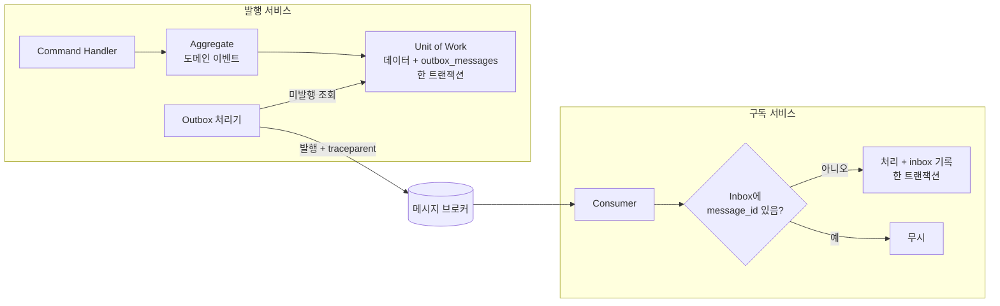

# 이벤트 기반 아키텍처 (EDA)

> 서비스 간 비동기 이벤트 통신의 구조와 규칙을 정의합니다. 결정 근거: [ADR-0004](adr/0004-adopt-event-driven-architecture.md)
> **도입 보류**: 메시지 브로커 · 메시징 추상화 · Outbox / Inbox 구현은 보류 중이며 재검토 시점은 [ADR-0023](adr/0023-deferred-adoptions.md)이 원본입니다. 이 문서는 도입 때 따를 설계안이고, ADR-0004(EDA)는 유지합니다. 지금은 도메인 이벤트를 수집만 하고 커밋 뒤 비웁니다.
> 이벤트 목록은 [이벤트 카탈로그](../05-api/event-catalog.md), Outbox 테이블 구조는 [데이터베이스 · Outbox](../04-development/database.md#outbox-테이블)를 따릅니다.
>
> [위키 홈](../README.md)

## EDA 적용 원칙

- **서비스 간 상태 전파는 통합 이벤트로 한다.** 다른 서비스의 상태 변화가 필요하면 동기 호출 대신 이벤트를 구독해 자기 DB에 필요한 데이터를 복제한다.
- 이벤트는 **이미 일어난 사실**이다. 명령(“발송하라”)이 아니라 사실(“긴급 상황이 발령되었다”)을 알린다.
- 발행은 **Transactional Outbox**로 보장하고, 소비는 **Inbox**로 멱등 처리한다. 전달 보장 수준은 at-least-once다.
- 이벤트 페이로드의 코드값은 **정수**다([ADR-0008](adr/0008-integer-codes-and-bitmask.md)). 문자열 enum 직렬화 금지.

### 도메인 이벤트 vs 통합 이벤트

| 구분 | 도메인 이벤트 | 통합 이벤트 |
|---|---|---|
| 범위 | 서비스(바운디드 컨텍스트) 내부 | 서비스 간 |
| 이름 | 과거형 + `DomainEvent` (`EmployeeRegisteredDomainEvent`) | 과거형 + `IntegrationEvent` (`EmployeeRegisteredIntegrationEvent`) |
| 정의 위치 | Domain | Application (서비스 간 계약) |
| 전달 | 같은 프로세스, 저장 후 디스패치 | 메시지 브로커 (Outbox 경유) |
| 페이로드 | 도메인 타입 사용 가능 | 원시 타입 · 정수 코드만 (계약이므로 도메인 타입 노출 금지) |
| 변경 | 자유롭게 | [버저닝 규칙](#이벤트-버저닝) 적용 |

- 도메인 이벤트 핸들러가 다른 서비스에 알릴 필요가 있으면 통합 이벤트로 **변환**해 Outbox에 넣는다.
- 모든 이벤트 타입은 `record`로 정의한다([코딩 컨벤션](../04-development/coding-conventions.md)).

### 메시지 봉투 (Envelope)

| 필드 | 타입 | 설명 |
|---|---|---|
| `message_id` | UUID v7 | 메시지 고유 ID. Inbox 멱등 키 |
| `message_type` | text | 이벤트 타입 이름 (역직렬화용 식별자, 코드값 아님) |
| `version` | integer | 이벤트 스키마 버전 (1부터) |
| `occurred_at` | timestamptz (UTC, ISO 8601) | 사건 발생 시각 |
| `source` | text | 발행 서비스 이름 (`employee` 등) |
| `traceparent` | 헤더 | W3C Trace Context. 소비 측이 추적을 이어 받음([로깅 & 관측성](../04-development/logging-observability.md#분산-추적-opentelemetry--correlation-id)) |
| `payload` | JSON | 이벤트 본문 (정수 코드) |

## 메시지 브로커 선정

> **보류**([ADR-0023](adr/0023-deferred-adoptions.md)): 브로커는 RabbitMQ(재검토 추천안) / Kafka, 추상화는 MassTransit 8.x / 브로커 클라이언트 직접 사용 중에서 도입 토픽에 ADR로 정합니다. MassTransit v9+는 상용 라이선스라 제외합니다.

| 기준 | RabbitMQ | Kafka |
|---|---|---|
| 모델 | 큐 기반, 라우팅 유연 | 로그 기반, 파티션 · 재처리 |
| 운영 부담 | 낮음 | 높음 |
| 순서 보장 | 큐 단위 | 파티션 단위 |
| 적합성 | 업무 이벤트 전달, 과제 규모 | 대량 스트림, 이벤트 재생 |

- 어느 쪽이든 애플리케이션 코드는 브로커 API에 직접 의존하지 않고 BuildingBlocks의 발행 / 구독 추상화를 쓴다.
- 통합 테스트는 Testcontainers로 실제 브로커를 띄운다.

## 이벤트 발행 / 구독 흐름

## Transactional Outbox / Inbox 패턴

**Outbox (발행 측)**

1. Command 처리 중 발생한 통합 이벤트를 비즈니스 데이터와 **같은 트랜잭션**으로 `outbox_messages`에 저장한다.
2. Outbox 처리기(백그라운드 작업)가 `processed_at IS NULL`인 메시지를 발생 순서(`occurred_at`, UUID v7 순)로 읽어 발행한다.
3. 발행 성공 시 `processed_at`을 기록하고, 실패 시 `retry_count`와 `last_error`를 갱신한다.
4. 처리된 메시지는 보관 기간 후 정리한다(기간은 Outbox 도입 때 정함, 보류 [ADR-0023](adr/0023-deferred-adoptions.md)).

**Inbox (소비 측)**

- 소비한 메시지의 `message_id`를 `inbox_messages`에 저장하고, 비즈니스 처리와 **같은 트랜잭션**으로 커밋한다.
- 같은 `message_id`가 다시 오면 처리하지 않고 확인(ack)만 한다.

> 보류([ADR-0023](adr/0023-deferred-adoptions.md)): MassTransit 도입이 확정되면 MassTransit의 EF Core Outbox / Inbox로 대체할 수 있습니다([데이터베이스 · Outbox](../04-development/database.md#outbox-테이블)).

## 멱등성 (Idempotency) 처리

- 브로커는 중복 전달이 가능하다고 가정한다(at-least-once). **모든 Consumer는 멱등**이어야 한다.
- 1차 방어: Inbox의 `message_id` 중복 검사
- 2차 방어: 처리 자체를 멱등하게 설계한다(상태 전이 검사, “이미 반영됨”은 성공으로 처리)
- 테스트: “같은 통합 이벤트 두 번 수신” 케이스를 필수 엣지 케이스로 검증한다([테스트 전략](../04-development/testing-strategy.md#엣지-케이스-체크리스트)).

## 재시도 & Dead Letter Queue

| 구분 | 정책 |
|---|---|
| 발행 재시도 (Outbox) | 처리기가 주기적으로 재시도. `retry_count` 상한(도입 때 정함, 보류 [ADR-0023](adr/0023-deferred-adoptions.md)) 초과 시 `Error` 로그와 알림 대상 |
| 소비 재시도 | 일시 오류(DB 연결, 타임아웃)는 지수 백오프로 즉시 재시도(횟수는 도입 때 정함, 보류 [ADR-0023](adr/0023-deferred-adoptions.md)) |
| DLQ | 재시도 후에도 실패하거나 역직렬화 불가한 메시지는 DLQ로 보낸다. 자동 폐기하지 않는다 |
| DLQ 처리 | 원인 수정 후 재주입. 절차는 브로커 도입 때 [운영 런북](../07-operations/runbook.md)에 정리 (보류 [ADR-0023](adr/0023-deferred-adoptions.md)) |

- 비즈니스 규칙 위반(재시도해도 같은 결과)은 재시도하지 않고 결과를 기록한다.
- 재시도 · DLQ 이동은 `Warning` / `Error` 로그로 남기고 `message_id`, `message_type`, `retry_count`를 속성으로 포함한다.

## 순서 보장

- **전체 순서는 보장하지 않는다.** 순서가 필요한 이벤트는 같은 Aggregate(키) 단위로만 순서를 기대한다(큐 / 파티션 키 설계는 브로커 선택과 함께, 보류 [ADR-0023](adr/0023-deferred-adoptions.md)).
- Consumer는 순서가 뒤바뀌어 도착할 수 있음을 고려한다: 이벤트에 Aggregate 버전 또는 `occurred_at`을 두고, 오래된 이벤트는 무시하거나 최신 상태만 반영한다.

## 분산 트랜잭션 (Saga / Choreography)

- 분산 트랜잭션(2PC)은 쓰지 않는다. 여러 서비스에 걸친 업무는 **Choreography**(이벤트 연쇄)를 기본으로 한다.
- 실패 시 보상 이벤트(예: `...CancelledIntegrationEvent`)로 되돌린다.
- 흐름이 복잡해져 추적이 어려우면 Orchestration Saga(MassTransit State Machine 등, 메시징 추상화 보류 [ADR-0023](adr/0023-deferred-adoptions.md))를 검토하고 ADR로 남긴다.
- 🟡 긴급 전파 흐름(Emergency → ContactNetwork → Notification)의 구체적인 이벤트 연쇄는 해당 PRD에서 정합니다.

## 이벤트 버저닝

통합 이벤트는 서비스 간 **계약**이므로 하위 호환을 지킵니다.

| 변경 | 허용 | 방법 |
|---|---|---|
| 필드 추가 (선택 값) | ✅ | 같은 버전 유지, 소비 측은 모르는 필드를 무시 |
| 코드값 추가 | ✅ | 소비 측은 모르는 정수 코드를 안전하게 처리(무시 / 기본 처리) |
| 필드 삭제 · 이름 변경 · 타입 변경 · 의미 변경 | ❌ (같은 버전에서) | 새 버전(`version` + 1) 발행, 구독자 전환 후 이전 버전 중단 |
| 코드값 재사용 / 비트 자리 재사용 | ❌ | 금지 ([ADR-0008](adr/0008-integer-codes-and-bitmask.md)) |

- 새 버전 도입 중에는 이전 버전과 새 버전을 함께 발행할 수 있다. 전환 완료 후 이전 버전 발행을 중단한다.
- 이벤트 추가 · 변경은 [이벤트 카탈로그](../05-api/event-catalog.md)에 기록한다.

---

## 변경 이력

| 날짜 | 작성자 | 내용 |
|---|---|---|
| 2026-09-27 | - | 문서 생성 |
| 2026-09-27 | - | 초안 작성: 적용 원칙, 도메인 / 통합 이벤트, 메시지 봉투, 브로커 비교(미정), Outbox / Inbox, 멱등성, 재시도 · DLQ, 순서, Saga, 버저닝 |
| 2026-09-28 | developer | 브로커 · 메시징 추상화 · Outbox / Inbox 관련 미정 표시를 보류([ADR-0023](adr/0023-deferred-adoptions.md) 링크)로 교체, 문서 머리에 도입 보류 안내 (S04-T02, BL-038) |
