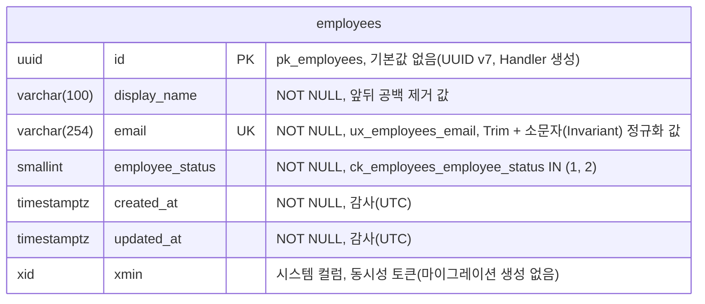

# 데이터베이스 (PostgreSQL)

> PostgreSQL 설계 규칙과 EF Core(Npgsql) 사용 가이드입니다. dba 에이전트가 작업 기준으로, developer 에이전트가 진입 점검 기준으로 사용합니다.
> 결정 근거: [ADR-0005 PostgreSQL](../03-architecture/adr/0005-use-postgresql.md), [ADR-0002 MSA](../03-architecture/adr/0002-adopt-msa.md), [ADR-0009 읽기 / 쓰기 분리](../03-architecture/adr/0009-separate-read-write-db-context.md), [ADR-0011 Aspire 로컬 오케스트레이션](../03-architecture/adr/0011-use-aspire-local-orchestration.md), [ADR-0012 마이그레이션 적용 · 리셋](../03-architecture/adr/0012-migration-apply-and-pre-production-reset.md), [ADR-0013 UUID v7](../03-architecture/adr/0013-uuid-v7-with-uuidnext.md), [ADR-0014 트랜잭션 경계 · UoW](../03-architecture/adr/0014-command-transaction-boundary-and-unit-of-work.md), [ADR-0022 Respawn](../03-architecture/adr/0022-respawn-and-coverage-tooling.md)
>
> [위키 홈](../README.md)

## Database per Service 원칙

- 서비스마다 **자기 Database**를 갖는다: `emergency_hub_<service>` (예: `emergency_hub_employee`). 로컬에서는 PostgreSQL 인스턴스 하나에 Database를 나눠 둔다.
- 서비스는 **다른 서비스의 Database에 접근하지 않는다**(조인, 조회 모두 금지). 필요한 데이터는 API나 통합 이벤트로 받아 자기 DB에 복제한다.
- 서비스별 DB 계정을 따로 두고, 계정은 자기 Database에만 권한을 갖는다([ADR-0011](../03-architecture/adr/0011-use-aspire-local-orchestration.md) 롤 모델).
  - 앱 롤은 `<service>_app`(예: `employee_app`)이다. `LOGIN` 롤이고 자기 DB의 **소유자**이며 `CREATEDB` · `SUPERUSER`가 없다. MigrationService와 Api가 모두 이 롤로 접속한다.
  - 슈퍼유저(`postgres`)는 서버 초기화와 DB 생성 스크립트에만 쓰고 애플리케이션에 주입하지 않는다(Aspire `WithReference(db)` 금지: 슈퍼유저 자격 증명이 주입된다).
  - PostgreSQL 15+에서 `public` 스키마 소유자는 `pg_database_owner`이므로 DB 소유자인 앱 롤은 별도 `GRANT` 없이 `public`에 객체를 만든다.
  - 마이그레이션 전용 롤 분리는 TD-001, 서비스 DB가 2개 이상이 되면 `REVOKE CONNECT, TEMPORARY ON DATABASE ... FROM PUBLIC`을 적용한다(BL-015).
- 테이블은 기본 스키마 `public`을 쓴다.
  - 매핑 · 마이그레이션은 스키마를 지정하지 않는다(`HasDefaultSchema` · `ToTable(..., schema)` · `MigrationsHistoryTable(..., schema)` 없음). 생성 SQL의 이름은 스키마 없이 나오고, 서버가 `search_path`로 해석한다.
  - **롤 이름과 같은 스키마(예: `employee_app`)를 만들지 않는다.** PostgreSQL 기본 `search_path`는 `"$user", public`이므로, 그런 스키마가 있으면 테이블과 `__EFMigrationsHistory`가 `public`이 아니라 그 스키마에 생긴다(통합 테스트 Respawn 제외 대상 · psql 확인과 어긋남, BL-036).

## 읽기 / 쓰기 연결 분리

**읽기 전용 DB(복제본)는 지금 두지 않지만, 설정과 코드에서는 처음부터 읽기와 쓰기를 나눕니다.** 나중에 복제본을 붙일 때 연결 문자열만 바꾸면 되도록 하기 위해서입니다.

| 구분 | 쓰기 (Command) | 읽기 (Query) |
|---|---|---|
| 연결 문자열 키 | `ConnectionStrings:Write` | `ConnectionStrings:Read` |
| 현재 대상 | 서비스 Database | **같은 서비스 Database** (복제본 도입 시 교체) |
| DbContext | `<Service>DbContext` | `<Service>ReadDbContext` |
| 추적 | 기본(변경 추적) | `QueryTrackingBehavior.NoTracking` 기본값 |
| 사용처 | Write Repository, Unit of Work, Outbox | Read Repository |
| 마이그레이션 | **여기서만** 생성 · 적용 | 만들지 않음 |

```json
// appsettings.json (서비스별)
{
  "ConnectionStrings": {
    "Write": "Host=localhost;Database=emergency_hub_employee;Username=employee_app",
    "Read":  "Host=localhost;Database=emergency_hub_employee;Username=employee_app;Options=-c default_transaction_read_only=on"
  }
}
```

- 예시에 `Password`가 없는 이유: 비밀번호는 커밋하지 않고 user-secrets · AppHost 매개변수로 주입한다(NFR-06). 연결 문자열에 들어가므로 `;`를 쓰지 않는다. 로컬에서는 AppHost가 `ConnectionStrings__Write` / `ConnectionStrings__Read`를 `ReferenceExpression`으로 조립해 환경 변수로 넣는다(Api에는 둘 다, MigrationService에는 Write만, [ADR-0011](../03-architecture/adr/0011-use-aspire-local-orchestration.md)).
- 읽기 연결은 `default_transaction_read_only=on`으로 열어, 읽기 DbContext로 실수로 쓰기를 하면 DB가 거부하도록 한다(`25006`). 이것은 실수를 막는 **안전장치이지 보안 경계가 아니다**(세션에서 `SET`으로 풀 수 있다). 복제본을 도입하면 읽기 전용 계정으로 바꾼다.
- 연결 문자열에 `Include Error Detail=true` · `Persist Security Info=true`를 쓰지 않는다([ADR-0020](../03-architecture/adr/0020-logging-with-serilog-and-otlp.md)).
- 두 DbContext는 같은 엔티티 매핑(`IEntityTypeConfiguration<T>`)을 공유한다(`ApplyConfigurationsFromAssembly`).
- 읽기 DbContext에는 `SaveChanges`를 쓰지 않는다. BuildingBlocks의 읽기 전용 기반 클래스가 `SaveChanges` 오버로드 4개(`SaveChanges()`, `SaveChanges(bool)`, `SaveChangesAsync(CancellationToken)`, `SaveChangesAsync(bool, CancellationToken)`)를 모두 `sealed override`로 막아 `InvalidOperationException`을 던진다. 추적 기본값은 `NoTracking`이다.
- 복제 지연이 생기면 "쓰고 바로 읽기"가 틀릴 수 있다. Command 직후 결과가 필요하면 Command가 필요한 값(ID 등)을 반환하게 한다.

## 로컬 DB 구성 (AppHost)

[ADR-0011](../03-architecture/adr/0011-use-aspire-local-orchestration.md)의 AppHost DB 구성 사양입니다(S03-T05). 값과 이름은 아래 표를 그대로 씁니다.

| 항목 | 값 |
|---|---|
| 서버 리소스 | `AddPostgres("postgres", password: postgres-password 매개변수)`. 사용자 이름 매개변수는 두지 않는다(기본값 `postgres`) |
| 이미지 | `postgres:17`. AppHost는 `.WithImageTag("17")`(9.5.2 기본값 17.6을 덮어씀), 통합 테스트는 `new PostgreSqlBuilder("postgres:17")`. 태그 `17`은 저장소에 **한 곳**만 둔다(권장: `Directory.Build.props` 속성 → 두 프로젝트에 `AssemblyMetadata`로 전달, [PostgreSQL 이미지](../03-architecture/package-versions.md#postgresql-이미지)) |
| 데이터 볼륨 | `.WithDataVolume("emergency-hub-postgres-data")`. 이름은 AppHost의 상수 한 곳. 복구 때는 **이 볼륨만** 지운다(다른 프로젝트 볼륨 금지) |
| 초기화 스크립트 | `src/Aspire/EmergencyHub.AppHost/postgres-init/01-create-employee-app-role.sh`. AppHost는 `.WithInitFiles("postgres-init")`(AppHost 디렉터리 기준 경로), 통합 테스트 fixture는 같은 파일을 Testcontainers `WithResourceMapping`으로 `/docker-entrypoint-initdb.d/`에 넣는다. 폴더에는 초기화 스크립트만 둔다(폴더 전체가 복사됨) |
| 롤 비밀번호 전달 | 서버 리소스에 `.WithEnvironment("EMPLOYEE_APP_PASSWORD", employee-app-password 매개변수)`. 스크립트가 `psql -v`로 받아 `:'employee_app_password'`로 인용한다 |
| Database 리소스 | `postgres.AddDatabase("employee-db", databaseName: "emergency_hub_employee").WithCreationScript("CREATE DATABASE emergency_hub_employee OWNER employee_app")`. 문장 하나만(롤 생성 · 여러 문장 금지) |
| 매개변수 2개 | `postgres-password`, `employee-app-password`: 둘 다 `builder.AddParameter(name, new GenerateParameterDefault { MinLength = 32, Special = false }, secret: true, persist: true)`. user-secrets 키 `Parameters:postgres-password` · `Parameters:employee-app-password`. AppHost csproj에 `UserSecretsId`가 있어야 저장된다 |
| 연결 주입 | `WithReference(employeeDb)` · `WithReference(postgres)` 금지. 아래 연결 식을 `WithEnvironment("ConnectionStrings__Write" / "ConnectionStrings__Read", 식)`로 넣는다 |
| 시작 순서 | `migrations.WaitFor(employeeDb)`, `api.WaitForCompletion(migrations)`, `api.WithHttpHealthCheck("/health/ready")`. MigrationService는 1개(`WithReplicas` 없음) |

- **비밀번호 생성 규칙**: `Special = false`라 영문 대소문자 · 숫자만 나온다(연결 문자열의 `;` · `'`가 생기지 않아 이스케이프가 필요 없다). 32자면 약 185비트다. 9.5.2에 `GenerateParameterDefault`와 `AddParameter(name, ParameterDefault, secret, persist)` 오버로드가 있다(패키지 XML 문서로 확인, 대시보드 입력 fallback 불필요). 사전 명령(`dotnet user-secrets set`)으로 넣는 방식은 쓰지 않는다.
- **비밀번호와 볼륨**: 두 비밀번호는 빈 볼륨을 처음 초기화할 때 서버에 저장된다. 볼륨이 남아 있는데 user-secrets만 지우면 새 값이 생성되어 **인증이 실패**한다(`28P01`, MigrationService 종료 코드 1, Api 미시작). 복구: AppHost를 멈추고 → `docker volume rm emergency-hub-postgres-data`(이 볼륨만) → 다시 실행. 비밀번호를 바꿀 때도 같은 절차다.
- **초기화 스크립트 규칙**: 빈 볼륨에서 한 번만 실행되므로 멱등 처리를 넣지 않는다. LF 줄바꿈, `psql -v ON_ERROR_STOP=1`, `CREATE ROLE employee_app LOGIN NOSUPERUSER NOCREATEDB NOCREATEROLE NOREPLICATION NOBYPASSRLS PASSWORD :'employee_app_password'`만 둔다. `CREATE SCHEMA` · `CREATE DATABASE` · `GRANT`는 넣지 않는다([Database per Service 원칙](#database-per-service-원칙)). 세션에서 `log_statement = 'none'` · `log_min_error_statement = 'panic'`로 서버 로그에 비밀번호 리터럴이 남지 않게 한다. `EMPLOYEE_APP_PASSWORD`가 비어 있으면 초기화가 실패한다(컨테이너 종료 1). 실행 비트가 없으면 엔트리포인트가 `source`로 실행하므로 `exit` · `set`을 쓰지 않는다.

연결 식(`ReferenceExpression.Create`, `ep = postgres.Resource.PrimaryEndpoint`, `pw` = employee-app-password 매개변수):

| 대상 | 환경 변수 | 식 |
|---|---|---|
| MigrationService | `ConnectionStrings__Write` | `Host={ep.Property(EndpointProperty.Host)};Port={ep.Property(EndpointProperty.Port)};Database=emergency_hub_employee;Username=employee_app;Password={pw};Application Name=employee-migration` |
| Api | `ConnectionStrings__Write` | 위와 같고 `Application Name=employee-api-write` |
| Api | `ConnectionStrings__Read` | Api Write 식과 같고 `Application Name=employee-api-read;Options=-c default_transaction_read_only=on` |

- `Options`는 **Read에만** 넣는다. `Application Name`은 선택이지만 넣으면 `pg_stat_activity`로 슈퍼유저 연결이 없음을 확인할 수 있다. `Include Error Detail` · `Persist Security Info` · `Timeout` · `Command Timeout`은 넣지 않는다.
- 연결 식의 호스트 · 포트는 서버 엔드포인트에서 얻고 고정 포트를 쓰지 않는다. `Database` · `Username` 값은 생성 스크립트 · 초기화 스크립트와 같은 이름이다(`emergency_hub_employee`, `employee_app`).

**psql 확인 항목**(S03-T05 증빙 (d) · BL-014). 컨테이너 안에서 `sh -c 'PGPASSWORD="$POSTGRES_PASSWORD" psql -X -h 127.0.0.1 -U postgres -d emergency_hub_employee ...'`처럼 컨테이너 환경 변수를 써서 비밀번호가 호스트 명령 · 로그에 나오지 않게 한다(앱 롤은 `$EMPLOYEE_APP_PASSWORD`, 컨테이너는 `docker ps --filter volume=emergency-hub-postgres-data`로 찾는다).

| # | 접속 | 쿼리 | 기대값 |
|---|---|---|---|
| 1 | postgres | `SELECT datname, pg_get_userbyid(datdba) FROM pg_database WHERE datname = 'emergency_hub_employee';` | `employee_app` |
| 2 | postgres | `SELECT rolsuper, rolcreatedb, rolcreaterole, rolreplication, rolbypassrls, rolcanlogin FROM pg_roles WHERE rolname = 'employee_app';` | `f f f f f t` |
| 3 | postgres | `SELECT rolpassword LIKE 'SCRAM-SHA-256$%' FROM pg_authid WHERE rolname = 'employee_app';` | `t`(해시는 출력하지 않음) |
| 4 | postgres | `SHOW server_version;` | `17.x` |
| 5 | employee_app | `SELECT pg_get_userbyid(nspowner) FROM pg_namespace WHERE nspname = 'public';` | `pg_database_owner` |
| 6 | employee_app | `\dn` 와 `SELECT count(*) FROM pg_namespace WHERE nspname = 'employee_app';` | `public`만, `0` |
| 7 | employee_app | `SELECT to_regclass('public."__EFMigrationsHistory"') IS NOT NULL;` 와 `SELECT count(*) FROM pg_class WHERE relname = '__EFMigrationsHistory' AND relkind = 'r';` | `t`, `1` |
| 8 | employee_app | `SELECT migration_id, product_version FROM public."__EFMigrationsHistory" ORDER BY migration_id;` | 1행, `<ID>_InitialCreate` · `8.0.31` |
| 9 | employee_app | `SELECT tablename, tableowner FROM pg_tables WHERE schemaname = 'public' ORDER BY 1;` | `__EFMigrationsHistory` · `employees` 모두 `employee_app` |
| 10 | employee_app | `SELECT usename, application_name, count(*) FROM pg_stat_activity WHERE datname = 'emergency_hub_employee' AND backend_type = 'client backend' AND pid <> pg_backend_pid() GROUP BY 1, 2;`(Api 호출 직후) | `usename`은 `employee_app`만, `application_name`은 `employee-api-*`, 연결 수가 헬스 주기마다 늘지 않음 |
| 11 | employee_app, `options='-c default_transaction_read_only=on'` | `SHOW default_transaction_read_only;` 뒤 `CREATE TABLE read_only_probe (id int);` | `on`, 그다음 `25006` |

- 11번은 Read 연결 식과 같은 `Options`로 연 psql 세션이다. Api 읽기 DbContext 자체의 `read_only`는 `/health/ready` 200(읽기 연결 `CanConnect` 통과)과 통합 테스트 S2(S03-T06)로 확인한다.
- 재시작 확인: 두 번째 실행부터 `postgres` 리소스 로그(서버 로그)에 생성 스크립트 때문에 `ERROR:  database "emergency_hub_employee" already exists`와 `STATEMENT:  CREATE DATABASE emergency_hub_employee OWNER employee_app`가 **실행마다 한 쌍** 남는다(`42P04`, 임시 postgres:17 실측). Aspire는 이 오류를 무시하고 진행한다(ADR-0011). PostgreSQL에는 `CREATE DATABASE IF NOT EXISTS`가 없고 트랜잭션 · `DO` 블록 안에서 실행할 수 없어 스크립트로 없앨 수 없으며, 서버 로그 수준을 낮추면 다른 오류도 가려지므로 바꾸지 않는다. 판정: 이 한 쌍을 뺀 `ERROR` · `FATAL` · `already exists`가 0건이고, 한 쌍의 개수가 (실행 횟수 − 1)과 같아야 한다. `employee_app`의 `already exists`(`42710`)는 초기화 스크립트가 다시 실행됐다는 뜻이므로 1건이라도 있으면 실패다.

## 테이블 / 컬럼 네이밍 규칙 (snake_case)

모든 식별자는 **소문자 snake_case**로 합니다. 따옴표가 필요한 이름은 만들지 않습니다(예외: 테이블 이름 `__EFMigrationsHistory` 하나, 그 컬럼과 기본 키는 snake_case, [마이그레이션 규칙](#마이그레이션-규칙) 참고). EF Core에서는 `EFCore.NamingConventions`의 `UseSnakeCaseNamingConvention()`으로 자동 변환합니다.

| 대상 | 규칙 | 예 |
|---|---|---|
| 테이블 | 복수형 | `employees`, `contact_groups` |
| 기본 키 컬럼 | `id` | `employees.id` |
| 외래 키 컬럼 | 단수 대상 + `_id` | `employee_id` |
| 일반 컬럼 | 의미 단위 snake_case | `display_name`, `hired_on` |
| 불리언 | `is_` / `has_` 접두사 | `is_primary`, `has_consent` |
| 시각 | `_at` 접미사 (timestamptz) | `created_at`, `acknowledged_at` |
| 날짜 | `_on` 접미사 (date) | `hired_on` |
| 코드 | 대상 + `_status` / `_type` / `_code` (정수) | `employee_status`, `contact_type` |
| 비트 플래그 | 복수형 명사 (정수) | `permissions`, `notification_channels` |
| 기본 키 제약 | `pk_<table>` | `pk_employees` |
| 외래 키 제약 | `fk_<table>_<ref_table>_<column>` | `fk_contacts_employees_employee_id` |
| 인덱스 | `ix_<table>_<columns>` | `ix_employees_department_id` |
| 유니크 인덱스 | `ux_<table>_<columns>` | `ux_employees_email` |
| 체크 제약 | `ck_<table>_<rule>` | `ck_employees_employee_status` |

- **식별자 길이는 63바이트 이하**로 한다. PostgreSQL은 더 긴 이름을 경고 없이 잘라 저장하므로, 잘린 제약 이름은 `23505` 매핑(`ConstraintName`)과 일치하지 않는다. 길면 `<columns>` / `<rule>`을 줄여 짓는다.
- `EFCore.NamingConventions`는 유니크 인덱스도 `ix_`로 만든다. 유니크 인덱스는 BuildingBlocks 도우미로 **`HasDatabaseName`을 명시해 `ux_`로 덮어쓴다**([EF Core 공통 모델 규칙](#ef-core-공통-모델-규칙-buildingblocksinfrastructure)).
- `ux_` 이름은 서비스 Infrastructure의 **이름 상수 한 곳**에 두고, 매핑(`HasDatabaseName`)과 `23505` 매핑 레지스트리가 같은 상수를 참조한다(문자열 중복 금지).

## 데이터 타입 규칙

| 용도 | 타입 | 규칙 |
|---|---|---|
| 기본 키 | `uuid` | **UUID v7**(시간 순서 정렬)을 애플리케이션에서 생성한다. 인덱스 단편화가 적고 서비스 간에 충돌하지 않는다([ADR-0013](../03-architecture/adr/0013-uuid-v7-with-uuidnext.md)). |
| 코드 | `smallint` | [코드값 규칙](#코드값-규칙) |
| 비트 플래그 | `integer` / `bigint` | [비트 마스킹 규칙](#비트-마스킹-규칙) |
| 문자열 | `text` | 길이 제한이 도메인 규칙이면 `varchar(n)` 또는 체크 제약. `char(n)` 금지 |
| 시각 | `timestamptz` | **항상 UTC로 저장**한다. `timestamp`(time zone 없음) 금지 |
| 날짜 | `date` | 시각 정보가 없는 날짜 |
| 금액 / 정밀 수치 | `numeric(p, s)` | `money`, `float` 금지 |
| 반정형 데이터 | `jsonb` | Outbox payload, 외부 응답 원문 등. 조회 조건으로 자주 쓰면 컬럼으로 뺀다 |
| 불리언 | `boolean` | NULL 허용하지 않는 것을 기본으로 한다 |

UUID v7 생성([ADR-0013](../03-architecture/adr/0013-uuid-v7-with-uuidnext.md)):

- `IIdGenerator`(BuildingBlocks.Application)의 구현(BuildingBlocks.Infrastructure)이 UUIDNext의 `Uuid.NewDatabaseFriendly(Database.PostgreSql)`로 만든다(.NET 8에는 `Guid.CreateVersion7()`이 없다).
- **Handler가 생성**해 Aggregate 팩토리에 넘긴다. EF 매핑은 `ValueGeneratedNever`다.
- DB 기본값(`gen_random_uuid()`는 v4, `uuidv7()`는 PostgreSQL 18부터)은 쓰지 않는다.
- PostgreSQL `uuid` 정렬 = 생성 순서다(Npgsql이 RFC 바이트 순서로 기록, S03-T06 통합 테스트로 검증). 메모리 안 정렬 검증은 `Guid.CompareTo`가 아니라 문자열 기준으로 한다.

- 컬럼은 기본으로 `NOT NULL`이다. NULL은 "값이 없음"이 업무적으로 의미 있을 때만 허용한다.
- 모든 테이블에 `created_at`, `updated_at`(timestamptz, NOT NULL)을 둔다. 값은 애플리케이션(`TimeProvider`)이 감사 인터셉터로 채운다. 대상은 **owned가 아닌 엔티티 형식**이고, owned 타입은 컬럼을 두지 않는다(소유자 행의 `updated_at`이 대신 바뀐다, [감사 컬럼](#감사-컬럼-created_at--updated_at)). 별도 테이블로 가는 owned 컬렉션(`OwnsMany`)도 예외이며, 행 단위 이력이 필요하면 owned가 아닌 엔티티로 설계한다.
- 삭제는 기본적으로 물리 삭제한다. 이력이 필요한 테이블만 `deleted_at`(soft delete)을 두고, 그 테이블은 쿼리 필터를 건다.

## 코드값 규칙

> **코드값을 문자열로 저장하지 않는다.** `varchar` 코드(`'ACTIVE'`), PostgreSQL `enum` 타입 모두 금지합니다.

- 코드는 C# `enum`(기반 형식 `short`)으로 정의하고 **`smallint` 컬럼**에 정수로 저장한다. C# 규칙은 [코딩 컨벤션 · 코드값](coding-conventions.md#코드값-enum-규칙)을 따른다.
- **C# enum이 코드 정의의 원본**이다. DB에는 코드 테이블을 두지 않고, 코드 값과 의미는 서비스별 [코드 정의](#코드-정의) 표에 기록한다.
- `0`은 예약 값(`Unknown` / `None`)이다. 저장 값으로 쓰지 않는다.
- 배포된 값은 바꾸거나 재사용하지 않는다. 폐기한 값은 코드 정의 표에 `폐기`로 남긴다.
- 허용 값은 체크 제약으로 막는다: `ck_employees_employee_status CHECK (employee_status IN (1, 2, 3))`. 목록은 enum에 정의된 값 중 `0`을 뺀 값을 오름차순으로 나열하고, 제약 이름의 `<rule>`은 컬럼 이름이다. BuildingBlocks 도우미가 enum 정의에서 만든다(손으로 SQL을 쓰지 않음). 값을 추가하면 마이그레이션으로 제약을 함께 바꾼다.
- NULL 허용 코드 컬럼은 제약에 `IS NULL`을 따로 넣지 않는다(체크 제약은 NULL이면 통과한다).
- EF Core는 enum을 기반 정수 형식으로 저장하므로 별도 변환이 필요 없다. `HasConversion<string>()`은 쓰지 않는다.

## 비트 마스킹 규칙

권한, 알림 채널처럼 **여러 코드를 조합**해야 하면 C# `[Flags]` enum을 정수 컬럼 하나에 저장합니다.

| 플래그 수 | C# 기반 형식 | 컬럼 타입 |
|---|---|---|
| 31개 이하 | `int` | `integer` |
| 63개 이하 | `long` | `bigint` |

- 각 플래그는 `1 << n` 값 하나를 차지한다. **비트 자리는 재사용하지 않는다.**
- `0`은 "없음"이다. 조합 별칭(`All`)은 코드에서만 정의하고 저장 값으로 따로 두지 않는다.
- 정의된 비트 밖의 값은 **마스크 조건** 체크 제약으로 막는다: `ck_employees_notification_channels CHECK (notification_channels >= 0 AND (notification_channels & ~7) = 0)`
  - `7`은 enum에 정의된 모든 값의 비트 OR(마스크)이다. 범위 조건(`<= 7`)은 비트 자리에 빈 곳이 있으면(예: 1, 2, 8) 정의되지 않은 값(4)을 통과시키므로 쓰지 않는다.
  - `&`와 `~`의 우선순위 때문에 괄호를 반드시 둔다. `0`(없음)은 허용된다.
  - 제약 이름의 `<rule>`은 컬럼 이름이고, BuildingBlocks 도우미가 enum 정의에서 마스크를 계산해 만든다. 비트를 추가하면 마이그레이션으로 제약을 함께 바꾼다.
- 조회는 비트 연산으로 한다.

```sql
-- 특정 플래그 포함 (SMS = 1)
SELECT id FROM employees WHERE notification_channels & 1 = 1;
-- 여러 플래그 모두 포함 (SMS | EMAIL = 5)
SELECT id FROM employees WHERE notification_channels & 5 = 5;
-- 여러 플래그 중 하나라도 포함
SELECT id FROM employees WHERE notification_channels & 5 <> 0;
```

```csharp
// EF Core: 비트 연산식은 SQL로 번역된다
var smsEnabled = await db.Employees
    .Where(e => (e.NotificationChannels & NotificationChannels.Sms) != 0)
    .ToListAsync(cancellationToken);
```

- 비트 연산 조건은 일반 B-tree 인덱스를 쓰지 못한다. 큰 테이블에서 특정 플래그로 자주 거르면 부분 인덱스(`WHERE notification_channels & 1 = 1`)를 만들거나, 조합이 아닌 별도 테이블로 설계를 바꾼다.

## 코드 정의

서비스별 코드 값과 의미를 기록합니다. 코드를 추가 / 변경하는 작업은 이 표를 함께 갱신합니다.

- `0`(`Unknown` / `None`)은 모든 코드의 예약 값이라 표에 따로 적지 않는다. enum에 멤버로 두더라도 저장 값이 아니고 체크 제약에서 빠진다.

### Employee

| 서비스 | enum (컬럼) | 값 | 이름 | 의미 | 상태 |
|---|---|---|---|---|---|
| Employee | `EmployeeStatus` (`employees.employee_status`) | 1 | `Active` | 재직(활성) | 사용 |
| Employee | `EmployeeStatus` (`employees.employee_status`) | 2 | `Inactive` | 비활성 | 사용 |

- 체크 제약: `ck_employees_employee_status CHECK (employee_status IN (1, 2))`(공통 도우미가 enum 정의에서 생성, S03-T02).
- 비트 플래그(`[Flags]`) 코드는 아직 없다(BL-088).

## EF Core 구성 (Npgsql)

- Provider: `Npgsql.EntityFrameworkCore.PostgreSQL`, 명명 규칙: `EFCore.NamingConventions`(`UseSnakeCaseNamingConvention()`)
- 등록: BuildingBlocks.Infrastructure의 공용 확장 메서드가 쓰기 · 읽기 DbContext를 `AddDbContext` + `UseNpgsql(연결, o => o.EnableRetryOnFailure())` + `UseSnakeCaseNamingConvention()`으로 등록한다. 두 DbContext는 같은 실행 전략을 쓰고, Api · MigrationService · 통합 테스트가 같은 등록 코드를 쓴다. 추적은 Npgsql.OpenTelemetry `AddNpgsql()`, 헬스체크는 `AddDbContextCheck<TDbContext>()`로 붙인다([ADR-0011](../03-architecture/adr/0011-use-aspire-local-orchestration.md)).
- 매핑은 Infrastructure의 `Persistence/Configurations/`에 **엔티티마다 `IEntityTypeConfiguration<T>` 하나**로 둔다. Domain에 데이터 어노테이션을 쓰지 않는다.
- 강타입 ID는 값 변환기로 `uuid`에 매핑한다. 엔티티마다 `HasConversion`을 쓰지 않고 공통 규칙이 등록한다([EF Core 공통 모델 규칙](#ef-core-공통-모델-규칙-buildingblocksinfrastructure)).
- Value Object는 Owned Type 또는 Complex Type(EF Core 8)으로 매핑한다.
- Lazy Loading은 쓰지 않는다. 필요한 연관은 `Include`로 명시한다.
- 데이터 접근은 **Repository**로만 한다. Repository에는 람다식 LINQ 쿼리만 두고 분기 · 로직을 넣지 않는다([코딩 컨벤션 · Repository 규칙](coding-conventions.md#repository-규칙-ef-core)).
- **Query(CQRS)는 Read Repository가 읽기 DbContext에서 `Select` 프로젝션**으로 응답 `record`를 바로 만든다. 엔티티 전체를 불러와 변환하지 않는다.
- Command는 Write Repository로 Aggregate를 불러온다. **Handler · Repository는 `SaveChanges`를 부르지 않는다**([ADR-0014](../03-architecture/adr/0014-command-transaction-boundary-and-unit-of-work.md)).
  - 트랜잭션 데코레이터(Command 전용)가 Handler 성공 뒤 `IUnitOfWork.CommitAsync`를 부른다. Handler는 실행 전략 밖에서 한 번만 실행된다.
  - UnitOfWork(Infrastructure)가 실행 전략 안에서 `BeginTransactionAsync(IsolationLevel.ReadCommitted)` → `SaveChangesAsync(acceptAllChangesOnSuccess: false)` → 커밋을 하고, 커밋이 성공한 뒤 전략 밖에서 `ChangeTracker.AcceptAllChanges()`를 부른다. 재시도 범위는 SaveChanges · 커밋뿐이다. 세부 순서와 재시도 때 상태는 [UnitOfWork 커밋 순서](#unitofwork-커밋-순서)에 있다.
- **공통 DbContext 등록**(S02-T07): 옵션 구성(`UseNpgsql(연결, EnableRetryOnFailure)` + `UseSnakeCaseNamingConvention()`)은 **한 메서드**에 두고 등록 확장 · 설계 시점 팩터리 · 모델 메타데이터 테스트가 같은 경로를 쓴다.
  - 쓰기 등록만 감사 인터셉터(`AuditSaveChangesInterceptor`)를 붙인다. 읽기 등록에는 붙이지 않는다(읽기 DbContext는 저장하지 않음). 인터셉터는 상태가 없으므로 Singleton 한 인스턴스를 붙인다(`TimeProvider`도 Singleton).
  - 쓰기와 읽기는 등록 메서드를 나눈다. MigrationService는 쓰기만 등록한다(`ConnectionStrings:Read`가 없어도 시작해야 함).
  - 연결 문자열이 없거나 비어 있으면 **시작 시** 예외로 멈춘다(첫 요청까지 미루지 않음). 예외 메시지 · 로그에 연결 문자열 값을 넣지 않는다(비밀번호).
  - 서비스 하나에 쓰기 DbContext는 하나다. `AddUnitOfWork<TContext>()`는 `IUnitOfWork`를 그 쓰기 DbContext에 묶어 Scoped로 등록하고, UnitOfWork와 Write Repository는 같은 스코프의 **같은 DbContext 인스턴스**를 쓴다. 다른 `TContext`로 다시 부르면 시작 시 예외다.
  - `EnableRetryOnFailure`는 Npgsql 기본값(최대 6회, 최대 지연 30초)을 쓴다. 재시도 설정(최대 횟수 · 최대 지연)은 **공통 옵션 구성 메서드의 선택 인자**로 받고, 서비스 등록 확장(예: `AddEmployeeInfrastructure`)이 그 인자를 넘긴다. 등록 확장 밖에서 `UseNpgsql`을 다시 불러 실행 전략을 덮어쓰지 않는다(실행 전략 설정 한 곳). 기준: Api는 재시도 총 대기 < 요청 제한 시간, MigrationService는 기본값. 값은 S03-T06에서 실측한 뒤 정한다(BL-073).
  - 구현(BuildingBlocks.Infrastructure): 옵션 구성 `UseBuildingBlocksNpgsql(연결)`, 등록 `AddWriteDbContext<T>(연결, 추가 옵션?)` · `AddReadDbContext<T>(연결, 추가 옵션?)` · `AddUnitOfWork<T>(errors => errors.Map(인덱스 상수, 서비스 Error))`, Outbox 확장 지점 `IPreCommitHook`(구현 없음, 멱등 필수). 재시도 한도 초과 분류기(`IExceptionClassifier`, 9003)는 `AddBuildingBlocksInfrastructure`가 Singleton으로 등록한다.
- **Api 등록 사양**(S03-T04): Api는 서비스 등록 확장(예: `AddEmployeeInfrastructure(configuration, retry)`) 하나로 쓰기 · 읽기 DbContext와 UnitOfWork를 등록한다(`AddConventionalServices` · `AddWriteDbContext` · `AddReadDbContext`를 호스트에서 다시 부르지 않음).
  - 연결 키: `ConnectionStrings:Write` · `ConnectionStrings:Read` 두 개뿐이고, 등록 확장이 `GetConnectionString("Write" / "Read")`로 읽는다. 로컬에서는 AppHost 환경 변수 `ConnectionStrings__Write` · `ConnectionStrings__Read`가 채운다([ADR-0011](../03-architecture/adr/0011-use-aspire-local-orchestration.md)). Api의 `appsettings*.json` · `launchSettings.json`에는 `ConnectionStrings` 절을 두지 않는다(비밀번호 없는 예시 값도 두지 않아, AppHost 없이 실행하면 시작 시 예외로 멈춤). Api 코드는 읽기 연결 문자열에 옵션을 덧붙이거나 고치지 않는다(`default_transaction_read_only=on`은 AppHost 연결 식 책임).
  - 재시도: Api는 `retry` 인자를 **명시**한다. T06 실측 전 임시값은 `new DbRetryOptions(maxRetryCount: 3, maxRetryDelay: TimeSpan.FromSeconds(5))`이고 Api 안 한 곳(상수 · 정적 속성)에만 두며 "BL-073 임시값, S03-T06 실측 뒤 확정" 주석을 단다. 예상 대기 합은 약 4.4초(지연 0 → 약 1.1 → 약 3.3초, 시도마다 연결 · 명령 제한 시간은 별도)다. `CommandTimeout` · 연결 `Timeout`은 바꾸지 않는다. MigrationService는 기본값을 유지한다.
  - 헬스체크: `AddHealthChecks().AddDbContextCheck<쓰기 DbContext>(tags: [ready]).AddDbContextCheck<읽기 DbContext>(tags: [ready])` 두 개만, 태그는 ServiceDefaults 상수(`HealthEndpoints.ReadyTag`)다. `customTestQuery` · `failureStatus` · 이름은 넘기지 않는다(기본 검사 `Database.CanConnectAsync` = 비풀링 연결을 열기만 하고 SQL 쓰기가 없어 읽기 전용 연결에서도 25006이 나지 않음, 응답 본문은 상태만이라 기본 이름 노출 없음). 나중에 검사 쿼리를 넣으면 `SELECT`만 쓴다. 패키지 `Microsoft.Extensions.Diagnostics.HealthChecks.EntityFrameworkCore`는 Api만 참조한다(ServiceDefaults는 EF 비참조).
  - `EnableSensitiveDataLogging`: Api는 켜지 않는다(추가 옵션 콜백을 넘기지 않음). [ADR-0020](../03-architecture/adr/0020-logging-with-serilog-and-otlp.md)의 Development opt-in 경로(`IsDevelopment() && Database:EnableSensitiveDataLogging`, 공용 등록 확장 한 곳에서 판단)는 아직 구현되지 않았고, 호스트 Program에서 직접 판단 · 설정하지 않는다(판단 위치 한 곳 규칙). 모든 환경에서 꺼진 상태는 ADR-0020의 기본값과 같다.
  - 마이그레이션: Api는 `Migrate` · `MigrateAsync` · `EnsureCreated`를 부르지 않는다(적용 주체는 MigrationService 1개, TD-011 · [ADR-0012](../03-architecture/adr/0012-migration-apply-and-pre-production-reset.md)). EF Design 패키지도 참조하지 않는다.
- DbContext는 `AddDbContext`로 `Scoped` 등록한다. `AddDbContextPool`과 Aspire 클라이언트 통합(`AddNpgsqlDbContext`)은 쓰지 않는다(풀 강제, DI의 `SaveChangesInterceptor`를 붙일 수 없음, [ADR-0011](../03-architecture/adr/0011-use-aspire-local-orchestration.md)).
- 연결 문자열은 설정 / 시크릿으로 주입한다([설정 & 시크릿 관리](../06-deployment/configuration.md)).

## EF Core 공통 모델 규칙 (BuildingBlocks.Infrastructure)

서비스 매핑(`IEntityTypeConfiguration<T>`)이 반복하지 않도록 BuildingBlocks.Infrastructure가 모든 서비스 DbContext에 같은 규칙을 적용합니다. 쓰기 · 읽기 DbContext는 **같은 공통 규칙과 같은 매핑**을 적용해 관계형 모델(테이블 · 컬럼 · 제약)이 같아야 합니다.

| 규칙 | 적용 방식 | 결과 |
|---|---|---|
| snake_case | `UseSnakeCaseNamingConvention()`(등록 확장) | 테이블 · 컬럼 · `pk_` · `fk_` · `ix_` 이름 |
| 유니크 인덱스 | 도우미가 `HasIndex(...).IsUnique().HasDatabaseName(상수)` | `ux_<table>_<columns>`(명명 규칙의 `ix_`를 덮어씀) |
| 코드값 체크 제약 | 도우미(enum 속성 지정) | `ck_<table>_<column>` + `IN (정의 값, 0 제외)` |
| 비트 플래그 체크 제약 | 도우미(`[Flags]` 속성 지정) | `ck_<table>_<column>` + `col >= 0 AND (col & ~mask) = 0` |
| 강타입 ID | `ConfigureConventions`에서 `IStronglyTypedId<TSelf>` 구현 형식마다 값 변환기 등록, 키는 `ValueGeneratedNever` | `uuid`, DB 기본값 없음 |
| 도메인 이벤트 | `DomainEvents`(와 `IDomainEvent`)를 매핑에서 제외 | 컬럼 · 테이블 · 탐색 없음(TD-015) |
| 감사 컬럼 | owned가 아닌 엔티티 형식에 shadow property + `SaveChangesInterceptor` | `created_at`, `updated_at` |
| 동시성 토큰 | owned가 아닌 엔티티 형식에 shadow property `IsRowVersion` | 시스템 컬럼 `xmin`(`xid`), 마이그레이션이 만들지 않음 |

- **체크 제약의 컬럼 · 테이블 이름은 메타데이터로 해석한다.** C# 속성 이름을 손으로 snake_case로 바꿔 SQL에 넣지 않는다. 명명 규칙이 최종 이름을 정한 뒤의 값(`GetTableName()`, `GetColumnName(StoreObjectIdentifier)`)을 쓴다.
- 도우미는 enum 기반 형식을 검사한다: 코드값은 `short`, `[Flags]`는 `int` / `long`이 아니면 모델 생성 시 예외.
- 공통 규칙이 만든 이름과 SQL은 **설계 시점 모델(`IDesignTimeModel`)로 단위 테스트**한다(DB 없이). 실제 DB에서의 확인은 서비스 통합 테스트와 마이그레이션 SQL 검토(dba)가 한다.

### 감사 컬럼 (created_at · updated_at)

- shadow property 이름은 `CreatedAt` · `UpdatedAt`(`DateTimeOffset`, `timestamptz`, NOT NULL)이고, 이름 상수를 공개한다. Domain 엔티티에는 감사 속성을 두지 않는다.
- Read Repository가 프로젝션에서 읽을 때는 상수로 `EF.Property<DateTimeOffset>(e, 상수)`를 쓴다(문자열 리터럴 금지).
- 대상은 **owned가 아닌 엔티티 형식**만이다. owned 타입(`OwnsOne` · `OwnsMany`)에는 두지 않는다.
- `SaveChangesInterceptor`가 저장 직전에 채운다. 시각은 `TimeProvider.GetUtcNow()`(오프셋 0)이며, 로컬 시간대가 `+09:00`이어도 UTC로 저장한다(Npgsql은 오프셋이 0이 아닌 `DateTimeOffset`을 `timestamptz`에 쓰지 않는다).

| 엔트리 상태 | `created_at` | `updated_at` |
|---|---|---|
| Added | now | now(`created_at`과 같은 값) |
| Modified | 바꾸지 않음(`IsModified = false`, 덮어쓰기 방지) | now |
| owned 엔트리가 Added / Modified / Deleted | 소유자는 그대로 | **소유자(owned가 아닌 최상위 엔티티)** 의 `updated_at` = now. 소유자가 Unchanged면 Modified가 된다 |
| Deleted / Unchanged | 없음 | 없음 |

- owned 변경이 소유자 `updated_at`을 바꾸면 소유자 행이 UPDATE되어 소유자의 `xmin` 동시성 검사도 함께 걸린다.
- 인터셉터는 상태를 보기 전에 `ChangeTracker.DetectChanges()`를 부른다(인터셉터 시점에는 자동 감지 전일 수 있다).
- 실행 전략이 재시도하면 인터셉터가 다시 실행되어 시각이 다시 계산된다. 이것은 허용한다(S02 계획 리뷰 결정, [ADR-0014](../03-architecture/adr/0014-command-transaction-boundary-and-unit-of-work.md)).
- 읽기 DbContext에는 인터셉터를 붙이지 않는다(저장이 없음).

## 마이그레이션 규칙

- 서비스마다 EF Core 마이그레이션을 따로 둔다(Infrastructure 프로젝트의 `Persistence/Migrations/`).
- 마이그레이션 이름은 PascalCase로 변경 의도를 적는다: `AddEmployeeNotificationChannels`
- **이미 적용(push)된 마이그레이션은 고치지 않는다.** 수정은 새 마이그레이션으로 한다. 운영 전 리셋(아래)은 전체를 `InitialCreate` 하나로 다시 만드는 예외이며, 리셋 기간에도 개별 마이그레이션의 부분 수정은 금지한다. push 전 토픽 브랜치 안에만 있는 공유되지 않은 마이그레이션을 다시 만드는 것은 이 규칙의 대상이 아니다.
- 생성한 SQL을 확인한다: `dotnet ef migrations script --idempotent`. dba는 작업마다 SQL을 검토한다.
- 파괴적 변경(컬럼 삭제 / 이름 변경 / 타입 변경)은 **확장 → 이전 → 축소** 2단계 이상으로 나눈다.
- 운영 환경에서는 애플리케이션 시작 시 자동 적용하지 않는다(마이그레이션 번들 / 스크립트로 적용).
- **로컬 적용**: MigrationService 하나가 Write 연결로 실행 전략 안에서 `MigrateAsync`만 하고 종료한다(실패 시 0이 아닌 종료 코드, Api는 `WaitForCompletion`으로 완료를 기다림). **Api는 시작할 때 마이그레이션하지 않는다.** DB 생성은 AppHost가 하고 `EnsureCreated`는 금지한다. EF Core 8 `MigrateAsync`에는 잠금이 없으므로 적용 주체는 하나다(TD-011, [ADR-0012](../03-architecture/adr/0012-migration-apply-and-pre-production-reset.md)).
  - **MigrationService 동작 사양**(S03-T03): 등록은 서비스의 쓰기 전용 등록 확장(예: `AddEmployeeWriteDbContext`) 하나뿐이다(`AddEmployeeInfrastructure` · UnitOfWork · 읽기 DbContext 등록 없음, `ConnectionStrings:Read` 없이 시작). 재시도 · 명령 제한 시간은 Npgsql 기본값(`retry` 인자 생략, `CommandTimeout` 미변경)이다. 새 DI 스코프에서 쓰기 DbContext를 꺼내 `db.Database.CreateExecutionStrategy().ExecuteAsync(ct => db.Database.MigrateAsync(ct), 종료 토큰)`만 호출한다(`EnsureCreated` · `GetPendingMigrations` 뒤 분기 · 원시 SQL · 시드 없음). 실행 전략 재시도는 `MigrateAsync` 전체를 다시 부르며, 마이그레이션마다 트랜잭션이고 이력 테이블로 적용분을 건너뛰므로 안전하다. 그래서 **트랜잭션을 끄는 마이그레이션(`suppressTransaction: true`, `CREATE INDEX CONCURRENTLY` 등)은 이 기간에 만들지 않는다.**
  - 결과: 성공이면 `Environment.ExitCode = 0`, 예외 · 취소면 0이 아닌 값을 **명시적으로** 설정한 뒤 호스트를 멈춘다(`StopApplication`). 실패 로그는 `Error` 수준 하나로, 속성은 DbContext 형식 이름 · 예외 형식 · SqlState(있으면)와 예외 객체다. 연결 문자열 · 비밀번호는 넣지 않는다(`Include Error Detail` 미사용이라 `PostgresException.Detail` 값은 가려진다, SQL 파라미터 미기록). 연결 문자열 누락은 등록 시 예외로 시작 전에 종료된다(0이 아닌 종료 코드, 메시지에 값 없음).
  - MigrationService는 Worker라 HTTP · `/health` 엔드포인트가 없다. 준비 판단은 AppHost의 `WaitForCompletion`(종료 코드)이 한다. `Application Name`(예: `employee-migration`)은 선택이며, 넣으면 AppHost 연결 식에서 넣는다(코드 · 공통 옵션 구성에서 연결 문자열을 고치지 않음).
- **설계 시점 팩터리**: `IDesignTimeDbContextFactory`는 쓰기 DbContext만 만들고, 연결 문자열은 환경 변수 또는 더미 값을 쓴다(비밀 없음). 한 어셈블리에 DbContext가 2개라 `dotnet ef`에는 `--context <Service>DbContext`가 필수다. `Migrations/**`는 생성 코드(`generated_code`)로 분석에서 뺀다. `generated_code`는 컴파일러 경고 CS1591을 끄지 못하므로 `.editorconfig` 같은 섹션에 `dotnet_diagnostic.CS1591.severity = none`을 함께 둔다(BL-047).
- **sealed partial 선언**: 마이그레이션 · 모델 스냅샷 생성 클래스는 `sealed`가 아니어서 [코딩 컨벤션](coding-conventions.md)의 "클래스는 기본 sealed"와 아키텍처 규칙 `ClassesAreSealed`를 어긴다. **생성 파일은 고치지 않고**, 같은 폴더에 직접 작성한 partial 선언 파일을 둔다: 마이그레이션마다 `<마이그레이션 ID>.Sealed.cs`(`public sealed partial class <이름>;`), 서비스마다 `<DbContext>ModelSnapshot.Sealed.cs`(`internal sealed partial class <DbContext>ModelSnapshot;`). `migrations add`로 **새 마이그레이션을 만들 때마다** 선언 파일을 함께 추가한다. ADR-0012 리셋 절차(`InitialCreate` 재생성)에서도 같은 조치를 하고, 마이그레이션 ID(타임스탬프)가 바뀌므로 선언 파일 이름도 새 ID로 맞춘다(`Migrations/` 폴더를 지웠다면 스냅샷 선언 파일도 다시 만든다). `.editorconfig`의 `[**/Persistence/Migrations/*.Sealed.cs]` 섹션이 이 파일들을 생성 코드에서 빼므로(`generated_code = false`, CS1591 warning) 분석기 · 스타일 규칙이 그대로 적용된다(S03-T02).
- **`__EFMigrationsHistory`**: snake_case 규칙의 예외는 **테이블 이름 하나뿐**이다. 테이블 이름은 EF 기본 이름을 유지하므로 SQL에서 따옴표가 필요하다(`"__EFMigrationsHistory"`). 컬럼과 기본 키 제약은 snake_case로 생성된다: `migration_id character varying(150)` · `product_version character varying(32)` · `pk___ef_migrations_history`(따옴표 불필요). 원인은 `EFCore.NamingConventions` 8.0.3의 `UseSnakeCaseNamingConvention()`이 이력 테이블 컬럼 · PK에도 적용되기 때문이다(S03-T02 `InitialCreate` idempotent SQL 실측). [ADR-0012](../03-architecture/adr/0012-migration-apply-and-pre-production-reset.md)의 "컬럼 `MigrationId` · `ProductVersion`은 따옴표 필요" 기재와 다르며, 이 문서가 실제 동작을 따른다(ADR-0012 이력 컬럼 조항의 대체 ADR은 S03 결과 리뷰에서 다룬다). 스키마를 지정하지 않으므로 `public."__EFMigrationsHistory"`에 생긴다([Database per Service 원칙](#database-per-service-원칙)의 스키마 규칙). 통합 테스트 Respawn 초기화 대상에서 제외한다([ADR-0022](../03-architecture/adr/0022-respawn-and-coverage-tooling.md)).
- **운영 전 리셋 정책**: 운영 배포(Phase 4) 전까지(그보다 먼저 로컬 밖 지속 공유 DB가 생기면 그때까지) 마이그레이션 전체 리셋을 허용한다. 절차 ①~⑤와 기록 방법(리셋만 담은 커밋, 스프린트 기록, 이 문서 변경 이력 한 줄)은 [ADR-0012](../03-architecture/adr/0012-migration-apply-and-pre-production-reset.md)를 따른다.

## 트랜잭션 & 동시성 제어

- **Command 하나 = 트랜잭션 하나 = Aggregate 하나.** 여러 Aggregate를 바꿔야 하면 도메인 이벤트로 나눈다.
- 격리 수준은 **Read Committed를 명시한다**(UnitOfWork가 `BeginTransactionAsync(IsolationLevel.ReadCommitted)`, 서버 기본값에 기대지 않음, ADR-0014). 더 높은 수준이 필요하면 이유를 작업 문서에 남긴다.
- 동시성은 **낙관적 잠금**으로 제어한다. PostgreSQL 시스템 컬럼 `xmin`을 동시성 토큰으로 매핑한다.
  - **EF shadow property**로 매핑하고 Domain에는 속성을 두지 않는다(S02 사용자 결정). 공통 규칙이 owned가 아닌 엔티티 형식마다 `Property<uint>(상수).IsRowVersion().HasColumnName("xmin").HasColumnType("xid")`를 적용한다.
  - 컬럼 이름 · 타입은 **명시**한다. Npgsql 규칙과 snake_case 명명 규칙이 둘 다 규칙(Convention) 수준에서 이름을 정하므로, 명시하지 않으면 적용 순서에 따라 `version` 같은 일반 컬럼이 생길 수 있다.
  - `xmin`은 시스템 컬럼이라 마이그레이션이 `CREATE TABLE`에 넣지 않는다. 생성 SQL(`migrations script --idempotent`)에 `xmin` 컬럼 생성이 없는지 dba가 확인한다.
  - owned 타입(테이블 분할)은 소유자의 토큰을 따른다. owned 변경은 감사 규칙으로 소유자 행을 UPDATE하므로 충돌이 검출된다.
- 영속성 예외의 `Result` 변환은 Infrastructure(UnitOfWork)에서 한다([ADR-0014](../03-architecture/adr/0014-command-transaction-boundary-and-unit-of-work.md)). Application은 EF · Npgsql 형식을 참조하지 않는다. 규칙은 아래 [영속성 예외 변환](#영속성-예외-변환)을 따른다.

### UnitOfWork 커밋 순서

1. `strategy = db.Database.CreateExecutionStrategy()`, `strategy.ExecuteAsync(..., cancellationToken)`
2. 전략 안(재시도 단위): `BeginTransactionAsync(IsolationLevel.ReadCommitted)` → `SaveChangesAsync(acceptAllChangesOnSuccess: false)` → **Outbox 확장 지점**(같은 트랜잭션, 커밋 전) → `CommitAsync`. 트랜잭션은 `await using`으로 열어, 예외가 전략 밖으로 나가기 전에 Dispose(= 롤백)되게 한다.
3. 전략 밖, 커밋 성공 뒤: `IHasDomainEvents` 엔트리 목록을 **먼저 모은 다음** `ChangeTracker.AcceptAllChanges()` → 모아 둔 Aggregate의 `ClearDomainEvents()`. `AcceptAllChanges`가 Deleted 엔트리를 Detached로 바꿔 추적기에서 빼므로, 순서를 바꾸면 삭제된 Aggregate의 이벤트가 남는다.
4. 예외 변환은 `ExecuteAsync` **바깥**에서 잡는다. 전략 안에서 잡으면 실행 전략이 일시 오류를 보지 못해 재시도하지 않는다. 바깥에서 잡을 때는 트랜잭션이 이미 롤백되어 있다(`IUnitOfWork` 계약: 실패 결과는 롤백 뒤).

재시도 때 상태(`acceptAllChangesOnSuccess: false`의 의미)

- 첫 시도의 `SaveChanges`가 성공하고 커밋이 일시 오류로 실패해도 엔트리 상태(Added / Modified / Deleted)와 **원래 값(OriginalValues)** 이 그대로다. 재시도는 같은 INSERT / UPDATE / DELETE를 다시 보내고, UPDATE · DELETE의 `WHERE xmin = @원래값`도 첫 시도와 같다(롤백되어 DB 행의 `xmin`도 그대로).
- 첫 시도 뒤 EF는 저장소 생성 값(`xmin`)을 **현재 값(CurrentValue)** 에만 반영한다. 원래 값은 `AcceptAllChanges` 때 바뀐다. 키는 `ValueGeneratedNever`라 임시 키 문제가 없다.
- 감사 인터셉터는 재시도마다 다시 실행되어 `created_at` · `updated_at`을 다시 계산한다(허용).
- Outbox 확장 지점은 재시도 때 다시 호출된다. 확장 지점에 들어가는 코드는 멱등이어야 한다(같은 엔트리를 두 번 Add하지 않음).
- 실패(변환된 `Result` 또는 예외) 뒤에는 `AcceptAllChanges` · `ClearDomainEvents`를 하지 않고 추적기를 비우지도 않는다. **스코프 하나 = Command 하나**가 전제이므로 실패한 스코프의 DbContext로 다른 Command를 커밋하지 않는다.
- 커밋 응답을 받는 중 연결이 끊기면 실제로는 성공한 커밋을 재시도해 `pk_` `23505`(→ 3003) 또는 `xmin` 충돌(→ 3001)로 잘못 보고할 수 있다(TD-010). 이 경우 로그 202(매핑 없는 유니크 위반, 제약 이름 `pk_...`)로 드러난다.

### 영속성 예외 변환

변환기는 UnitOfWork가 쓰는 **순수 함수**다(DB · DI 없이 `PostgresException` public 생성자로 테스트). 판정은 형식 검사(`is`)와 Npgsql 상수(`PostgresErrorCodes.UniqueViolation`)로 하고, 형식 이름 · SqlState 문자열 리터럴을 비교하지 않는다. 위에서부터 처음 맞는 행을 쓴다.

| # | 입력 | 결과 | 로그 |
|---|---|---|---|
| 1 | `DbUpdateConcurrencyException` | `Result` 실패 3001 `Common.ConcurrencyConflict` | 203 |
| 2 | `DbUpdateException`, `InnerException`이 `PostgresException`이고 SqlState `23505`, `ConstraintName`이 레지스트리에 있음 | `Result` 실패: 레지스트리의 서비스 Error(예: 23001 이메일 중복) | 201 |
| 3 | 2와 같으나 `ConstraintName`이 레지스트리에 없음(`pk_...`, `null`, 빈 문자열 포함) | `Result` 실패 3003 `Common.UniqueConstraintViolated` | 202 |
| 4 | `DbUpdateException` + `PostgresException` SqlState `23514`(체크 제약) | 변환하지 않음(다시 던짐 → 전역 예외 처리 9001) | 없음 |
| 5 | `DbUpdateException` + `PostgresException` 그 밖의 SqlState(`23503` · `23502` · `22001` · `25006` 등) | 변환하지 않음 | 없음 |
| 6 | `DbUpdateException`인데 `InnerException`이 `PostgresException`이 아님(`null`, `NpgsqlException`, 한 단계 더 감싼 경우 포함) | 변환하지 않음 | 없음 |
| 7 | `DbUpdateException`으로 감싸지 않은 `PostgresException`(예: `COMMIT`에서 발생) | 변환하지 않음 | 없음 |
| 8 | `RetryLimitExceededException` | UnitOfWork는 변환하지 않음. 전역 예외 처리기가 예외 분류 포트(`IExceptionClassifier`)로 9003 `Common.TemporarilyUnavailable` | 없음(EF 재시도 로그만) |
| 9 | `OperationCanceledException` | 변환하지 않음(취소 전파) | 없음 |

- `InnerException`은 **바로 한 단계만** 본다. Npgsql EF 공급자가 `PostgresException`을 직접 감싸는 형태만 변환하고, 더 깊은 체인을 뒤지지 않는다(다른 오류를 유니크 위반으로 오판하지 않기 위해).
- 유니크 **인덱스** 위반에서도 PostgreSQL은 `ConstraintName`에 인덱스 이름을 넣는다. 그래서 `ux_` 인덱스 이름으로 매핑한다. 유니크 인덱스는 `DEFERRABLE`이 될 수 없으므로 23505는 `COMMIT`이 아니라 `SaveChanges`에서 난다(규칙 7이 23505를 놓치지 않음). `DEFERRABLE` 제약은 쓰지 않는다.
- `23505`는 일시 오류가 아니라 실행 전략이 재시도하지 않고 그대로 올라온다. `40001` · `40P01` 등 Npgsql이 일시 오류로 보는 SqlState는 실행 전략이 재시도하고, 한도를 넘으면 규칙 8이 된다.

**23505 매핑 레지스트리 계약** (BuildingBlocks.Infrastructure 계약, 서비스 Infrastructure가 등록)

- 키는 `UniqueIndexName`, 값은 `Error`다. 키는 서비스 Infrastructure의 `ux_` 이름 상수(매핑의 `HasDatabaseName`과 같은 상수)를 참조하고 문자열 리터럴을 쓰지 않는다.
- 값 `Error`의 `ErrorType`은 `Conflict`여야 한다(유니크 위반은 충돌, 409). 아니면 등록 시 `ArgumentException`.
- 같은 키를 두 번 등록하면 시작 시 `InvalidOperationException`(같은 값이어도). 등록이 끝나면 바뀌지 않는다(불변, Singleton).
- 조회는 `ConstraintName` 문자열을 `UniqueIndexName.Value`와 **Ordinal**로 비교한다. 조회할 때 `ConstraintName`으로 `UniqueIndexName`을 만들지 않는다(`pk_` 등 `ux_`가 아닌 이름은 생성자가 예외를 던짐).
- 레지스트리에는 **자기 서비스의 인덱스만** 둔다. 모든 `ux_`를 등록할 필요는 없다(없으면 3003).
- 서비스 테스트는 레지스트리 키가 모두 모델의 유니크 인덱스 이름(`GetDatabaseName()`)에 있는지 단언한다(이름 변경 · 오타 검출).

**변환 로그와 메시지** (로그 이벤트 ID 201~299, [에러 코드 · 공통 하위 범위](../05-api/error-codes.md#공통-하위-범위))

- 로그 속성은 **제약 이름(`ConstraintName`) · SqlState · 엔티티 형식 이름(`DbUpdateException.Entries`의 엔티티 형식 짧은 이름, 중복 제거)** 과 변환한 에러 코드뿐이다. 3001은 제약 이름 · SqlState가 없으므로 엔티티 형식과 에러 코드만 남긴다.
- `PostgresException.Detail`(예: `Key (email)=(...) already exists`) · `MessageText` · 엔트리 값 · 키 값은 남기지 않는다. 로그 호출에 **예외 객체를 넘기지 않는다**(싱크가 `ToString()`으로 내부 예외를 펼침).
- `Result`의 메시지는 레지스트리 · `CommonErrors`에 정의된 고정 문구다. 예외 메시지로 만들지 않는다.
- 실패 `Result`는 로깅 데코레이터가 102(`CommandFailed`, Information)로 이미 남긴다. 변환 로그는 같은 사실을 Information으로 다시 남기지 않는다: 매핑된 23505(201) · 동시성 충돌(203)은 `Debug`, 매핑 없는 23505(202)는 매핑 누락 또는 TD-010 신호이므로 `Warning`이다.
- 재시도 로그는 따로 만들지 않는다(EF Core 실행 전략 자체 로그).

## Outbox 테이블

> **도입 보류**([ADR-0023](../03-architecture/adr/0023-deferred-adoptions.md)). 지금은 테이블과 처리기를 만들지 않는다. 확장 지점은 UnitOfWork의 커밋 전 · 같은 트랜잭션이다([ADR-0014](../03-architecture/adr/0014-command-transaction-boundary-and-unit-of-work.md)). ADR-0004는 유지하며, 아래 표는 도입할 때의 설계안이다.

- 통합 이벤트는 비즈니스 데이터와 **같은 트랜잭션**으로 `outbox_messages`에 저장하고, 별도 처리기가 브로커로 발행한다([ADR-0004](../03-architecture/adr/0004-adopt-event-driven-architecture.md)).
- 소비 측은 멱등 처리를 위해 `inbox_messages`(처리한 메시지 ID)를 둔다.

| 컬럼 | 타입 | 설명 |
|---|---|---|
| `id` | `uuid` | 메시지 ID (UUID v7) |
| `message_type` | `text` | 이벤트 타입 이름 (코드값이 아니라 역직렬화용 타입 식별자) |
| `payload` | `jsonb` | 이벤트 본문 |
| `occurred_at` | `timestamptz` | 발생 시각 |
| `processed_at` | `timestamptz` NULL | 발행 완료 시각 |
| `retry_count` | `integer` | 발행 재시도 횟수 |
| `last_error` | `text` NULL | 마지막 오류 |

- 브로커 도입을 재검토할 때 이 설계안을 MassTransit EF Core Outbox로 대체할지 함께 결정한다(ADR-0023 재검토 시점).

## 시드 데이터

- 코드값은 C# enum이 원본이므로 DB 시드 대상이 아니다.
- 운영에 필요한 기준 데이터는 마이그레이션(`HasData`)으로 넣는다. `HasData` 기준 데이터 테이블은 통합 테스트 Respawn의 `TablesToIgnore`에 추가한다(또는 초기화 뒤 재시드, [ADR-0022](../03-architecture/adr/0022-respawn-and-coverage-tooling.md)).
- 통합 테스트 DB 규칙(`employee_app` 재현, `postgres:17`, 쓰기 연결로 Respawn)은 [테스트 전략 · 통합 테스트](testing-strategy.md#통합-테스트-testcontainers)에 있다.
- 개발 / 테스트용 샘플 데이터는 마이그레이션에 넣지 않고 별도 시더(개발 환경 전용)로 넣는다.

## 서비스별 ERD

서비스마다 Mermaid `erDiagram`을 둡니다. 서비스 사이 관계는 그리지 않습니다(다른 서비스 DB를 참조하지 않음).

### Employee (`emergency_hub_employee`, 스키마 `public`)



| 테이블 | 인덱스 · 제약 | 비고 |
|---|---|---|
| `employees` | `pk_employees`(id), `ux_employees_email`(email), `ck_employees_employee_status` | 인덱스는 2개. `CHECK (email = lower(email))`는 두지 않는다(DB collation과 .NET Invariant 소문자 변환 결과가 다를 수 있음, S03 계획 리뷰). 외래 키 없음 |

- 이름 상수(테이블 `employees`, `ux_employees_email`)는 `EmergencyHub.Employee.Infrastructure`의 한 곳에 두고, 매핑(`ToTable` · `HasUniqueIndex`)과 23505 매핑 등록(`ux_employees_email` → 23001 `EmployeeErrors.DuplicateEmail`)이 같은 상수를 쓴다.

---

## 변경 이력

| 날짜 | 작성자 | 내용 |
|---|---|---|
| 2026-09-27 | - | 문서 생성 |
| 2026-09-27 | - | 기본 규칙 초안: 네이밍, 타입(UUID v7, timestamptz), 정수 코드값(문자열 금지), 비트 마스킹, EF Core, 마이그레이션, 동시성(xmin), Outbox |
| 2026-09-27 | - | 읽기 / 쓰기 연결 분리(연결 문자열 · DbContext 분리, 현재는 같은 DB), Repository 경유 원칙 추가 |
| 2026-09-27 | developer | ADR 0011~0014 · 0022 · 0023 반영: 롤 모델, UUID v7 확정, 마이그레이션 적용 · 리셋 · 이력 테이블 예외, 트랜잭션 격리 명시, EF 등록, 예외 변환, Outbox 보류 (S01-T04) |
| 2026-09-27 | developer | 마이그레이션 생성 코드에 CS1591 none 병기 (S01-T05, BL-047) |
| 2026-09-27 | dba | EF Core 공통 모델 규칙 절 추가(snake_case · `ux_` 덮어쓰기와 이름 상수 공유 · `ck_` 도우미 · 강타입 ID · DomainEvents 제외 · 감사 shadow property · `xmin`), `xmin`을 shadow property로 정정, `[Flags]` 체크 제약을 마스크 조건으로 정정, 63바이트 식별자 한도, 읽기 DbContext SaveChanges 4개 차단 (S02-T04) |
| 2026-09-27 | dba | 공통 DbContext 등록 규칙(옵션 구성 한 곳, 인터셉터 쓰기만 · Singleton, 쓰기 / 읽기 등록 분리, 연결 문자열 시작 시 검사, UoW와 Repository 같은 인스턴스), UnitOfWork 커밋 순서(이벤트 대상 수집 → AcceptAllChanges, 변환은 전략 밖)와 재시도 때 상태, 영속성 예외 변환 규칙표(1~9), 23505 매핑 레지스트리 계약, 변환 로그 필드 · 수준 (S02-T07) |
| 2026-09-27 | developer | 공통 DbContext 등록 구현 이름(`UseBuildingBlocksNpgsql`, `AddWriteDbContext` · `AddReadDbContext` · `AddUnitOfWork`, `IPreCommitHook`, 분류기 등록 위치) (S02-T07) |
| 2026-09-27 | dba | Employee 코드 정의 표(`EmployeeStatus` 1 · 2)와 ERD, 스키마 미지정 · 롤 이름 스키마 금지 규칙, 이력 테이블 PK 이름 예외, 재시도 설정 인자 규칙(BL-073), UUID 정렬 검증 작업 번호 정정 (S03-T02) |
| 2026-09-27 | dba | `__EFMigrationsHistory` 예외를 테이블 이름으로 한정(컬럼 `migration_id` · `product_version`, PK `pk___ef_migrations_history`는 snake_case, EFCore.NamingConventions 8.0.3 실측, ADR-0012 기재와 차이) (S03-T02 재확인) |
| 2026-09-27 | developer | 마이그레이션 · 스냅샷 sealed partial 선언 규칙(`*.Sealed.cs`, 새 마이그레이션 · 리셋 때 함께 추가, 생성 코드 분류 제외) (S03-T02 재작업) |
| 2026-09-27 | dba | MigrationService 동작 사양(쓰기 전용 등록 · 기본 재시도, 실행 전략 안 `MigrateAsync`만, 트랜잭션 끄는 마이그레이션 금지, 종료 코드 명시 · 실패 로그 필드, `/health` 없음, `Application Name`은 AppHost 연결 식) (S03-T03) |
| 2026-09-27 | dba | Api 등록 사양(연결 키 Write · Read만 · appsettings에 연결 문자열 없음, 재시도 임시값 3회 · 5초 명시, `/health/ready` DbContext 검사 2개 기본 검사 · ready 태그, `EnableSensitiveDataLogging` 미사용 · opt-in 경로 미구현 기록, Migrate 호출 금지) (S03-T04) |
| 2026-09-28 | dba | 로컬 DB 구성(AppHost) 절 추가: 리소스 · 이미지 태그 한 곳 · 볼륨 `emergency-hub-postgres-data` · 초기화 스크립트 위치(AppHost `postgres-init/`, fixture 공유) · 생성 스크립트 한 문장 · 매개변수 2개(`GenerateParameterDefault` 32자 · 특수문자 없음 · persist) · 비밀번호와 볼륨 복구 절차, Write / Read 연결 식(`Application Name`, Read에만 `Options`), psql 확인 항목 11개, 재시작 때 `42P04` 서버 로그 판정 기준 (S03-T05) |
