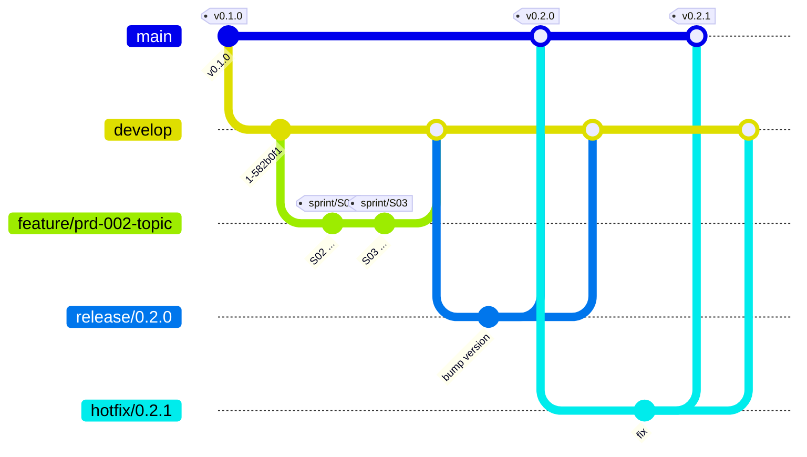

# Git 워크플로우 (Git Flow)

> Git Flow 기반 브랜치 전략, 커밋 메시지, PR, 버전 태깅 규칙을 정의합니다.
> 도구는 Git for Windows에 포함된 `git flow`(AVH Edition 1.12.3)를 사용합니다.
>
> [위키 홈](../README.md)

## 브랜치 전략

| 브랜치 | 수명 | 분기 원점 | 병합 대상 | 용도 |
|---|---|---|---|---|
| `main` | 영구 | - | - | 릴리스된 코드만 둔다. 모든 커밋은 태그(`vX.Y.Z`)가 붙은 릴리스 시점이다. |
| `develop` | 영구 | `main` | - | 다음 릴리스를 통합하는 기본 개발 브랜치 |
| `feature/prd-*` | 토픽 기간 | `develop` | `develop` | **토픽 브랜치**: PRD 하나의 모든 스프린트 작업 ([개발 관리](../10-delivery/README.md#git-운영)) |
| `feature/*` | 임시 | `develop` | `develop` | 토픽 밖 작업(위키, 설정, 워크플로우 개선) |
| `bugfix/*` | 임시 | `develop` | `develop` | 아직 릴리스되지 않은 버그 수정 |
| `release/*` | 임시 | `develop` | `main` + `develop` | 릴리스 준비(버전, 변경 이력, 최종 수정만) |
| `hotfix/*` | 임시 | `main` | `main` + `develop` | 릴리스된 버전의 긴급 수정 |



### 로컬 설정 (`git flow config`)

| 항목 | 값 |
|---|---|
| Production 브랜치 | `main` |
| Development 브랜치 | `develop` |
| Prefix | `feature/`, `bugfix/`, `release/`, `hotfix/`, `support/` |
| 버전 태그 prefix | `v` |

`git flow` 설정은 `.git/config`에 저장되어 저장소를 새로 clone하면 사라집니다. 새 환경에서는 다음을 실행합니다.

```bash
git checkout develop        # 원격 develop 추적 브랜치 생성
git checkout main
git flow init -d            # 기본값 사용
git config gitflow.prefix.versiontag v
```

### 기본 명령

```bash
git flow feature start <name>      # develop에서 feature/<name> 생성
# 병합은 git flow feature finish 대신 GitHub PR로 한다
git flow release start 0.2.0
git flow release finish 0.2.0      # main/develop 병합 + 태그 v0.2.0
git flow hotfix start 0.2.1
git flow hotfix finish 0.2.1
```

## 브랜치 네이밍

- 형식: `<type>/<짧은-설명>`, `kebab-case`, 영문 소문자
- 토픽 브랜치는 PRD ID를 소문자로 붙인다: `feature/prd-NNN-<토픽>`. 스프린트와 작업은 브랜치가 아니라 커밋으로 구분한다.
- 토픽 밖 작업은 ID 없이 쓴다. 토픽 회고 개선안은 `feature/retro-prd-NNN-<설명>`을 쓴다.
- 버전 브랜치는 SemVer 숫자만 쓴다: `release/0.2.0`, `hotfix/0.2.1`

| 예 | 설명 |
|---|---|
| `feature/prd-001-foundation` | 토픽 PRD-001 |
| `feature/retro-prd-001-reviewer-checklist` | PRD-001 회고 개선안 반영 |
| `feature/wiki-git-workflow` | 토픽 밖 문서 작업 |
| `bugfix/notification-retry` | 토픽 밖 미릴리스 버그 수정 |
| `release/0.1.0` | 첫 릴리스 준비 |
| `hotfix/0.1.1` | 릴리스 긴급 수정 |

## 커밋 메시지 규칙 (Conventional Commits)

```
<type>(<scope>): <제목>

<본문: 무엇을, 왜>

<footer: BREAKING CHANGE, Refs 등>
```

- 제목은 한국어로, 명령형 / 명사형으로 짧게(50자 안팎) 쓰고 끝에 마침표를 찍지 않는다.
- `scope`는 서비스명(`employee`, `notification` 등)이나 영역(`wiki`, `worklog`, `adr`, `ci`)을 쓴다.
- 호환성을 깨는 변경은 `type!:` 또는 footer의 `BREAKING CHANGE:`로 표시한다.
- 토픽 브랜치의 스프린트 작업 커밋은 제목 끝에 작업 ID를, footer에 작업자 단계를 적는다. 단계마다 로컬 커밋하고 push는 스프린트 종료 때 한다.

```
feat(employee): Employee Aggregate 구현 (S01-T02)

Stage: developer
```

| type | 용도 |
|---|---|
| `feat` | 기능 추가 |
| `fix` | 버그 수정 |
| `docs` | 문서 (위키, worklog, ADR) |
| `test` | 테스트 추가 / 수정 |
| `refactor` | 동작 변경 없는 구조 개선 |
| `perf` | 성능 개선 |
| `build` | 빌드, 의존성 |
| `ci` | CI 설정 |
| `chore` | 그 밖의 잡무 |

## Pull Request 규칙 & 템플릿

| 브랜치 | PR 시점 | 대상 | 병합 방식 |
|---|---|---|---|
| `feature/prd-*` (토픽) | `/prd`에서 **Draft PR** 생성 → `/retro` 후 Ready로 바꿔 병합 | `develop` | **Merge commit**: 스프린트 · 작업자별 커밋을 증빙으로 보존 |
| `feature/*`, `bugfix/*` (토픽 밖) | 작업 완료 시 | `develop` | **Squash merge** (PR 제목을 Conventional Commits 형식으로) |
| `release/*`, `hotfix/*` | 릴리스 / 수정 준비 완료 시 | `main` (병합 후 `develop`에 역병합) | **Merge commit** (`--no-ff`) |

- 토픽 PR 제목: `feat(<scope>): PRD-NNN <토픽 제목>`
- PR 병합 전 테스트 통과가 필수다([ADR-0006](../03-architecture/adr/0006-adopt-tdd.md)). CI 구성 후 필수 체크로 건다.
- 템플릿: 저장소 루트의 [`.github/pull_request_template.md`](../../.github/pull_request_template.md)

> 🟡 1인 과제 기준으로 리뷰어 승인은 필수로 두지 않습니다.

### GitHub 저장소 설정

| 항목 | 값 |
|---|---|
| 기본 브랜치 | `develop` (PR 기본 대상) |
| 병합 방식 | Squash merge, Merge commit 허용 / Rebase merge 끔 |
| 병합 후 브랜치 삭제 | 자동 |
| 브랜치 보호 (`main`, `develop`) | ⚪ 적용 불가: GitHub Free의 private 저장소는 브랜치 보호 / Ruleset을 지원하지 않음(HTTP 403) |

브랜치 보호가 없으므로 **`main` / `develop`에 직접 push하지 않는 것은 규칙으로 지킵니다.** GitHub Pro로 올리거나 저장소를 public으로 바꾸면 보호 규칙(PR 필수, force push / 삭제 금지)을 적용합니다.

## 코드 리뷰 가이드

> TODO: 코드가 생기면 체크리스트(레이어 의존 규칙, 테스트 유무, 도메인 용어 일치 등)를 정합니다.

## Issue / Project 관리

- 작업 관리는 GitHub Issues / Projects가 아니라 위키의 [개발 관리](../10-delivery/README.md)(PRD, 스프린트, 백로그, 기술부채 문서)에서 한다. 증빙이 git 이력으로 함께 남도록 하기 위해서다.
- 토픽 PR 본문에 PRD, 스프린트, 회고 문서 링크와 FR 충족 요약을 적는다. PR 번호는 PRD 문서의 `pr` 필드에 적는다.

## 버전 태깅 & 릴리스

- [SemVer](https://semver.org/lang/ko/) `vMAJOR.MINOR.PATCH`를 쓴다. 첫 기능 릴리스 전까지는 `0.x.y`로 둔다.
  - `MINOR`: 기능 추가 (release)
  - `PATCH`: 버그 수정 (hotfix)
- **토픽 하나 = 릴리스 하나**: 토픽 PR을 `develop`에 병합한 뒤 `release/0.N.0`을 만들어 `main`에 병합하고 `v0.N.0` 태그를 붙인다. 토픽마다 MINOR를 하나씩 올린다.
- 스프린트 종료는 토픽 브랜치에 태그 `sprint/SNN`(annotated)으로 남긴다. 릴리스 태그가 아니다.
- 태그는 `git flow release finish` / `hotfix finish`가 `main`에 만드는 annotated tag를 쓴다.
- 서비스별 독립 버전이 필요해지면(MSA) 태그 형식을 다시 정한다.

---

## 변경 이력

| 날짜 | 작성자 | 내용 |
|---|---|---|
| 2026-09-27 | - | 문서 생성 |
| 2026-09-27 | - | GitHub Flow → Git Flow로 변경, 브랜치 전략·네이밍·커밋·PR·태깅 규칙 초안 작성 |
| 2026-09-27 | - | GitHub 저장소 설정 기록, 브랜치 보호 적용 불가(Free private)로 직접 push 금지는 규칙으로 운영 |
| 2026-09-27 | - | 개발 관리(10-delivery)와 연결: 토픽 브랜치(`feature/prd-*`), 단계별 커밋, 토픽 PR은 Draft → Merge commit, 토픽 = 릴리스 |
