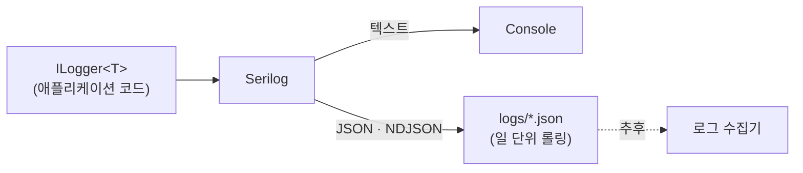

# 로깅 & 관측성

> 로그 출력 형식, 레벨, 작성 규칙과 분산 추적 · 헬스체크 기본 정책을 정의합니다. developer는 이 규칙대로 로그를 남기고, reviewer는 이 기준으로 판정합니다.
>
> [위키 홈](../README.md)

## 기본 원칙

- **출력 대상마다 형식을 나눈다.**
  - **콘솔: 사람이 읽기 좋은 텍스트**. 개발 · 디버깅용
  - **파일: JSON (한 줄에 이벤트 하나, NDJSON)**. 수집 · 분석용
- 모든 로그는 **구조화 로그**다. 값은 메시지 문자열에 이어 붙이지 않고 메시지 템플릿의 속성으로 남긴다. 그래야 JSON에서 필드로 검색 · 집계할 수 있다.
- 로그 한 건으로 **어느 서비스의, 어느 요청의, 어떤 일**인지 알 수 있어야 한다(서비스명, TraceId, 이벤트 ID).
- **개인정보를 남기지 않는다.** 직원 연락처를 다루는 시스템이므로 이름 · 전화번호 · 이메일 대신 ID를 남긴다.

## 구성 (Serilog)

애플리케이션 코드는 `Microsoft.Extensions.Logging`의 **`ILogger<T>`**만 쓰고, Serilog는 공급자(provider)로 연결합니다. Serilog 정적 `Log` 클래스는 쓰지 않습니다.



| 항목 | 콘솔 | 파일 |
|---|---|---|
| 형식 | 텍스트 템플릿 | JSON (CLEF: Compact Log Event Format) |
| 포매터 | `outputTemplate` | `RenderedCompactJsonFormatter` (완성된 메시지 `@m`과 템플릿 해시 `@i` 포함) |
| 경로 | stdout | `logs/<service>-<yyyyMMdd>.json` |
| 롤링 | - | 일 단위 + 파일당 100MB 초과 시 분할 |
| 보관 | - | 최근 14개 파일 (수집기 도입 후 조정) |
| 최소 레벨 | 개발 `Debug` / 그 외 `Information` | `Information` |
| 쓰기 방식 | 동기 | 비동기(`Serilog.Sinks.Async`)로 요청 처리를 막지 않음 |

> 🟡 **로그 수집기 미정**(Seq / Loki / ELK). CLEF는 Seq와 여러 수집기가 바로 읽고, ELK를 택하면 ECS 포매터(`Elastic.CommonSchema.Serilog`)로 바꿀 수 있습니다. 필드 규칙은 아래 표를 기준으로 유지합니다.

### 콘솔 출력 (텍스트)

```
outputTemplate: [{Timestamp:HH:mm:ss.fff} {Level:u3}] {ServiceName} {SourceContext} ({TraceId}) {Message:lj}{NewLine}{Exception}
```

```
[14:03:12.418 INF] employee EmergencyHub.Employee.Application.Employees.Commands.RegisterEmployee.RegisterEmployeeCommandHandler (4bf92f3577b34da6a3ce929d0e0e4736) Employee 0192a1b3-... registered with channels 3
```

### 파일 출력 (JSON)

```json
{"@t":"2026-09-27T05:03:12.4181234Z","@mt":"Employee {EmployeeId} registered with channels {NotificationChannels}","@m":"Employee 0192a1b3-... registered with channels 3","@i":"a1b2c3d4","@l":"Information","@tr":"4bf92f3577b34da6a3ce929d0e0e4736","@sp":"00f067aa0ba902b7","EventId":{"Id":20001,"Name":"EmployeeRegistered"},"EmployeeId":"0192a1b3-...","NotificationChannels":3,"SourceContext":"EmergencyHub.Employee.Application...RegisterEmployeeCommandHandler","ServiceName":"employee","Environment":"Development","MachineName":"dev-01"}
```

- 시각(`@t`)은 **UTC ISO 8601**
- 코드값은 JSON에서도 **정수**로 남긴다([ADR-0008](../03-architecture/adr/0008-integer-codes-and-bitmask.md)). 콘솔에서 읽기 어려우면 메시지에 이름을 함께 쓰지 말고 코드 정의 표를 본다.
- 설정은 코드가 아니라 `appsettings.json`의 `Serilog` 절(`ReadFrom.Configuration`)로 관리하고, 환경별 파일에서 레벨만 바꾼다.

### 공통 필드 (Enricher)

| 필드 | 값 | 출처 |
|---|---|---|
| `ServiceName` | `employee`, `notification` 등 | 설정 (`Serilog:Properties:ServiceName`) |
| `Environment` | `Development` / `Staging` / `Production` | 호스트 환경 |
| `MachineName` | 호스트 이름 | `Enrich.WithMachineName()` |
| `@tr` / `@sp` (`TraceId` / `SpanId`) | W3C Trace Context | `Activity.Current` (OpenTelemetry) |
| `SourceContext` | 로그를 남긴 클래스 | `ILogger<T>` |
| `EventId` | 로그 이벤트 번호 · 이름 | `[LoggerMessage]` |
| `RequestPath`, `StatusCode`, `Elapsed` | 요청 로그 | `UseSerilogRequestLogging()` |
| `UserId` | 인증된 사용자 ID (ID만) | 미들웨어 `LogContext` |

## 로그 레벨 기준

| 레벨 | 쓰는 경우 | 예 |
|---|---|---|
| `Critical` | 서비스가 계속 동작할 수 없음 | DB 연결 불가로 시작 실패, 메시지 브로커 영구 단절 |
| `Error` | 요청 / 작업 하나가 **예상하지 못한 이유로** 실패 | 처리되지 않은 예외, Outbox 발행 최종 실패 |
| `Warning` | 비정상이지만 스스로 회복했거나 곧 문제가 될 상황 | 외부 발송 재시도, 동시성 충돌, 느린 쿼리 |
| `Information` | 업무 흐름의 주요 사건 (운영에서 기본으로 보는 수준) | 긴급 상황 전파 시작 / 완료, 직원 등록, 요청 로그 |
| `Debug` | 개발 중 흐름 확인 | Handler 진입 / 결과, 쿼리 조건 |
| `Trace` | 아주 상세한 내부 상태 | 운영에서 켜지 않음 |

- **예상 가능한 실패(`Result` 실패)는 `Error`가 아니다.** 검증 실패 · 대상 없음 · 규칙 위반은 요청 로그의 상태 코드로 충분하고, 업무상 의미가 있을 때만 `Information` / `Warning`으로 남긴다.
- 프레임워크 로그는 `Microsoft`, `System`을 `Warning`으로 낮추고 `Microsoft.Hosting.Lifetime`만 `Information`으로 둔다. EF Core SQL 로그는 개발 환경에서만 `Information`으로 켠다.

## 로그 작성 규칙

- **메시지 템플릿을 쓴다.** 문자열 보간(`$"..."`)과 문자열 연결로 메시지를 만들지 않는다(구조화 속성이 사라지고 매번 문자열을 만든다).
- 템플릿 속성 이름은 **PascalCase**, 같은 개념은 모든 서비스에서 같은 이름을 쓴다(`EmployeeId`, `EmergencyId`, `NotificationChannels`).
- 반복해서 남기는 로그는 **`[LoggerMessage]` 소스 생성기**로 정의한다. 이벤트 ID는 **정수**이며, 범위는 [에러 코드 · 로그 이벤트 ID 범위](../05-api/error-codes.md#로그-이벤트-id-범위)를 따른다(에러 코드와 겹치지 않음).
- 객체 전체 분해(`{@Employee}`)는 쓰지 않는다. 필요한 속성만 남긴다(개인정보 유출과 로그 크기 방지).
- 예외는 **경계에서 한 번만** 로그로 남긴다(전역 예외 처리기, 백그라운드 작업 최상위). 잡아서 로그를 남기고 다시 던지는 것을 여러 층에서 반복하지 않는다.
- 예외는 `logger.LogError(exception, "...")`처럼 **예외 객체를 첫 인자로** 넘긴다. `exception.Message`만 남기지 않는다.
- Repository에는 로그를 두지 않는다([Repository 규칙](coding-conventions.md#repository-규칙-ef-core)). 로그는 Handler, 파이프라인 동작, 인프라 어댑터에서 남긴다.
- 요청마다 시작 / 종료 로그를 직접 남기지 않는다. `UseSerilogRequestLogging()`이 요청당 한 줄을 남긴다.

```csharp
internal static partial class EmployeeLogs
{
    [LoggerMessage(EventId = 20001, Level = LogLevel.Information,
        Message = "Employee {EmployeeId} registered with channels {NotificationChannels}")]
    public static partial void EmployeeRegistered(this ILogger logger, Guid employeeId, NotificationChannels notificationChannels);
}

// 사용
logger.EmployeeRegistered(employee.Id.Value, employee.NotificationChannels);

// 금지
logger.LogInformation($"Employee {employee.Id} registered");          // 문자열 보간
logger.LogInformation("Employee {Email} registered", employee.Email); // 개인정보
```

## 개인정보 · 보안

| 남기지 않음 | 대신 남김 |
|---|---|
| 이름, 전화번호, 이메일, 주소 | 직원 ID (`EmployeeId`) |
| 비밀번호, 토큰, API 키, 연결 문자열 | 없음 (필요하면 "설정됨 / 없음" 여부만) |
| 요청 / 응답 본문 전체 | 요청 경로, 상태 코드, 처리 시간 |
| 외부 발송 메시지 본문 | 발송 ID, 채널 코드, 결과 코드 |

- 불가피하게 식별 정보가 필요하면 마스킹한다(예: 전화번호 뒤 4자리 `***-****-1234`). 마스킹 유틸리티는 BuildingBlocks에 둔다.
- 로그 파일은 저장소에 커밋하지 않는다(`.gitignore`에 `logs/`).

## 분산 추적 (OpenTelemetry / Correlation ID)

- 추적은 **OpenTelemetry**로 하고, 서비스 간 전파는 **W3C Trace Context**(`traceparent`)를 쓴다. 별도 Correlation ID 헤더는 만들지 않고 `TraceId`를 상관 ID로 쓴다.
- HTTP 호출은 자동 계측(ASP.NET Core, HttpClient)으로 전파하고, **메시지(통합 이벤트)는 헤더에 `traceparent`를 넣어** 소비 측에서 이어 받는다.
- 로그의 `@tr` / `@sp`는 현재 `Activity`에서 채워지므로, 로그와 추적이 TraceId로 연결된다.
- 응답 헤더에 `traceparent`를 돌려주어 문제 신고 시 TraceId로 로그를 찾을 수 있게 한다.

> 🟡 추적 수집 백엔드(Jaeger / Tempo 등)와 OTLP 내보내기 설정은 인프라 구성 때 정합니다.

## 메트릭

> TODO: OpenTelemetry Metrics로 기본 계측(ASP.NET Core, HttpClient, 런타임)을 켜고, 업무 메트릭(전파 소요 시간, 응답률)은 긴급 상황 전파 토픽에서 정합니다.

## 헬스체크

- 엔드포인트: `/health/live`(프로세스 생존), `/health/ready`(DB · 메시지 브로커 등 의존성 준비)
- 헬스체크 요청은 요청 로그에서 제외한다(로그 잡음 방지).

## 알림 기준

> TODO: 로그 수집기 도입 후 정합니다. 기본안은 `Critical` 즉시, `Error` 급증(5분 N건 이상) 시 알림입니다.

---

## 변경 이력

| 날짜 | 작성자 | 내용 |
|---|---|---|
| 2026-09-27 | - | 문서 생성 |
| 2026-09-27 | - | 로그 이벤트 ID 범위를 에러 코드 문서로 연결, 예시 ID 수정(20001) |
| 2026-09-27 | - | 로그 컨벤션 초안: 콘솔 텍스트 / 파일 JSON(CLEF), 공통 필드, 레벨 기준, 작성 규칙(`[LoggerMessage]`, 정수 이벤트 ID), 개인정보, 분산 추적, 헬스체크 |
