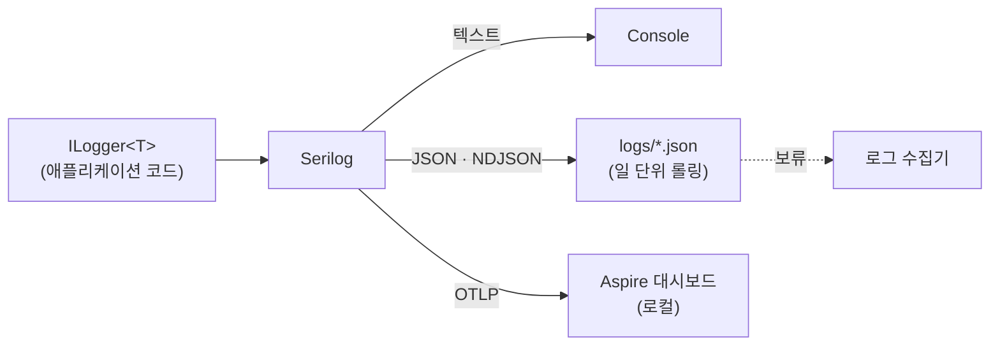

# 로깅 & 관측성

> 로그 출력 형식, 레벨, 작성 규칙과 분산 추적 · 헬스체크 기본 정책을 정의합니다. developer는 이 규칙대로 로그를 남기고, reviewer는 이 기준으로 판정합니다.
> 결정 근거: [ADR-0020 로깅 · 관측 구현](../03-architecture/adr/0020-logging-with-serilog-and-otlp.md), [ADR-0023 도입 보류](../03-architecture/adr/0023-deferred-adoptions.md)(로그 수집기 · 추적 백엔드)
>
> [위키 홈](../README.md)

## 기본 원칙

- **출력 대상마다 형식을 나눈다.**
  - **콘솔: 사람이 읽기 좋은 텍스트**. 개발 · 디버깅용
  - **파일: JSON (한 줄에 이벤트 하나, NDJSON)**. 수집 · 분석용
- 모든 로그는 **구조화 로그**다. 값은 메시지 문자열에 이어 붙이지 않고 메시지 템플릿의 속성으로 남긴다. 그래야 JSON에서 필드로 검색 · 집계할 수 있다.
- 로그 한 건으로 **어느 서비스의, 어느 요청의, 어떤 일**인지 알 수 있어야 한다(서비스명, TraceId, 이벤트 ID).
- **개인정보를 남기지 않는다.** 직원 연락처를 다루는 시스템이므로 이름 · 전화번호 · 이메일 대신 ID를 남긴다.

## 구성 (Serilog)

애플리케이션 코드는 `Microsoft.Extensions.Logging`의 **`ILogger<T>`**만 쓰고, Serilog는 공급자(provider)로 연결합니다. Serilog 정적 `Log` 클래스는 쓰지 않습니다.



| 항목 | 콘솔 | 파일 |
|---|---|---|
| 형식 | 텍스트 템플릿 | JSON (CLEF: Compact Log Event Format) |
| 포매터 | `outputTemplate` | `RenderedCompactJsonFormatter` (완성된 메시지 `@m`과 템플릿 해시 `@i` 포함) |
| 경로 | stdout | `logs/<service>-<yyyyMMdd>.json` |
| 롤링 | - | 일 단위 + 파일당 100MB 초과 시 분할 |
| 보관 | - | 최근 14개 파일 (수집기 도입 후 조정) |
| 최소 레벨 | 개발 `Debug` / 그 외 `Information` | `Information` |
| 쓰기 방식 | 동기 | 비동기(`Serilog.Sinks.Async`, [패키지 버전](../03-architecture/package-versions.md#애플리케이션))로 요청 처리를 막지 않음 |

> **로그 수집기는 도입 보류**입니다([ADR-0023](../03-architecture/adr/0023-deferred-adoptions.md), 재검토: 로컬 밖 공유 환경 구성 또는 알림 기준 설계 때). 로컬 관측은 Aspire 대시보드(OTLP)로 합니다. 후보는 Seq / Loki / ELK이고, CLEF는 Seq와 여러 수집기가 바로 읽으며 ELK를 택하면 ECS 포매터(`Elastic.CommonSchema.Serilog`)로 바꿀 수 있습니다. 필드 규칙은 아래 표를 기준으로 유지합니다.

### 등록과 설정 (ADR-0020)

- ServiceDefaults의 공통 확장(`AddServiceDefaults`)이 `builder.Services.AddSerilog((services, configuration) => ...)`로 등록한다. Api와 MigrationService가 같은 코드를 쓴다. 정적 `Log`와 부트스트랩 로거는 쓰지 않는다.
- 싱크 · 수준은 `appsettings*.json`의 `Serilog` 절(`ReadFrom.Configuration`)로 관리한다. **수준은 `Serilog:MinimumLevel`에서만 정하고 `Logging:LogLevel` 절은 두지 않는다**(Serilog가 로거 팩터리를 교체하므로 쓰이지 않는다). 테스트 · CI 호스트는 설정으로 파일 싱크를 끈다.
- OTLP 싱크(Serilog.Sinks.OpenTelemetry)는 `OTEL_EXPORTER_OTLP_ENDPOINT`가 있을 때만 코드에서 붙인다(Aspire가 주입. 테스트 · CI에는 없음). 싱크가 `OTEL_*` 환경 변수를 읽어 로그가 트레이스와 같은 서비스로 묶인다.
- 구성 순서(`SerilogDefaults.Configure`, S03-T03): `ReadFrom.Configuration` → `ReadFrom.Services`(DI에 등록한 `ILogEventSink` · 보강기를 싱크로 받음. 통합 테스트의 수집 싱크는 `ConfigureTestServices`로 등록) → `Enrich.FromLogContext` · `WithMachineName` · `Environment` 속성 → `MinimumLevel.Override(ExceptionHandlerMiddleware 범주, Off)` → (엔드포인트가 있으면) OTLP 싱크. 범주 끄기를 설정보다 **뒤에** 두어 `Serilog:MinimumLevel:Override`로 다시 켤 수 없다(BL-075). 정적 `Log.Logger`는 바꾸지 않는다(`preserveStaticLogger: true`).

**Serilog / OpenTelemetry 로그 중복 방지**:

1. ServiceDefaults는 OpenTelemetry SDK 로그 공급자를 등록하지 않는다(Aspire 템플릿의 `builder.Logging.AddOpenTelemetry(...)` 제거, TD-012).
2. OTLP 내보내기는 `UseOtlpExporter()` 대신 `WithTracing` · `WithMetrics` 안의 `AddOtlpExporter()`로 트레이스 · 메트릭에만 붙인다.
3. Serilog는 `writeToProviders: false`(기본)로 등록한다.
4. 대시보드에서 같은 이벤트가 한 번만 보이는지는 S03-T04에서 확인한다.

### Aspire 연동 (Serilog → OTLP, ADR-0020)

로컬에서는 AppHost가 띄운 Aspire 대시보드가 로그 · 트레이스 · 메트릭을 모두 받습니다. 경로는 신호마다 하나입니다.

| 신호 | 경로 | 켜는 조건 |
|---|---|---|
| 로그 | `ILogger<T>` → Serilog → **Serilog OTLP 싱크**(`Serilog.Sinks.OpenTelemetry`) → 대시보드 구조화 로그 | `OtlpEndpoint.IsConfigured`(`OTEL_EXPORTER_OTLP_ENDPOINT` 값이 있음). `SerilogDefaults.Configure`가 마지막에 붙인다 |
| 트레이스 | OpenTelemetry SDK(ASP.NET Core · HttpClient · Npgsql 계측) → `WithTracing` 안의 `AddOtlpExporter()` → 대시보드 추적 | 같은 조건(`ServiceDefaultsExtensions`) |
| 메트릭 | OpenTelemetry SDK → `WithMetrics` 안의 `AddOtlpExporter()` → 대시보드 메트릭 | 같은 조건 |

- 로그는 **Serilog OTLP 싱크 한 경로로만** 나간다. OpenTelemetry 로그 공급자는 등록하지 않는다(위 중복 방지 1 ~ 3). 싱크가 `OTEL_*` 환경 변수를 읽으므로 로그와 트레이스가 대시보드에서 같은 서비스 · TraceId로 묶인다.
- `OTEL_EXPORTER_OTLP_ENDPOINT` 등 `OTEL_*` 값은 AppHost가 프로젝트 리소스(Api · MigrationService)에 주입한다. 서비스 코드 · `appsettings*.json`에 엔드포인트를 적지 않는다. 테스트 · CI 호스트에는 값이 없어 OTLP 연결을 시도하지 않는다.
- 대시보드 OTLP 수신 주소는 AppHost `launchSettings.json` 프로필이 정한다: `https` 프로필(기본) `ASPIRE_DASHBOARD_OTLP_ENDPOINT_URL` = `https://localhost:21180`, `http` 프로필 `http://localhost:19180`(+ `ASPIRE_ALLOW_UNSECURED_TRANSPORT=true`).
- **`https` 프로필은 ASP.NET Core 개발 인증서를 신뢰해야 대시보드에 로그 · 트레이스가 보인다.** 신뢰하지 않으면 OTLP 전송이 TLS에서 실패해 구조화 로그 · 추적이 0건이고, 앱 파일 로그와 HTTP 동작은 정상이다(S03-T05 실측, [증빙](../10-delivery/evidence/S03-T05/README.md), BL-099). 확인 · 신뢰 명령과 `http` 프로필 대안은 [로컬 개발 환경 구성 · 개발 인증서 (https 프로필)](../01-getting-started/local-setup.md#개발-인증서-https-프로필)에서 다룬다(S04-T03).

### 콘솔 출력 (텍스트)

```
outputTemplate: [{Timestamp:HH:mm:ss.fff} {Level:u3}] {ServiceName} {SourceContext} ({TraceId}) {Message:lj}{NewLine}{Exception}
```

```
[14:03:12.418 INF] employee EmergencyHub.Employee.Application.Employees.Commands.RegisterEmployees.RegisterEmployeesCommandHandler (4bf92f3577b34da6a3ce929d0e0e4736) Employee 0192a1b3-... registered
```

### 파일 출력 (JSON)

```json
{"@t":"2026-09-27T05:03:12.4181234Z","@mt":"Employee {EmployeeId} registered","@m":"Employee 0192a1b3-... registered","@i":"a1b2c3d4","@l":"Information","@tr":"4bf92f3577b34da6a3ce929d0e0e4736","@sp":"00f067aa0ba902b7","EventId":{"Id":20001,"Name":"EmployeeRegistered"},"EmployeeId":"0192a1b3-...","SourceContext":"EmergencyHub.Employee.Application...RegisterEmployeesCommandHandler","ServiceName":"employee","Environment":"Development","MachineName":"dev-01"}
```

- 시각(`@t`)은 **UTC ISO 8601**
- 코드값은 JSON에서도 **정수**로 남긴다([ADR-0008](../03-architecture/adr/0008-integer-codes-and-bitmask.md)). 콘솔에서 읽기 어려우면 메시지에 이름을 함께 쓰지 말고 코드 정의 표를 본다.
- 설정은 코드가 아니라 `appsettings.json`의 `Serilog` 절(`ReadFrom.Configuration`)로 관리하고, 환경별 파일에서 레벨만 바꾼다(`Logging:LogLevel`은 쓰지 않음).

### 공통 필드 (Enricher)

| 필드 | 값 | 출처 |
|---|---|---|
| `ServiceName` | `employee`, `notification` 등 | 설정 (`Serilog:Properties:ServiceName`) |
| `Environment` | `Development` / `Staging` / `Production` | 호스트 환경 |
| `MachineName` | 호스트 이름 | `Enrich.WithMachineName()` (Serilog.Enrichers.Environment) |
| `@tr` / `@sp` (`TraceId` / `SpanId`) | W3C Trace Context | `Activity.Current` (OpenTelemetry) |
| `SourceContext` | 로그를 남긴 클래스 | `ILogger<T>` |
| `EventId` | 로그 이벤트 번호 · 이름 | `[LoggerMessage]` |
| `RequestPath`, `StatusCode`, `Elapsed` | 요청 로그 | `UseSerilogRequestLogging()` |
| `UserId` | 인증된 사용자 ID (ID만) | 미들웨어 `LogContext` |

## 로그 레벨 기준

| 레벨 | 쓰는 경우 | 예 |
|---|---|---|
| `Critical` | 서비스가 계속 동작할 수 없음 | DB 연결 불가로 시작 실패, 메시지 브로커 영구 단절 |
| `Error` | 요청 / 작업 하나가 **예상하지 못한 이유로** 실패 | 처리되지 않은 예외(이벤트 1 → 9001), 마이그레이션 실패(20902), Outbox 발행 최종 실패(도입 보류) |
| `Warning` | 비정상이지만 스스로 회복했거나 곧 문제가 될 상황 | 외부 발송 재시도, 동시성 충돌, 느린 쿼리, DB 재시도 한도 초과로 분류된 예외(이벤트 301 → 9003) |
| `Information` | 업무 흐름의 주요 사건 (운영에서 기본으로 보는 수준) | 긴급 상황 전파 시작 / 완료, 직원 등록, 요청 로그 |
| `Debug` | 개발 중 흐름 확인 | Handler 진입 / 결과, 쿼리 조건 |
| `Trace` | 아주 상세한 내부 상태 | 운영에서 켜지 않음 |

- **예상 가능한 실패(`Result` 실패)는 `Error`가 아니다.** 검증 실패 · 대상 없음 · 규칙 위반은 요청 로그의 상태 코드로 충분하고, 업무상 의미가 있을 때만 `Information` / `Warning`으로 남긴다.
- **재시도 한도 초과(9003)는 `Warning`, 최종 실패는 `Error`로 나눈다(BL-105).** EF Core 실행 전략의 `RetryLimitExceededException`은 예외 분류기(`PersistenceExceptionClassifier`)가 9003(`Unavailable`, 503)으로 분류하고, 전역 예외 처리기가 이벤트 301 `ExceptionClassified`(`Warning`)로 한 번 남긴다([에러 코드 · API 로그 이벤트](../05-api/error-codes.md#api-로그-이벤트)). 원인이 일시 장애로 알려져 있고 클라이언트가 재시도할 수 있으므로 `Error`가 아니다. 반면 Outbox 발행처럼 재시도를 다 쓴 뒤 **다시 시도할 주체가 없는** 최종 실패는 작업이 유실되므로 `Error`다. 분류기가 모두 `null`을 돌려준 예외는 원인을 알 수 없으므로 이벤트 1(`Error`, 9001)이다.
- 프레임워크 로그는 `Microsoft`, `System`을 `Warning`으로 낮추고 `Microsoft.Hosting.Lifetime`만 `Information`으로 둔다. `Microsoft.AspNetCore` = `Warning`으로 ASP.NET Core 자체 요청 로그를 낮춰 `UseSerilogRequestLogging()`과 중복되지 않게 한다.
- EF Core 로그 수준(`Serilog:MinimumLevel:Override`): 기본 `Microsoft.EntityFrameworkCore` = `Warning`, `Microsoft.EntityFrameworkCore.Database.Command` = `Warning`. `appsettings.Development.json`에서만 `Microsoft.EntityFrameworkCore.Database.Command` = `Information`(SQL 문장 · 소요 시간, 파라미터 값은 `?`). Npgsql 자체 로그는 켜지 않는다(SQL 로그는 EF Core 범주 하나로, [ADR-0020](../03-architecture/adr/0020-logging-with-serilog-and-otlp.md)).
- EF Core 실패 이벤트 `CommandError` · `SaveChangesFailed` · `TransactionError`는 `Debug`로 낮춘다(BL-023 결정, S03-T06). 정상 경합(`23505` → 서비스 코드)과 재시도로 회복한 일시 오류에 `Error`가 남지 않게 하고, 예상 밖 DB 오류는 경계(전역 예외 처리기 이벤트 1, MigrationService Worker)에서 한 번만 남긴다. 설정 위치는 공통 옵션 구성 `UseBuildingBlocksNpgsql` 한 곳이다(`Serilog:MinimumLevel:Override`로 하지 않음, 범주가 아니라 이벤트 단위이기 때문). 근거와 실측은 [데이터베이스 · 영속성 예외 변환](database.md#영속성-예외-변환).

## 로그 작성 규칙

- **메시지 템플릿을 쓴다.** 문자열 보간(`$"..."`)과 문자열 연결로 메시지를 만들지 않는다(구조화 속성이 사라지고 매번 문자열을 만든다).
- 템플릿 속성 이름은 **PascalCase**, 같은 개념은 모든 서비스에서 같은 이름을 쓴다(`EmployeeId`, `EmergencyId`, `NotificationChannels`).
- 반복해서 남기는 로그는 **`[LoggerMessage]` 소스 생성기**로 정의한다. 이벤트 ID는 **정수**이며, 범위는 [에러 코드 · 로그 이벤트 ID 범위](../05-api/error-codes.md#로그-이벤트-id-범위)를 따른다(에러 코드와 겹치지 않음).
- 객체 전체 분해(`{@Employee}`)는 쓰지 않는다. 필요한 속성만 남긴다(개인정보 유출과 로그 크기 방지).
- 예외는 **경계에서 한 번만** 로그로 남긴다(전역 예외 처리기, 백그라운드 작업 최상위). 잡아서 로그를 남기고 다시 던지는 것을 여러 층에서 반복하지 않는다.
- 예외는 `logger.LogError(exception, "...")`처럼 **예외 객체를 첫 인자로** 넘긴다. `exception.Message`만 남기지 않는다.
  - 요청 처리 중 처리되지 않은 예외는 전역 예외 처리기(BuildingBlocks.Api)가 **메시지를 뺀 예외 사본**(형식 이름 · 스택 트레이스 · 내부 예외 사슬, `RedactedException`)을 넘겨 이벤트 ID 1로 한 번 남긴다. 변환되지 않은 DB 예외의 메시지에 제약 이름 · SQL · 값이 들어가기 때문이다([ADR-0024](../03-architecture/adr/0024-building-blocks-api-for-common-http-handling.md), [에러 코드 · API 로그 이벤트](../05-api/error-codes.md#api-로그-이벤트)). 원인은 형식 이름 · 스택 · TraceId로 찾는다.
  - 프레임워크 `ExceptionHandlerMiddleware`의 자체 `Error` 로그(원본 메시지 포함)는 범주 `Microsoft.AspNetCore.Diagnostics.ExceptionHandlerMiddleware`를 꺼서 남기지 않는다. `AddBuildingBlocksApi`가 Microsoft.Extensions.Logging 필터를 걸고, Serilog 설정(ServiceDefaults)도 같은 범주를 `MinimumLevel.Override`로 끈다.
- Repository에는 로그를 두지 않는다([Repository 규칙](coding-conventions.md#repository-규칙-ef-core)). 로그는 Handler, 파이프라인 동작, 인프라 어댑터에서 남긴다.
- 요청마다 시작 / 종료 로그를 직접 남기지 않는다. `UseSerilogRequestLogging()`이 요청당 한 줄을 남긴다.
  - 요청 로그 미들웨어는 `options.Logger`가 없으면 정적 `Serilog.Log`에 쓰는데, ServiceDefaults는 정적 로거를 바꾸지 않는다(`preserveStaticLogger: true`). 그래서 `AddServiceDefaults`가 `IOptions<RequestLoggingOptions>`의 `Logger`를 DI의 Serilog 로거로 채운다(S03-T05 발견 · S03-T07 수정). 서비스 코드는 `options.Logger`를 따로 주지 않는다(주면 그 값이 이긴다).

```csharp
// 실제 정의: src/Services/Employee/EmergencyHub.Employee.Application/Employees/EmployeeLogs.cs (XML 문서 주석 제외)
internal static partial class EmployeeLogs
{
    [LoggerMessage(EventId = 20001, Level = LogLevel.Information, Message = "Employee {EmployeeId} registered")]
    public static partial void EmployeeRegistered(this ILogger logger, Guid employeeId);
}

// 사용 (RegisterEmployeesCommandHandler, 등록한 직원마다 한 줄)
logger.EmployeeRegistered(employee.Id.Value);

// 금지
logger.LogInformation($"Employee {employee.Id} registered");          // 문자열 보간
logger.LogInformation("Employee {Email} registered", employee.Email); // 개인정보 (Value Object record는 ToString이 값을 출력, BL-130)
logger.LogInformation("Import {Command} failed", command);           // Command · Value Object를 인자로 넘김 (BL-130)
```

## 개인정보 · 보안

| 남기지 않음 | 대신 남김 |
|---|---|
| 이름, 전화번호, 이메일, 주소 | 직원 ID (`EmployeeId`) |
| 비밀번호, 토큰, API 키, 연결 문자열 | 없음 (필요하면 "설정됨 / 없음" 여부만) |
| 요청 / 응답 본문 전체 | 요청 경로, 상태 코드, 처리 시간 |
| 외부 발송 메시지 본문 | 발송 ID, 채널 코드, 결과 코드 |

- 불가피하게 식별 정보가 필요하면 마스킹한다(예: 전화번호 뒤 4자리 `***-****-1234`). 마스킹 유틸리티는 BuildingBlocks에 둔다.

EF Core · Npgsql 민감 데이터 규칙([ADR-0020](../03-architecture/adr/0020-logging-with-serilog-and-otlp.md)):

- `EnableSensitiveDataLogging`은 **Development에서만, 설정 플래그로 켤 수 있고 기본은 꺼짐**이다(`IHostEnvironment.IsDevelopment() && Database:EnableSensitiveDataLogging`). Testing · CI · Staging · Production에서는 설정과 무관하게 끈다. 판단은 DbContext 공용 등록 확장 메서드 한 곳에서만 한다.
  - **현재 상태(2026-09-28): opt-in 경로는 구현되지 않았고 모든 환경에서 꺼져 있다**(BL-094, 안전 쪽). `src`에 `EnableSensitiveDataLogging` 호출이 없고 `Database:EnableSensitiveDataLogging` 키도 읽지 않는다. Employee Api `Program`은 이 값을 판단 · 설정하지 않으며, 단위 테스트 `ProgramTests.ConfigureServices_Development_DoesNotEnableSensitiveDataLogging`이 Development에서도 꺼져 있음을 고정한다. 구현(공용 등록 확장 한 곳 + 환경별 단위 테스트)은 로컬 SQL 파라미터 디버깅이 필요해질 때 한다.
- `EnableDetailedErrors`는 Development에서만 켠다. 현재 `src`에 `EnableDetailedErrors` 호출은 없다(모든 환경에서 꺼짐).
- SQL 파라미터 값은 기록하지 않는다: Npgsql `parameterLoggingEnabled` · `EnableParameterLogging`을 쓰지 않는다.
- 연결 문자열에 `Include Error Detail=true`(제약 위반 예외에 값 노출) · `Persist Security Info=true`를 쓰지 않는다. 제약 위반 변환 로그에는 SqlState, 제약 이름, 엔티티 형식 이름만 남긴다.
- `IConfiguration`, `ConnectionStrings` 절, `ConnectionStrings__*` 환경 변수를 통째로 로그에 쓰지 않는다. 시작 로그는 호스트 · DB 이름 · 사용자까지만 남긴다.
- 로그 파일은 저장소에 커밋하지 않는다(`.gitignore`에 `logs/`).

## 분산 추적 (OpenTelemetry / Correlation ID)

- 추적은 **OpenTelemetry**로 하고, 서비스 간 전파는 **W3C Trace Context**(`traceparent`)를 쓴다. 별도 Correlation ID 헤더는 만들지 않고 `TraceId`를 상관 ID로 쓴다.
- HTTP 호출은 자동 계측(ASP.NET Core, HttpClient)으로 전파하고, **메시지(통합 이벤트)는 헤더에 `traceparent`를 넣어** 소비 측에서 이어 받는다.
- 로그의 `@tr` / `@sp`는 현재 `Activity`에서 채워지므로, 로그와 추적이 TraceId로 연결된다.
- 응답 헤더에 `traceparent`를 돌려주어 문제 신고 시 TraceId로 로그를 찾을 수 있게 한다.

- **OTLP 내보내기**: ServiceDefaults가 트레이스 · 메트릭을 OTLP로 Aspire 대시보드에 보낸다(OpenTelemetry 1.19.x, 템플릿의 1.9.0은 취약점 대상이라 쓰지 않음). 계측은 ASP.NET Core · HttpClient · Npgsql.OpenTelemetry `AddNpgsql()`이고, EF Core용 OTel 계측은 Npgsql span과 중복되므로 추가하지 않는다. 헬스체크 경로는 추적에서 뺀다([ADR-0020](../03-architecture/adr/0020-logging-with-serilog-and-otlp.md)).
- **추적 수집 백엔드(Jaeger / Tempo 등)는 도입 보류**다([ADR-0023](../03-architecture/adr/0023-deferred-adoptions.md)). OTLP 표준 출력을 유지하므로 도입할 때는 내보내기 대상 설정만 바꾼다.

## 메트릭

OpenTelemetry Metrics로 기본 계측(ASP.NET Core, HttpClient, 런타임)을 켜고 OTLP로 Aspire 대시보드에 보낸다([ADR-0020](../03-architecture/adr/0020-logging-with-serilog-and-otlp.md)).

> TODO: 업무 메트릭(전파 소요 시간, 응답률)은 긴급 상황 전파 토픽에서 정합니다.

## 헬스체크

ServiceDefaults의 `MapDefaultEndpoints`가 매핑합니다(S03-T03, BL-030). 경로 · 태그 상수는 `HealthEndpoints`에 있습니다.

| 경로 | 실행하는 검사 | 용도 |
|---|---|---|
| `/health/live` | 없음(등록된 검사를 하나도 실행하지 않음) | 프로세스 생존. DB가 내려가도 200 |
| `/health/ready` | `ready` 태그가 붙은 검사만 | 의존성 준비. 서비스 Api가 쓰기 · 읽기 DbContext 검사를 `ready` 태그로 등록(S03-T04) |

- **노출 환경: 모든 환경**에 매핑한다. Aspire 템플릿은 `/health` · `/alive`를 Development에서만 매핑하지만, 대시보드 · 오케스트레이터의 준비 판단이 환경과 무관하게 같은 경로를 써야 하므로 바꿨다(템플릿과의 차이, TD-012). 템플릿 경로 `/health` · `/alive`는 매핑하지 않는다.
- **응답 본문은 상태 문자열만**(`Healthy` / `Degraded` / `Unhealthy`, 기본 작성기)이다. 검사 이름 · 설명 · 예외 · 소요 시간을 싣는 JSON 작성기는 쓰지 않는다. 모든 환경에 인증 없이 노출되므로 DB 호스트 · 연결 오류 메시지 같은 내부 정보가 나가지 않게 하기 위해서다. 상태 코드는 `Healthy` · `Degraded` 200, `Unhealthy` 503(기본값)이다.
- 검사 실패 원인은 응답이 아니라 로그 · 추적에서 본다.
- **DB 정지 때 응답 시간(S03-T07 실측, BL-108 기록)**: PostgreSQL을 멈춘 상태에서 `/health/ready`는 약 15.0초 뒤 503을 돌려주고 `/health/live`는 200이며, DB를 다시 켜면 `/health/ready`가 곧바로 200으로 돌아왔다. 15초는 DbContext 검사가 연결 제한 시간만큼 기다리기 때문이고, 헬스 검사 전용 제한 시간은 두지 않았다. 프로브 제한 시간 · 주기와 함께 배포 토픽에서 정한다(BL-108).
- ServiceDefaults는 EF Core를 참조하지 않는다. DB 검사(`AddDbContextCheck`)는 서비스 Api가 등록한다. MigrationService는 Worker라 헬스 엔드포인트가 없고, 준비 판단은 AppHost `WaitForCompletion`(종료 코드)이 한다([데이터베이스 · 마이그레이션 규칙](database.md#마이그레이션-규칙)).
- 헬스체크 요청은 추적(ASP.NET Core 계측 `Filter`)과 요청 로그에서 제외한다(로그 잡음 방지). 판별은 `HealthEndpoints.IsHealthPath`(`/health` 아래)로 한다.

## 알림 기준

> TODO: 로그 수집기 도입 후 정합니다(보류, [ADR-0023](../03-architecture/adr/0023-deferred-adoptions.md)). 기본안은 `Critical` 즉시, `Error` 급증(5분 N건 이상) 시 알림입니다.

---

## 변경 이력

| 날짜 | 작성자 | 내용 |
|---|---|---|
| 2026-09-27 | - | 문서 생성 |
| 2026-09-27 | - | 로그 이벤트 ID 범위를 에러 코드 문서로 연결, 예시 ID 수정(20001) |
| 2026-09-27 | - | 로그 컨벤션 초안: 콘솔 텍스트 / 파일 JSON(CLEF), 공통 필드, 레벨 기준, 작성 규칙(`[LoggerMessage]`, 정수 이벤트 ID), 개인정보, 분산 추적, 헬스체크 |
| 2026-09-27 | developer | ADR 0020 · 0023 반영: 등록 · 설정(`Logging:LogLevel` 미사용), OTLP 중복 방지, EF 로그 수준, EF · Npgsql 민감 데이터 규칙, 로그 수집기 · 추적 백엔드 보류 (S01-T04) |
| 2026-09-27 | developer | 전역 예외 처리기의 예외 기록 방식(메시지를 뺀 사본, 이벤트 ID 1)과 프레임워크 예외 미들웨어 로그 끄기 (S02-T06) |
| 2026-09-27 | developer | 헬스체크 경로 · 노출 환경(모든 환경) · 응답 본문(상태 문자열만), ServiceDefaults Serilog 구성(`ReadFrom.Services`, ExceptionHandlerMiddleware 범주 `MinimumLevel.Override` 끄기) (S03-T03) |
| 2026-09-28 | developer | EF 실패 이벤트 3개 `Debug`(BL-023 결정), 설정 위치 한 곳과 경계 로그 (S03-T06) |
| 2026-09-28 | developer | 요청 로그 로거를 DI Serilog 로거로 채우는 위치(ServiceDefaults `RequestLoggingOptions`, 정적 `Log` 무음 결함 수정) (S03-T07) |
| 2026-09-28 | developer | Aspire 연동 절(Serilog → OTLP 로그 한 경로, 트레이스 · 메트릭 exporter, 프로필별 OTLP 주소, https 프로필 dev-certs 신뢰 필요 BL-099), 20001 예시를 실제 템플릿(`Employee {EmployeeId} registered`)으로(BL-089), 수준 기준에 9003 = `Warning`(301)과 최종 실패 `Error` 차이(BL-105), `EnableSensitiveDataLogging` opt-in 미구현 · 꺼짐(BL-094 기록), DB 정지 때 `/health/ready` 약 15.0초 뒤 503 실측(BL-108 기록) (S04-T05) |
| 2026-09-28 | developer | Aspire 연동 절의 local-setup 링크에 `#개발-인증서-https-프로필` 앵커 추가 (S04-T03) |
| 2026-09-28 | developer | 출력 예시 · 사용 예시의 Handler 이름을 `RegisterEmployeesCommandHandler`로(BL-132), 금지 예시에 Command · Value Object 로그 인자(BL-130) (S06-T04) |
