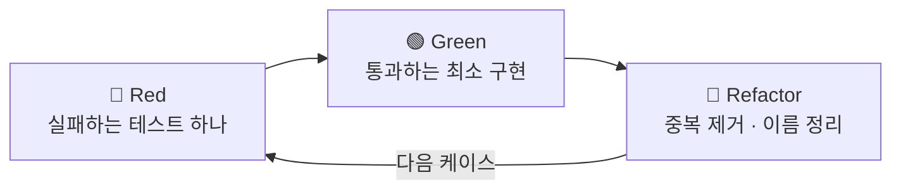

# TDD 가이드

> 테스트를 먼저 쓰는 절차와 테스트 코드 작성 규칙입니다. developer는 스프린트 작업에서 이 절차대로 구현하고, reviewer는 테스트가 구현과 함께 들어왔는지 판정합니다.
> 무엇을 얼마나 테스트할지(필수 케이스, 테스트 종류, 도구)는 [테스트 전략](testing-strategy.md)에 있습니다. 결정 근거: [ADR-0006](../03-architecture/adr/0006-adopt-tdd.md)
>
> [위키 홈](../README.md)

## TDD 사이클 (Red → Green → Refactor)



1. **Red**: 완료 조건에서 **동작 하나**를 골라 실패하는 테스트를 쓴다. 컴파일이 안 되는 것도 실패로 본다. 테스트를 돌려 **기대한 이유로** 실패하는지 확인한다.
2. **Green**: 그 테스트만 통과하는 **가장 단순한 구현**을 한다. 다른 케이스를 미리 구현하지 않는다.
3. **Refactor**: 모든 테스트가 통과하는 상태를 유지하면서 중복을 없애고 이름과 구조를 컨벤션에 맞춘다. 테스트 코드도 정리 대상이다.
4. 다음 케이스로 반복한다. 순서는 **성공 → 실패(규칙마다) → 엣지 케이스**를 권장한다.

- 한 사이클은 짧게(수 분 단위) 유지한다. 한 번에 여러 동작을 구현하고 싶어지면 테스트를 더 잘게 나눈다.
- 버그를 고칠 때도 **재현 테스트를 먼저** 쓰고 고친다.
- 스프린트 작업에서는 developer 단계 안에서 사이클을 반복하고, 단계가 끝날 때 모든 테스트가 통과한 상태로 넘긴다(단계 커밋은 스킬이 한다).

## 레이어별 TDD 적용 방법

| 레이어 | 먼저 쓰는 테스트 | Test Double | 비고 |
|---|---|---|---|
| **Domain** | Aggregate / Value Object의 동작: 생성, 불변식, 상태 전이, 도메인 이벤트 | 없음 | 가장 먼저, 가장 많이. 순수 단위 테스트 |
| **Application · Command** | Handler 흐름: Repository 조회 → 도메인 호출 → Repository에 추가 → `Result` | Repository, `IIdGenerator` 등 포트 → NSubstitute | 도메인 규칙은 Domain 테스트에서 이미 검증했으므로 흐름과 분기만 본다. Handler는 저장하지 않는다(`SaveChanges` · `CommitAsync`는 트랜잭션 데코레이터 → `IUnitOfWork`, [ADR-0014](../03-architecture/adr/0014-command-transaction-boundary-and-unit-of-work.md)) |
| **Application · 파이프라인** | 데코레이터 순서, 검증 실패 시 Handler 미호출, 성공 시 커밋 · 실패 `Result` 시 미커밋 | 안쪽 Handler, `IUnitOfWork` → NSubstitute | BuildingBlocks 작업에서 한 번 작성([ADR-0015](../03-architecture/adr/0015-custom-mediator-pipeline.md)) |
| **Application · Validator** | 규칙마다 통과 / 실패 | 없음 | FluentValidation `TestValidate` |
| **Application · Query** | (단위 테스트 생략 가능) | - | 핵심이 DB 프로젝션이므로 tester의 통합 테스트로 검증 |
| **Infrastructure** | - | - | Repository · 매핑 · 마이그레이션은 tester가 Testcontainers 통합 테스트로 검증 |
| **Api** | - | - | 엔드포인트는 tester가 `WebApplicationFactory` 통합 테스트로 검증 |

권장 순서: **Domain → Validator → Command Handler → (Api 연결)**. 바깥 레이어는 안쪽이 준비된 뒤에 쓴다.

## 테스트 네이밍 규칙

- 테스트 클래스: `<대상 클래스>Tests` (예: `EmployeeTests`, `RegisterEmployeesCommandHandlerTests`)
- 테스트 메서드: **`<메서드>_<조건>_<기대 결과>`**

| 종류 | 예 |
|---|---|
| 성공 | `Register_WithValidInput_ReturnsEmployee`, `Register_WithValidInput_RaisesEmployeeRegisteredDomainEvent` |
| 실패 | `Register_WithDuplicateEmail_ReturnsConflictError`, `ChangeStatus_FromRetired_ReturnsInvalidTransitionError` |
| 엣지 | `Register_WithNameAtMaxLength_Succeeds`, `Register_WithNameOverMaxLength_ReturnsValidationError`, `Register_WithUndefinedChannelBit_ReturnsInvalidChannelsError` |

- 조건과 기대 결과는 업무 용어로 쓴다. `Test1`, `ShouldWork` 같은 이름은 쓰지 않는다.
- 인수 테스트에는 FR ID를 `Trait`로 남긴다: `[Trait("FR", "PRD-001/FR-03")]`

## 테스트 구조 (Arrange / Act / Assert)

```csharp
[Fact]
public async Task Handle_EmailAlreadyStored_ReturnsConflictError()
{
    // Arrange
    _repository.ListExistingNormalizedEmailsAsync(Arg.Any<IReadOnlyCollection<string>>(), Arg.Any<CancellationToken>())
        .Returns(["kim@example.com"]);
    var command = new RegisterEmployeesCommand(
        EmployeeImportFormat.Csv, EmployeeImportSources.Body, Encoding.UTF8.GetBytes("김직원,Kim@Example.com,010-1234-5678,2020-01-02"));

    // Act
    var result = await CreateSut().Handle(command, TestContext.Current.CancellationToken);

    // Assert
    result.IsFailure.Should().BeTrue();
    result.Error.Code.Should().Be(23001);
}
```

- 세 구역을 주석(`// Arrange`, `// Act`, `// Assert`)이나 빈 줄로 나눈다.
- **Act는 한 줄**이다. 여러 동작을 호출하면 테스트를 나눈다.
- Assert는 **한 가지 개념**만 검증한다(여러 단언이 같은 개념을 설명하는 것은 괜찮다).
- 실패 케이스는 반드시 **에러 코드**까지 검증한다([에러 코드](../05-api/error-codes.md)). 메시지 문자열로 검증하지 않는다.
- 테스트 안에 `if`, 반복문, `try` / `catch`를 두지 않는다. 여러 입력은 `[Theory]`로 나눈다.
- 테스트와 무관한 값은 Test Data Builder의 기본값에 맡기고, 테스트가 말하려는 값만 드러낸다.
- 시간은 `FakeTimeProvider`로 고정하고, 무작위 값(`Guid.NewGuid()` 등)에 결과가 좌우되지 않게 한다.

> 위 예의 단언 문법은 AwesomeAssertions(`Should()`)입니다([ADR-0021](../03-architecture/adr/0021-test-tooling-xunit-v3-and-awesomeassertions.md), [테스트 전략 · 도구](testing-strategy.md#도구)).

## Test Double 사용 기준

| 종류 | 쓰는 경우 | 도구 |
|---|---|---|
| **Stub** | 의존 대상이 **값을 돌려주기만** 하면 될 때 (Repository 조회 결과) | NSubstitute `Returns` |
| **Mock** | **호출 여부 자체가 결과**일 때 (Repository `Add`가 호출됐는가, 트랜잭션 데코레이터가 `CommitAsync`를 불렀는가) | NSubstitute `Received` |
| **Fake** | 가벼운 실제 구현이 더 읽기 쉬울 때 | `FakeTimeProvider`, 메모리 기반 테스트 구현 |

- **Domain 테스트에는 Test Double을 쓰지 않는다.** 필요해 보이면 도메인 설계(외부 의존이 도메인에 들어왔는지)를 먼저 의심한다.
- 대체하는 것은 **레이어 경계의 인터페이스**(Repository, 포트, `TimeProvider`)뿐이다. 도메인 객체, Value Object, `record` DTO는 실제 객체를 쓴다.
- 구현 세부(내부 메서드 호출 순서, private 상태)를 검증하지 않는다. 리팩터링에 깨지는 테스트가 된다.
- DbContext를 Mock으로 대체하지 않는다. DB가 관여하면 Testcontainers 통합 테스트로 옮긴다.

## TDD 예시

작업 "직원 등록 시 알림 채널을 하나 이상 지정해야 한다"의 사이클 예입니다.

| 사이클 | 🔴 Red: 먼저 쓴 테스트 | 🟢 Green: 구현 | 🔵 Refactor |
|---|---|---|---|
| 1 | `Register_WithValidInput_ReturnsEmployee` | `Employee.Register` 팩토리가 `Result.Success` 반환 | - |
| 2 | `Register_WithValidInput_RaisesEmployeeRegisteredDomainEvent` | 등록 시 도메인 이벤트 추가 | `AggregateRoot` 기반 기능 사용 |
| 3 | `Register_WithNoChannels_ReturnsInvalidChannelsError` (`None`) | `channels == None`이면 실패 반환 | 에러를 `EmployeeErrors`로 이동 |
| 4 | `Register_WithInvalidChannels_…` `[Theory]`: 정의되지 않은 비트, 음수 | 정의 범위 비트 검사 | 채널 검증을 `NotificationChannels` 확장 메서드로 추출 |
| 5 | `Register_WithValidChannels_Succeeds` `[Theory]`: 단일, 조합, `All` | (통과 확인만) | 테스트 데이터를 `MemberData`로 정리 |

---

## 변경 이력

| 날짜 | 작성자 | 내용 |
|---|---|---|
| 2026-09-27 | - | 문서 생성 |
| 2026-09-27 | - | 기본 가이드 초안: 사이클, 레이어별 적용, 네이밍, AAA, Test Double 기준, 예시 |
| 2026-09-27 | developer | ADR 0014 · 0015 · 0021 반영: Command Handler 흐름에서 "저장" 제거, 파이프라인 테스트 행 추가, Mock 예시 수정, 단언 라이브러리 AwesomeAssertions 명시 (S01-T04) |
| 2026-09-28 | developer | 테스트 클래스 이름 예시와 AAA 예시를 일괄 등록 Handler(`RegisterEmployeesCommandHandlerTests`, DB 기존 이메일 23001)로 교체(BL-132) (S06-T04) |
