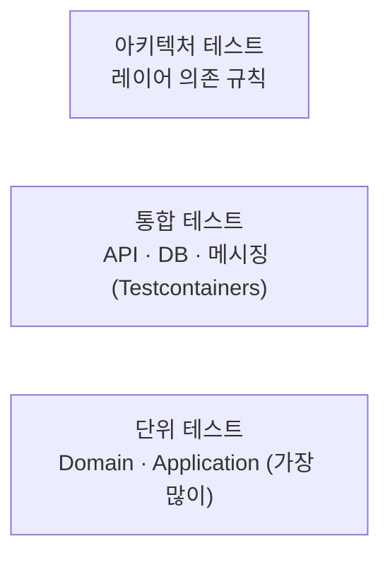

# 테스트 전략

> 테스트 종류별 범위, 도구, 필수 테스트 케이스(성공 / 실패 / 엣지 케이스), 품질 기준을 정의합니다.
> developer(단위 테스트)와 tester(통합 · 인수 테스트) 에이전트가 작업 기준으로, reviewer와 tester가 진입 점검 기준으로 사용합니다.
> 결정 근거: [ADR-0006 TDD](../03-architecture/adr/0006-adopt-tdd.md), [ADR-0021 테스트 도구](../03-architecture/adr/0021-test-tooling-xunit-v3-and-awesomeassertions.md), [ADR-0022 Respawn · 커버리지](../03-architecture/adr/0022-respawn-and-coverage-tooling.md) · 작성 절차: [TDD 가이드](tdd-guide.md)
>
> [위키 홈](../README.md)

## 테스트 피라미드



| 종류 | 대상 | 작성자 | 실행 시점 |
|---|---|---|---|
| 단위 | Aggregate, Value Object, Command / Query Handler, Validator | developer (구현 전에 먼저) | 빌드마다 |
| 통합 | API 엔드포인트, EF Core 매핑 · 마이그레이션, Repository, UnitOfWork(커밋 · 예외 변환) | tester | PR / 스프린트 종료 |
| 인수 | PRD 인수 조건(FR) 시나리오 | tester | 스프린트 종료 |
| 아키텍처 | 레이어 의존 규칙, 명명 규칙 | 기반 구축 때 작성, 이후 유지 | 빌드마다 |
| 계약 | API / 이벤트 스키마 | (서비스 간 연동 시작 시 도입) | - |

## 필수 테스트 케이스: 성공 · 실패 · 엣지 케이스

**테스트 대상 동작(도메인 메서드, Handler, API 엔드포인트) 하나마다** 세 종류를 모두 작성합니다. reviewer는 이 기준으로 누락을 판정합니다.

> **기반 · 셋팅 작업**(BuildingBlocks, DI 등록, 공통 규칙, 빌드 · CI 설정)은 완료 조건 **항목마다** 성공 / 실패 / 엣지를 최소 1개씩 작성하는 것으로 충족합니다. 체크리스트의 나머지 엣지는 tester가 완료 조건 대조에서 빈 곳이 있을 때만 보강합니다. 도메인 로직은 아래 기준 전부를 적용합니다. 원본: [에이전트 워크플로우 테스트 범위](../10-delivery/agents.md#테스트-범위)(S02 회고).

| 종류 | 기준 | 예: `Employee.Register` |
|---|---|---|
| **성공** | 정상 입력에서 기대 결과와 부수 효과(상태 변경, 도메인 이벤트)를 검증한다. 최소 1개 | 등록 성공, `EmployeeRegisteredDomainEvent` 발생 |
| **실패** | 비즈니스 규칙 · 검증 규칙 **하나마다** 실패 케이스 1개 이상. 반환된 `Error`의 코드까지 검증한다 | 이메일 형식 오류, 중복 이메일, 채널 없음 |
| **엣지 케이스** | 아래 체크리스트 중 해당하는 항목 전부 | 이름 최대 길이 / 최대+1, 공백 이름, 한글 이름, 채널 전체 조합 |

### 엣지 케이스 체크리스트

작업마다 해당 여부를 판단하고, 해당하는 항목은 테스트로 만듭니다. 해당 없다고 본 항목은 판단 근거를 남길 필요가 없지만, reviewer / tester가 누락으로 지적하면 반려 사유가 됩니다.

| 분류 | 확인할 케이스 |
|---|---|
| 경계값 | 최소, 최소-1, 최대, 최대+1, `0`, 음수 |
| 빈 값 | `null`, 빈 문자열, 공백만 있는 문자열, 빈 컬렉션, 빈 `Guid` |
| 문자열 | 최대 길이, 한글 · 이모지(유니코드), 앞뒤 공백, 대소문자 차이(이메일 등) |
| 컬렉션 | 원소 0개, 1개, 대량, 중복 원소 |
| 코드값 | 정의되지 않은 정수, 예약 값 `0`, 폐기된 값 |
| 비트 플래그 | `None`(0), 단일 플래그, 여러 플래그 조합, 전체(`All`), **정의되지 않은 비트**, 추가 / 제거 후 결과 |
| 상태 전이 | 허용되지 않은 전이, 같은 상태로 전이, 종료 상태에서의 변경 |
| 중복 · 멱등 | 같은 Command 두 번, 같은 통합 이벤트 두 번 수신(Inbox) |
| 동시성 | 같은 Aggregate 동시 수정(낙관적 잠금 충돌) |
| 시간 | UTC 변환, 자정 · 월말 · 연말 경계, 타임존이 다른 입력, 과거 / 미래 시각 |
| 권한 | 권한 없음, 일부 권한만 있음, 다른 조직의 리소스 |
| 외부 연동 | 타임아웃, 일시 오류 후 재시도 성공, 영구 실패 |
| 존재하지 않음 | 없는 ID 조회 · 수정 · 삭제 |

엣지 케이스는 `[Theory]` + `[InlineData]` / `[MemberData]`로 묶어 한 테스트에서 여러 입력을 검증합니다.

```csharp
[Theory]
[InlineData(NotificationChannels.Sms)]
[InlineData(NotificationChannels.Sms | NotificationChannels.Email)]
[InlineData(NotificationChannels.All)]
public void Register_WithValidChannels_Succeeds(NotificationChannels channels) { /* ... */ }

[Theory]
[InlineData(NotificationChannels.None)]
[InlineData((NotificationChannels)8)]    // 정의되지 않은 비트
[InlineData((NotificationChannels)(-1))]
public void Register_WithInvalidChannels_ReturnsInvalidChannelsError(NotificationChannels channels) { /* ... */ }
```

## 단위 테스트 (Domain / Application)

- **Domain**: Aggregate와 Value Object의 불변식, 상태 전이, 도메인 이벤트 발생. 외부 의존이 없으므로 Test Double을 쓰지 않는다.
- **Application**: Handler의 흐름(Repository 조회 · 추가, 도메인 호출, `Result` 반환)과 Validator 규칙. Repository · `IIdGenerator` 등 포트는 NSubstitute로 대체한다. Handler는 저장하지 않으므로(`SaveChanges` · `CommitAsync`를 부르지 않음, [ADR-0014](../03-architecture/adr/0014-command-transaction-boundary-and-unit-of-work.md)) Handler 테스트에서 저장 호출을 검증하지 않는다. 성공 시 커밋 · 실패 `Result` 시 미커밋은 트랜잭션 데코레이터 단위 테스트(가짜 `IUnitOfWork`)가 검증한다([ADR-0015](../03-architecture/adr/0015-custom-mediator-pipeline.md)). Query Handler는 DB 프로젝션이 핵심이므로 통합 테스트로 검증한다.
- 시간은 `FakeTimeProvider`(Microsoft.Extensions.TimeProvider.Testing)로 고정한다.
- 테스트끼리 상태를 공유하지 않는다. 실행 순서에 의존하지 않는다.

## 통합 테스트 (Testcontainers)

- DB는 **Testcontainers로 실제 PostgreSQL**을 띄운다. InMemory Provider / SQLite 대체는 쓰지 않는다(PostgreSQL 동작 차이 때문).
- API는 `WebApplicationFactory<Program>`으로 띄우고 HTTP로 호출한다.
- 컨테이너는 테스트 컬렉션 단위로 공유하고(`ICollectionFixture`), 테스트마다 Respawn으로 데이터를 초기화한다([ADR-0022](../03-architecture/adr/0022-respawn-and-coverage-tooling.md)).
  - **컬렉션 fixture에서 한 번**: 컨테이너 시작 → 슈퍼유저 연결로 생성 스크립트 1문장 → `MigrateAsync` → `Respawner.CreateAsync`. `CreateAsync`는 테이블 목록을 캐시하므로 반드시 마이그레이션 뒤에 부른다. 세부는 아래 [테스트 DB 구성](#테스트-db-구성-fixture).
  - **테스트마다 시작 전**(`IAsyncLifetime.InitializeAsync`): `ResetAsync`.
  - Respawn 옵션: `DbAdapter.Postgres`, `SchemasToInclude = ["public"]`, `TablesToIgnore = [new Table("public", "__EFMigrationsHistory")]`(따옴표 없이 대소문자 그대로), `WithReseed = false`.
  - Respawn은 **쓰기 연결**(`employee_app`)로 연 별도 `NpgsqlConnection`을 쓴다. 읽기 연결은 `TRUNCATE`가 `25006`으로 거부된다(S03-T06 실측).
  - 같은 DB를 쓰는 테스트는 한 컬렉션에서 순차 실행한다(`TRUNCATE`의 `ACCESS EXCLUSIVE` 잠금). 컬렉션을 나누면 컨테이너도 따로 둔다.
- 마이그레이션을 실제로 적용한 스키마에서 테스트한다. `EnsureCreated`는 금지하고, 운영 등록 코드(`AddDbContext` + `UseNpgsql(EnableRetryOnFailure)` + `UseSnakeCaseNamingConvention`)로 만든 쓰기 DbContext에서 실행 전략으로 `MigrateAsync`를 fixture당 한 번 적용한다([ADR-0012](../03-architecture/adr/0012-migration-apply-and-pre-production-reset.md)). `WebApplicationFactory` 호스트는 마이그레이션하지 않는다(EF Core 8 잠금 없음, TD-011). 체크 제약(코드값, 비트 플래그 범위)이 동작하는지도 확인한다.
- 연결 문자열은 `NpgsqlConnectionStringBuilder`로 조립해 `ConnectionStrings:Write` / `ConnectionStrings:Read`로 주입한다(Read = Write + `Options=-c default_transaction_read_only=on`). `Include Error Detail` · `Persist Security Info`는 테스트 연결에도 쓰지 않는다.
- 브로커 컨테이너와 Inbox 멱등 테스트는 브로커 도입 토픽에서 추가한다(도입 보류, [ADR-0023](../03-architecture/adr/0023-deferred-adoptions.md)).

### 테스트 DB 구성 (fixture)

AppHost의 로컬 DB 구성([데이터베이스 · 로컬 DB 구성](database.md#로컬-db-구성-apphost))을 그대로 재현합니다. 값을 새로 만들지 않고 AppHost와 같은 원본을 씁니다(S03-T06 dba 사양, 임시 `postgres:17` 컨테이너 실측).

| 항목 | 사양 |
|---|---|
| 이미지 | `new PostgreSqlBuilder($"postgres:{태그}")`. 태그는 csproj `EmergencyHubUsesPostgresImage=true` → 어셈블리 메타데이터 `EmergencyHubPostgresImageTag`에서 읽는다(원본 `Directory.Build.props` 한 곳, 코드에 태그 리터럴 금지, TD-004). 매개변수 없는 생성자 금지 |
| 초기화 스크립트 | 저장소의 `src/Aspire/EmergencyHub.AppHost/postgres-init/01-create-employee-app-role.sh`를 `WithResourceMapping(파일, "/docker-entrypoint-initdb.d/")`로 **컨테이너 시작 전** 복사한다(복사본 · 수정본을 테스트 프로젝트에 두지 않음). 기본 권한 `0644`면 엔트리포인트가 `source`로 실행하며 정상 동작한다. 저장소 루트는 `EmergencyHub.sln`을 위로 찾아 정한다 |
| 롤 비밀번호 | `WithEnvironment("EMPLOYEE_APP_PASSWORD", 테스트마다 만든 난수)`(영문 · 숫자만, 비어 있으면 초기화 실패). 슈퍼유저 비밀번호도 난수. 값은 출력 · 로그에 남기지 않는다 |
| DB 생성 | 컨테이너 준비 뒤 **슈퍼유저 연결**(`postgres` DB)로 AppHost 생성 스크립트와 같은 한 문장 `CREATE DATABASE emergency_hub_employee OWNER employee_app`을 실행한다. 문장은 AppHost `EmployeeDatabaseSettings.CreationScript`와 같아야 한다(공유 또는 단위 테스트로 대조). 슈퍼유저 연결은 이것 외에 쓰지 않는다 |
| Write 연결 | `NpgsqlConnectionStringBuilder`: 컨테이너 호스트 · 매핑 포트, `Database=emergency_hub_employee`, `Username=employee_app`, 롤 비밀번호. `Application Name`은 선택(예: `employee-it-write`) |
| Read 연결 | Write와 같고 `Options=-c default_transaction_read_only=on`만 추가 |
| 금지 옵션 | `Include Error Detail` · `Persist Security Info` · `Timeout` · `Command Timeout` 변경 없음. 슈퍼유저 연결 문자열을 `ConnectionStrings:*`에 넣지 않는다 |
| 마이그레이션 | 운영 등록 코드(`AddEmployeeInfrastructure` 또는 `AddEmployeeWriteDbContext`)로 만든 쓰기 DbContext에서 `CreateExecutionStrategy().ExecuteAsync(ct => MigrateAsync(ct))`를 fixture당 한 번(MigrationWorker와 같은 형태). `EnsureCreated` 금지 |
| Respawn | 위 옵션 그대로. `Respawner`는 마이그레이션 뒤 한 번 만들고 다시 만들지 않는다(아래 장애 주입 객체가 목록에 들어가지 않게) |
| 컨테이너 | 컬렉션 fixture 1개 공유(T06 · T07), 컨테이너 1개. 이름 있는 볼륨 · 고정 포트 · 로컬 AppHost 볼륨(`emergency-hub-postgres-data`) 재사용 금지 |

- **대기 전략**: Testcontainers.PostgreSql 4.15.0 기본 대기는 컨테이너 안에서 `pg_isready --host localhost`(TCP)를 반복한다. 초기화 스크립트가 도는 임시 서버는 유닉스 소켓만 열어 TCP 검사가 통과하지 않으므로, 초기화가 끝나고 최종 서버가 뜬 뒤에야 준비로 판정한다(실측: 임시 서버 로그에 `listening on Unix socket`만 있고 IPv4 · IPv6 수신은 최종 서버에서만 나옴). 로그 문구 대기(`database system is ready to accept connections`)로 바꾸지 않는다. 이 문구는 임시 서버와 최종 서버에서 **두 번** 나와 첫 번째에 준비로 판정하면 롤 · DB가 없는 상태에서 연결한다.
- 첫 연결 확인: fixture 시작 직후 `employee_app`으로 연결해 `SELECT current_user`(= `employee_app`)와 `SELECT rolsuper FROM pg_roles WHERE rolname = current_user`(= `f`)를 단언하면 초기화 스크립트 공유 마운트가 동작한 것이다.
- 정리: 컨테이너 폐기 뒤 `docker volume ls`에 테스트가 만든 익명 볼륨이 남지 않는지 tester가 한 번 확인한다(`postgres` 이미지는 데이터 경로에 익명 볼륨을 만든다).

### 장애 주입

트랜잭션 · UoW 실측(BL-081 P1~P8)에 쓰는 장애 주입 방식입니다. **실제 서버 오류가 필요한 곳은 테스트 전용 트리거**, 서버에 없는 조건(예: 호출 순서 관찰, Hook 예외)은 인터셉터 · 테스트 등록으로 만듭니다. 두 방식 모두 운영 코드를 바꾸지 않고, 재시도 한도는 `DbRetryOptions`로 줄여 등록합니다.

| 항목 | 추천 | 이유 · 대안 |
|---|---|---|
| P1 격리 수준 | 트리거(관찰) + 서버 기본값을 바꾼 연결 | Write 연결에 `Options=-c default_transaction_isolation=serializable`을 붙인 등록으로 커밋하고, 트리거가 기록한 `transaction_isolation`이 `read committed`인지 본다(명시하지 않으면 `serializable`이 나옴, 실측). 인터셉터(`IDbTransactionInterceptor.TransactionStarted`의 `IsolationLevel`)는 보조 확인으로만 쓴다(요청 값이지 서버 값이 아님) |
| P2 커밋 시점 일시 오류 1회 | 트리거(`CONSTRAINT TRIGGER ... DEFERRABLE INITIALLY DEFERRED`) | 서버가 실제 `COMMIT`에서 `40001`을 내고 트랜잭션을 롤백한다. UoW 실측: 재시도 1회 뒤 `Success`, 행 1개, 트리거 실행 2회. 인터셉터(`TransactionCommitting`에서 예외)는 서버 커밋 전에 끊는 것이라 대안으로만 쓴다 |
| P3 PreCommitHook 예외 | 테스트용 `IPreCommitHook` 등록 | DB 조건이 아니다. 검증은 다른 연결에서 `SELECT count(*)` = 0 |
| P4 23505 | 장애 주입 없음 | 사전 검사를 건너뛰고 쓰기 DbContext에 직접 `Add` → `CommitAsync`. 같은 이메일 → `ux_employees_email` → 23001 · 로그 201, 같은 ID → `pk_employees` → 3003 · 로그 202(실측) |
| P5 xmin 충돌 | 장애 주입 없음 | 스코프 2개에서 같은 행을 읽고 `Deactivate()` → 먼저 커밋한 쪽 `Success`, 나중 쪽 3001 · 로그 203(실측) |
| P6 매번 일시 오류 | 트리거(`BEFORE INSERT`, 항상 `40001`) | 실행 전략이 `DbUpdateException` 안의 `40001`을 일시 오류로 보고 재시도 → `RetryLimitExceededException`(→ 9003). 시도 수 = `MaxRetryCount + 1`(실측: 2회 한도 → 3회, 약 60ms). 인터셉터(`DbCommandInterceptor`에서 `PostgresException` 생성)는 대안 |
| P7 Deleted 이벤트 비움 · P8 로그 | 장애 주입 없음 | P8은 로그 수집 sink로 EF `Error` 건수와 이메일 · Detail 노출을 센다 |

**트리거 규칙**

- `employee_app`으로 만든다(테이블 소유자이고 `public` 소유자 `pg_database_owner`의 멤버라 `CREATE FUNCTION` · `CREATE TRIGGER` · `CREATE SEQUENCE`가 된다. `plpgsql`은 신뢰 언어라 슈퍼유저가 필요 없다, 실측).
- 이름은 `test_fault_*` · `test_probe_*`로 시작한다(운영 명명 규칙과 구분, 잔여 검사 대상). 마이그레이션 · 운영 코드에 넣지 않는다. database.md의 "`DEFERRABLE` 제약은 쓰지 않는다"는 운영 스키마 규칙이고, P2 트리거는 fixture 안에서만 만들고 지우는 예외다.
- **"한 번만 실패"는 시퀀스로 센다.** 카운터 테이블은 실패한 트랜잭션과 함께 롤백되어 매번 첫 번째로 보이므로 계속 실패한다(실측: 3회 시도 뒤에도 카운터 0). 시퀀스(`nextval`)는 롤백과 무관하게 증가하고, `last_value`가 트리거 실행 횟수(= 시도 수)가 된다.
- 순서: `Respawner.CreateAsync` **뒤에** 만들고, 테스트 본문을 `try`로 감싸 `finally`에서 `DROP ... IF EXISTS`(트리거 → 함수 → 시퀀스 · 테이블 순)로 지운다. 테스트는 한 컬렉션에서 순차 실행한다. 지우지 않으면 뒤 테스트의 `INSERT`가 모두 실패한다(실측: P6 트리거가 남아 P1이 `40001`).
- 정리 뒤 잔여 검사(모두 0): 아래 SQL. fixture 폐기 전 한 번, 또는 장애 주입 테스트마다 `finally` 뒤에 단언한다.
- Respawn(`TRUNCATE`)은 행 트리거를 실행하지 않고 시퀀스를 건드리지 않는다(`WithReseed = false`). 시퀀스 값은 DROP으로 없어진다.

```sql
-- P2: 커밋 시점 40001 1회
CREATE SEQUENCE test_fault_p2_attempts;
CREATE FUNCTION test_fault_p2_fail_first_commit() RETURNS trigger LANGUAGE plpgsql AS $$
BEGIN
    IF nextval('test_fault_p2_attempts') = 1 THEN
        RAISE EXCEPTION 'test fault P2: commit-time serialization failure' USING ERRCODE = '40001';
    END IF;
    RETURN NULL;
END
$$;
CREATE CONSTRAINT TRIGGER test_fault_p2_fail_first_commit
    AFTER INSERT ON employees DEFERRABLE INITIALLY DEFERRED
    FOR EACH ROW EXECUTE FUNCTION test_fault_p2_fail_first_commit();

-- P6: 매번 40001
CREATE SEQUENCE test_fault_p6_attempts;
CREATE FUNCTION test_fault_p6_always_fail() RETURNS trigger LANGUAGE plpgsql AS $$
BEGIN
    PERFORM nextval('test_fault_p6_attempts');
    RAISE EXCEPTION 'test fault P6: persistent serialization failure' USING ERRCODE = '40001';
END
$$;
CREATE TRIGGER test_fault_p6_always_fail
    BEFORE INSERT ON employees FOR EACH ROW EXECUTE FUNCTION test_fault_p6_always_fail();

-- P1: 트랜잭션 설정 관찰 (Write 연결 Options=-c default_transaction_isolation=serializable 로 커밋)
CREATE TABLE test_probe_p1_observations (
    transaction_isolation text NOT NULL,
    transaction_read_only text NOT NULL,
    default_transaction_isolation text NOT NULL
);
CREATE FUNCTION test_probe_p1_isolation() RETURNS trigger LANGUAGE plpgsql AS $$
BEGIN
    INSERT INTO test_probe_p1_observations
    VALUES (current_setting('transaction_isolation'), current_setting('transaction_read_only'),
            current_setting('default_transaction_isolation'));
    RETURN NEW;
END
$$;
CREATE TRIGGER test_probe_p1_isolation
    BEFORE INSERT ON employees FOR EACH ROW EXECUTE FUNCTION test_probe_p1_isolation();

-- 판정: P2 SELECT last_value FROM test_fault_p2_attempts (= 2), P6 SELECT last_value FROM test_fault_p6_attempts (= MaxRetryCount + 1),
--       P1 SELECT transaction_isolation, default_transaction_isolation FROM test_probe_p1_observations (= read committed, serializable)

-- finally 정리
DROP TRIGGER IF EXISTS test_fault_p2_fail_first_commit ON employees;
DROP FUNCTION IF EXISTS test_fault_p2_fail_first_commit();
DROP SEQUENCE IF EXISTS test_fault_p2_attempts;
DROP TRIGGER IF EXISTS test_fault_p6_always_fail ON employees;
DROP FUNCTION IF EXISTS test_fault_p6_always_fail();
DROP SEQUENCE IF EXISTS test_fault_p6_attempts;
DROP TRIGGER IF EXISTS test_probe_p1_isolation ON employees;
DROP FUNCTION IF EXISTS test_probe_p1_isolation();
DROP TABLE IF EXISTS test_probe_p1_observations;

-- 잔여 검사 (0, 0, 0)
SELECT (SELECT count(*) FROM pg_trigger WHERE tgname LIKE 'test\_%' AND NOT tgisinternal),
       (SELECT count(*) FROM pg_proc p JOIN pg_namespace n ON n.oid = p.pronamespace
         WHERE n.nspname = 'public' AND p.proname LIKE 'test\_%'),
       (SELECT count(*) FROM pg_class c JOIN pg_namespace n ON n.oid = c.relnamespace
         WHERE n.nspname = 'public' AND c.relname LIKE 'test\_%');
```

### DB 검증 쿼리

스키마 · 연결 실측(BL-082)과 P 시나리오의 DB 쪽 판정입니다. 검증 연결은 Write(`employee_app`)의 별도 `NpgsqlConnection`을 쓰고, 기대값은 이름 상수(`EmployeeDbNames`)와 대조합니다.

| # | 대상 | 쿼리 · 조작 | 기대값 (실측) |
|---|---|---|---|
| Q1 | S3 · S4 · FR-06 타입 | `SELECT column_name, data_type, character_maximum_length, is_nullable, column_default FROM information_schema.columns WHERE table_schema = 'public' AND table_name = 'employees' ORDER BY ordinal_position` | `id uuid` · `display_name character varying 100` · `email character varying 254` · `employee_status smallint` · `created_at` / `updated_at timestamp with time zone`, 모두 `NO`, `column_default` 모두 NULL |
| Q2 | 제약 · 인덱스 이름 | `SELECT conname, contype FROM pg_constraint WHERE conrelid = 'public.employees'::regclass`, `SELECT indexname FROM pg_indexes WHERE schemaname = 'public' AND tablename = 'employees'` | 제약 `ck_employees_employee_status`(c) · `pk_employees`(p), 인덱스 `pk_employees` · `ux_employees_email`. 체크 식은 서버가 `CHECK ((employee_status = ANY (ARRAY[1, 2])))`로 정규화해 돌려주므로 모델 문자열 `employee_status IN (1, 2)`와 **텍스트 비교하지 않는다**(값 판정은 S4 삽입으로) |
| Q3 | S4 원시 SQL | Write 연결로 `employee_status` 0 · 3 · 9 `INSERT` | 모두 `PostgresException` `SqlState = 23514`, `ConstraintName = "ck_employees_employee_status"`, `TableName = "employees"`. 1 · 2는 성공 |
| Q4 | S4 추적 엔트리 | 추적 엔트리의 `EmployeeStatus`를 `(EmployeeStatus)9`로 바꿔 `CommitAsync` | `DbUpdateException` 재전파(변환 없음), 내부 `23514` · 같은 `ConstraintName`, `Detail`은 가려짐(`Detail redacted ...`) |
| Q5 | P4 23505 | 사전 검사 없이 같은 이메일 / 같은 ID | `ConstraintName`이 `EmployeeDbNames.EmailUniqueIndex.Value`면 23001, `pk_employees`면 3003 |
| Q6 | S2 읽기 거부 | Read 연결로 `INSERT`, `TRUNCATE employees`(UPDATE · DELETE도 같음), `SHOW default_transaction_read_only` | `on`, 쓰기는 모두 `SqlState = 25006`(`ConstraintName` null). 명시 트랜잭션 `BEGIN ISOLATION LEVEL READ COMMITTED` 안에서도 `25006` |
| Q7 | S3 정렬 | `IIdGenerator`로 한 밀리초 안 여러 ID(실측 200개가 같은 밀리초) → 섞어서 삽입 → `SELECT id FROM employees ORDER BY id` | 생성 순서와 같음(PostgreSQL `uuid` 비교는 바이트 순, UUIDNext `PostgreSql` 형식과 일치) |
| Q8 | S1 UTC | 세션 `SET TIME ZONE 'Asia/Seoul'` 뒤 `SELECT created_at, extract(epoch FROM created_at)`, 그리고 `SET TIME ZONE 'UTC'` 뒤 같은 쿼리 | 두 세션의 epoch가 같다(표시만 `+09` / `+00`). EF로 읽은 `DateTimeOffset.Offset`은 0. `FakeTimeProvider`를 `+09:00` 오프셋으로 두어도 저장 값은 같은 순간의 UTC |
| Q9 | P5 xmin · 감사 | `SELECT xmin::text::bigint, created_at, updated_at FROM employees WHERE id = $1`(커밋 전후) | `xmin` 값이 바뀜, `updated_at > created_at`, `created_at` 불변 |
| Q10 | S6 · 결정 A Respawn | `ResetAsync` 뒤 `SELECT count(*) FROM employees`, `SELECT count(*) FROM public."__EFMigrationsHistory"`, 그리고 `respawner.DeleteSql` | `0`, `1`. `DeleteSql`은 `truncate table "public"."employees" cascade;`이고 `__EFMigrationsHistory`를 포함하지 않는다. `TablesToIgnore`는 **테이블 이름 대소문자 그대로** 비교한다: `"__efmigrationshistory"`나 따옴표를 붙인 `"\"__EFMigrationsHistory\""`로 주면 제외되지 않아 이력 테이블이 비워진다(실측) |
| Q11 | 결정 A 이력 테이블 | `SELECT to_regclass('public."__EFMigrationsHistory"') IS NOT NULL`, `SELECT to_regclass('public.__EFMigrationsHistory') IS NULL`, `SELECT migration_id, product_version FROM public."__EFMigrationsHistory"` | `t`, `t`(따옴표 없으면 소문자로 접혀 못 찾음), 1행 `<ID>_InitialCreate` · `8.0.31`. 컬럼 · PK는 `migration_id` · `product_version` · `pk___ef_migrations_history` |
| Q12 | BL-082 재적용 | 운영 경로 `MigrateAsync` 2회, 그리고 idempotent SQL(`dotnet ef migrations script --idempotent` 결과 또는 `IMigrator.GenerateScript(options: MigrationsSqlGenerationOptions.Idempotent)`)을 `employee_app`으로 2회 실행 | 모두 오류 0, 이력 1행. 두 번째 idempotent 실행에는 `NOTICE: relation "__EFMigrationsHistory" already exists, skipping`이 한 번 나온다(오류 아님). psql로 실행하면 `-v ON_ERROR_STOP=1`, 파일의 UTF-8 BOM은 문제없음 |

## 인수 테스트

- PRD의 FR 인수 조건 하나마다 시나리오 테스트를 하나 이상 둔다. 테스트 이름이나 `Trait`에 FR ID를 남긴다: `[Trait("FR", "PRD-001/FR-03")]`
- tester는 스프린트 종료 전에 FR 충족 여부를 이 테스트로 판단하고, 결과를 [회고의 FR 충족 표](../_templates/retro.md)의 근거로 쓴다.

## 계약 테스트 (API / 이벤트)

> TODO: 서비스 간 연동이 시작되면 도입 여부와 도구를 정합니다. 우선은 이벤트 페이로드 직렬화 스냅숏 테스트로 대신합니다.

## 아키텍처 테스트

NetArchTest.Rules 1.3.2로 검증합니다([ADR-0021](../03-architecture/adr/0021-test-tooling-xunit-v3-and-awesomeassertions.md)). 프로젝트는 `tests/EmergencyHub.ArchitectureTests`이고(S02-T05), 규칙 원본은 [ADR-0024 의존성 규칙 표](../03-architecture/adr/0024-building-blocks-api-for-common-http-handling.md#의존성-규칙-표-초안)와 [Clean Architecture · 의존성 규칙](../03-architecture/clean-architecture.md#의존성-규칙)입니다. 규칙마다 원본 행 · 절을 규칙 정의(`Source`)와 테스트 주석에 적습니다.

- 의존성 규칙(형식 의존, ADR-0024 표 행마다 테스트 1개 · 10개): Domain은 System과 Domain 레이어만 의존(직렬화 라이브러리 금지), Application ↛ Infrastructure 계열 · Api 계열 · EF Core · Npgsql · Scrutor · ASP.NET Core, Infrastructure 계열 ↛ Api 계열 · ASP.NET Core(Swashbuckle 포함), BuildingBlocks.Api ↛ Infrastructure 계열 · EF Core · Npgsql, `<Service>.Api`의 Controller ↛ Infrastructure 계열 형식 · Repository(`IRepository` / `IReadRepository` 파생, 생성자 · 액션 매개변수 등 시그니처 기준. DI 등록 코드는 대상 아님), `<Service>.MigrationService` ↛ Api 계열, 서비스 ↛ 다른 서비스(서비스 접두사 `EmergencyHub.<Service>` 기준, 서비스마다 규칙 1개, `<Service>.Domain`끼리 의존도 이 규칙이 막는다).
- 선언 참조: csproj의 프로젝트 · 패키지 참조도 같은 금지 목록을 따른다. **쓰지 않는 참조도 막는다**(컴파일된 어셈블리에는 남지 않으므로 테스트 어셈블리의 deps.json으로 확인). `<Service>.Domain`은 BuildingBlocks.Domain만, `<Service>.MigrationService`는 Api 계열 금지, 모든 서비스 프로젝트는 자기 서비스 · BuildingBlocks · ServiceDefaults 밖의 `EmergencyHub.*`(다른 서비스)를 참조하지 않는다(서비스 수와 관계없이 적용, 목록에 없는 서비스도 이름으로 잡음).
- 컨벤션: 클래스 sealed(예외 `Error` · `Result`), Command · Query · Request · Response · Dto · 이벤트는 `record`, Repository 인터페이스는 `IRepository` / `IReadRepository` 상속, 구현은 `RepositoryBase` / `ReadRepositoryBase` 파생, `IStronglyTypedId<TSelf>`의 `TSelf`는 자기 자신, Entity 키는 강타입 ID, enum 기반 형식(일반 `short`, `[Flags]` `int` / `long`), Handler · Validator · Repository · 포트 구현은 `internal sealed`, Validator는 `RequestValidator<T>` 파생, 명시 등록 포트(`IUnitOfWork` · `IExceptionClassifier` · `IIdGenerator` · `IPreCommitHook`) 구현은 마커 미구현, `Error` / `Result` 파생 금지, Entity 파생은 `sealed`.
- 주입: Handler ↛ `ISender`, Validator ↛ Repository · 서비스 주입, Query Handler ↛ `IUnitOfWork` · Write Repository · Command Handler 겸용.
- **대상 어셈블리는 `ArchitectureAssemblies` 한곳에서 관리한다.** 서비스를 추가하면 레이어별로 목록에 넣고 csproj에 참조를 더한다. 테스트 어셈블리는 넣지 않는다.
- 규칙마다 제품 대상 형식이 1개 이상임을 단언한다(공허 통과 방지). 대상이 서비스 코드에만 있는 규칙(현재 10개: 컨벤션 · 주입 8, Controller, MigrationService)은 서비스 어셈블리가 목록에 없는 동안만 건너뜀(Skip)으로 표시하고, 서비스가 들어오면 대상 0개는 실패다. 서비스 ↛ 다른 서비스 규칙은 서비스가 2개 미만이면 건너뛴다(금지할 다른 서비스가 없음). 지금 건너뛰는 제품 테스트는 11개다.
- 규칙마다 테스트 어셈블리 안 표본 네임스페이스에 위반 예시와 지킨 예시를 두고, 같은 규칙 객체가 위반 예시만 정확히 잡는지 확인한다.
- 아키텍처 테스트 프로젝트에는 `coverlet.collector`를 넣지 않는다. 수집기가 출력 폴더의 제품 DLL을 계측하면 Coverlet 추적 형식 의존이 생겨 Domain 규칙이 실패한다(S02-T05 실측).
- 한계: `const` 참조는 컴파일러가 인라인해 형식 의존으로 보이지 않는다. enum의 `: int` 명시 여부는 메타데이터로 구별할 수 없어 `[Flags]`의 `: int` 생략은 사람 리뷰로 잡는다. Controller가 메서드 본문에서 서비스 로케이터로 Repository를 꺼내는 경우는 시그니처에 드러나지 않아 reviewer가 판정한다.
- Repository에 분기 · 로직이 없는지는 아키텍처 테스트로 잡기 어려우므로 reviewer가 판정한다.

DI 등록 검증(통합 테스트): 마커를 구현한 모든 타입이 `Scoped`로 등록되어 컨테이너에서 해석되는지 확인한다.

## 테스트 네이밍과 구조

- 테스트 프로젝트: `<대상 프로젝트>.UnitTests`, `EmergencyHub.<Service>.IntegrationTests`, `EmergencyHub.ArchitectureTests`
- 테스트 클래스: `<대상 클래스>Tests`
- 테스트 메서드: `<메서드>_<조건>_<기대 결과>` (예: `Register_WithDuplicateEmail_ReturnsConflictError`)
- 본문은 Arrange / Act / Assert로 나누고, Act는 한 줄로 둔다.
- 테스트 데이터는 Test Data Builder로 만든다(`new EmployeeBuilder().WithEmail("...").Build()`). 테스트와 무관한 값은 빌더 기본값에 맡긴다.

## 도구

버전은 `Directory.Packages.props`에서 중앙 관리하고, 출처 · 라이선스는 [패키지 버전 · 라이선스](../03-architecture/package-versions.md#테스트)가 원본입니다.

| 용도 | 도구 | 버전 | 결정 |
|---|---|---|---|
| 테스트 프레임워크 | xUnit v3 (`xunit.v3`) + `xunit.runner.visualstudio` + `Microsoft.NET.Test.Sdk` | 4.0.1 / 4.0.0 / 18.10.1 | [ADR-0021](../03-architecture/adr/0021-test-tooling-xunit-v3-and-awesomeassertions.md) |
| 단언 | AwesomeAssertions (FluentAssertions는 어떤 버전도 쓰지 않음) | 9.6.0 | ADR-0021 |
| Test Double | NSubstitute + NSubstitute.Analyzers.CSharp | 6.2.0 / 1.0.17 | ADR-0021 |
| 통합 DB | Testcontainers.PostgreSql, Respawn | 4.15.0 / 7.0.0 | ADR-0021 / [ADR-0022](../03-architecture/adr/0022-respawn-and-coverage-tooling.md) |
| 시간 | Microsoft.Extensions.TimeProvider.Testing | 10.10.0 | ADR-0021 |
| 아키텍처 | NetArchTest.Rules | 1.3.2 | ADR-0021 |
| 커버리지 | coverlet.collector + ReportGenerator(로컬 도구 매니페스트) | 10.0.1 / 5.5.11 | ADR-0022 |

- xUnit v3는 SDK 8.0.4xx 이상이 필요하고, 테스트 프로젝트는 `OutputType=Exe`다. .NET 8 SDK의 `dotnet test`(VSTest) 경로로 실행한다.
- 비동기 준비 · 정리는 `IAsyncLifetime`(v3는 `ValueTask`)으로 하고, 테스트 안의 취소 토큰은 `TestContext.Current.CancellationToken`을 쓴다.
- 테스트 프로젝트의 `GlobalUsings.cs`에 `using AwesomeAssertions;`를 둔다.

## 커버리지 기준

- BuildingBlocks(Domain · Application)와 서비스 Domain / Application 라인 커버리지 **80% 이상**을 목표로 한다([PRD-001](../10-delivery/prd/PRD-001-foundation.md) NFR-03). CI에서 측정 · 보고만 하고 필수 체크(임계값 실패)는 걸지 않는다. 안정되면 필수 체크로 바꿀지 새로 정한다.
- 측정: `dotnet test --collect "XPlat Code Coverage" --settings coverlet.runsettings` → ReportGenerator로 합산 보고. 대상 어셈블리 · 제외 규칙(테스트, `Migrations/**`, 생성 코드)은 [ADR-0022](../03-architecture/adr/0022-respawn-and-coverage-tooling.md#커버리지)를 따른다.
- 커버리지 숫자보다 **필수 테스트 케이스(성공 / 실패 / 엣지)의 충족**을 우선 판정한다.
- Api / Infrastructure는 커버리지 대신 통합 테스트로 확인한다.

## CI

- 워크플로: [`.github/workflows/ci.yml`](../../.github/workflows/ci.yml). `develop` · `main` 대상 PR(Draft PR 포함)마다 `ubuntu-24.04`에서 실행한다([PRD-001](../10-delivery/prd/PRD-001-foundation.md) FR-10). 권한은 `contents: read`, 비밀은 쓰지 않는다. SDK는 `global.json`으로 설치하고, 액션은 커밋 SHA로 고정한다([패키지 버전 · 라이선스](../03-architecture/package-versions.md#github-actions)).
- 커버리지 설정: 저장소 루트 [`coverlet.runsettings`](../../coverlet.runsettings)(cobertura, NFR-03 대상 4개 어셈블리 `Include` — 아직 없는 어셈블리도 패턴으로 미리 포함, 테스트 어셈블리 · `Migrations/**` · `obj/**` · `*.g.cs` 제외, `GeneratedCode` · `CompilerGenerated` · `ExcludeFromCodeCoverage` 속성 제외, `SkipAutoProps`).
- 같은 순서를 로컬에서 그대로 실행할 수 있다(저장소 루트, Git Bash).

```bash
dotnet tool restore
dotnet restore EmergencyHub.sln
dotnet build EmergencyHub.sln --no-restore --configuration Release
dotnet format EmergencyHub.sln --verify-no-changes --no-restore
dotnet test EmergencyHub.sln --no-build --configuration Release --collect "XPlat Code Coverage" --settings coverlet.runsettings --logger trx --results-directory TestResults
dotnet tool run reportgenerator "-reports:TestResults/*/coverage.cobertura.xml" "-targetdir:coveragereport" "-reporttypes:Html;TextSummary;MarkdownSummaryGithub"
```

- 보고 경로는 한 단계 패턴(`TestResults/*/`)을 쓴다. trx 로거가 커버리지 첨부를 `TestResults/<trx 이름>/In/**` 아래로 한 번 더 복사해 `**` 패턴이면 같은 결과가 두 번 합산된다.
- CI 산출물: 텍스트 요약은 로그에, Markdown 요약은 잡 요약(`GITHUB_STEP_SUMMARY`)에 싣는다. trx(`test-results`)와 HTML 보고서(`coverage-report`)는 아티팩트로 14일 보관한다(실패해도 업로드). 단계별 소요 시간은 Actions 실행 화면의 단계 목록에서 확인한다(NFR-07 10분 이내).
- `TestResults/` · `coveragereport/`는 `.gitignore` 대상이다.

---

## 변경 이력

| 날짜 | 작성자 | 내용 |
|---|---|---|
| 2026-09-27 | - | 문서 생성 |
| 2026-09-27 | - | 기본 전략 초안: 피라미드, 필수 테스트 케이스(성공 / 실패 / 엣지 체크리스트), 단위 · 통합 · 인수 · 아키텍처 테스트, 도구 |
| 2026-09-27 | - | 아키텍처 테스트에 Repository · DI 마커 · record 규칙, DI 등록 검증 추가 |
| 2026-09-27 | developer | ADR 0014 · 0021 · 0022 · 0023 반영: 도구 버전 고정(xUnit v3, AwesomeAssertions), 통합 테스트 Respawn · DB 준비 규칙, 커버리지 대상 · 보고 방식, Handler 테스트의 저장 검증 제외 (S01-T04) |
| 2026-09-27 | developer | CI 절 추가: 워크플로 · runsettings 위치, 로컬 재현 명령, 보고 경로 패턴(중복 합산 방지), 산출물 (S01-T07) |
| 2026-09-27 | developer | 아키텍처 테스트 절을 구현에 맞춰 갱신: 규칙 원본(ADR-0024 표), 규칙 목록, 쓰지 않는 선언 참조 금지, 대상 어셈블리 단일 목록, 공허 통과 방지 · 서비스 전용 규칙 건너뜀, 표본 검증, 한계 (S02-T05) |
| 2026-09-27 | developer | 아키텍처 테스트 규칙 목록에 `<Service>.Api` Controller · `<Service>.MigrationService` · 서비스 격리 규칙 추가(S03 예정 문구를 본문으로), 건너뛰는 규칙 수 명시 (S02-T05 재작업) |
| 2026-09-27 | - | S02 회고: 기반 · 셋팅 작업은 완료 조건 항목마다 성공 / 실패 / 엣지 최소 1개, 나머지 엣지는 tester가 빈 곳만 보강 |
| 2026-09-28 | dba | 통합 테스트 fixture DB 구성 표(이미지 태그 메타데이터, 초기화 스크립트 공유 마운트, 생성 스크립트 한 문장, Write / Read 연결, 대기 전략 주의), Respawn 옵션 형식과 이름 대소문자 실측, 장애 주입 절(항목별 트리거 / 인터셉터 추천, 테스트 전용 트리거 SQL · 시퀀스 카운터 · 생성 · DROP · 잔여 검사), DB 검증 쿼리 Q1~Q12 (S03-T06) |
