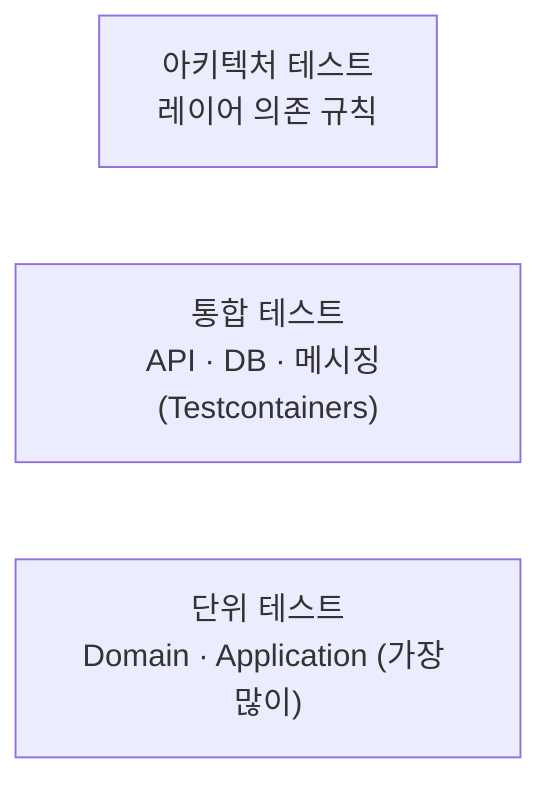

# 테스트 전략

> 테스트 종류별 범위, 도구, 필수 테스트 케이스(성공 / 실패 / 엣지 케이스), 품질 기준을 정의합니다.
> developer(단위 테스트)와 tester(통합 · 인수 테스트) 에이전트가 작업 기준으로, reviewer와 tester가 진입 점검 기준으로 사용합니다.
> 결정 근거: [ADR-0006 TDD](../03-architecture/adr/0006-adopt-tdd.md) · 작성 절차: [TDD 가이드](tdd-guide.md)
>
> [위키 홈](../README.md)

## 테스트 피라미드



| 종류 | 대상 | 작성자 | 실행 시점 |
|---|---|---|---|
| 단위 | Aggregate, Value Object, Command / Query Handler, Validator | developer (구현 전에 먼저) | 빌드마다 |
| 통합 | API 엔드포인트, EF Core 매핑 · 마이그레이션, Repository, Outbox | tester | PR / 스프린트 종료 |
| 인수 | PRD 인수 조건(FR) 시나리오 | tester | 스프린트 종료 |
| 아키텍처 | 레이어 의존 규칙, 명명 규칙 | 기반 구축 때 작성, 이후 유지 | 빌드마다 |
| 계약 | API / 이벤트 스키마 | (서비스 간 연동 시작 시 도입) | - |

## 필수 테스트 케이스: 성공 · 실패 · 엣지 케이스

**테스트 대상 동작(도메인 메서드, Handler, API 엔드포인트) 하나마다** 세 종류를 모두 작성합니다. reviewer는 이 기준으로 누락을 판정합니다.

| 종류 | 기준 | 예: `Employee.Register` |
|---|---|---|
| **성공** | 정상 입력에서 기대 결과와 부수 효과(상태 변경, 도메인 이벤트)를 검증한다. 최소 1개 | 등록 성공, `EmployeeRegisteredDomainEvent` 발생 |
| **실패** | 비즈니스 규칙 · 검증 규칙 **하나마다** 실패 케이스 1개 이상. 반환된 `Error`의 코드까지 검증한다 | 이메일 형식 오류, 중복 이메일, 채널 없음 |
| **엣지 케이스** | 아래 체크리스트 중 해당하는 항목 전부 | 이름 최대 길이 / 최대+1, 공백 이름, 한글 이름, 채널 전체 조합 |

### 엣지 케이스 체크리스트

작업마다 해당 여부를 판단하고, 해당하는 항목은 테스트로 만듭니다. 해당 없다고 본 항목은 판단 근거를 남길 필요가 없지만, reviewer / tester가 누락으로 지적하면 반려 사유가 됩니다.

| 분류 | 확인할 케이스 |
|---|---|
| 경계값 | 최소, 최소-1, 최대, 최대+1, `0`, 음수 |
| 빈 값 | `null`, 빈 문자열, 공백만 있는 문자열, 빈 컬렉션, 빈 `Guid` |
| 문자열 | 최대 길이, 한글 · 이모지(유니코드), 앞뒤 공백, 대소문자 차이(이메일 등) |
| 컬렉션 | 원소 0개, 1개, 대량, 중복 원소 |
| 코드값 | 정의되지 않은 정수, 예약 값 `0`, 폐기된 값 |
| 비트 플래그 | `None`(0), 단일 플래그, 여러 플래그 조합, 전체(`All`), **정의되지 않은 비트**, 추가 / 제거 후 결과 |
| 상태 전이 | 허용되지 않은 전이, 같은 상태로 전이, 종료 상태에서의 변경 |
| 중복 · 멱등 | 같은 Command 두 번, 같은 통합 이벤트 두 번 수신(Inbox) |
| 동시성 | 같은 Aggregate 동시 수정(낙관적 잠금 충돌) |
| 시간 | UTC 변환, 자정 · 월말 · 연말 경계, 타임존이 다른 입력, 과거 / 미래 시각 |
| 권한 | 권한 없음, 일부 권한만 있음, 다른 조직의 리소스 |
| 외부 연동 | 타임아웃, 일시 오류 후 재시도 성공, 영구 실패 |
| 존재하지 않음 | 없는 ID 조회 · 수정 · 삭제 |

엣지 케이스는 `[Theory]` + `[InlineData]` / `[MemberData]`로 묶어 한 테스트에서 여러 입력을 검증합니다.

```csharp
[Theory]
[InlineData(NotificationChannels.Sms)]
[InlineData(NotificationChannels.Sms | NotificationChannels.Email)]
[InlineData(NotificationChannels.All)]
public void Register_WithValidChannels_Succeeds(NotificationChannels channels) { /* ... */ }

[Theory]
[InlineData(NotificationChannels.None)]
[InlineData((NotificationChannels)8)]    // 정의되지 않은 비트
[InlineData((NotificationChannels)(-1))]
public void Register_WithInvalidChannels_ReturnsInvalidChannelsError(NotificationChannels channels) { /* ... */ }
```

## 단위 테스트 (Domain / Application)

- **Domain**: Aggregate와 Value Object의 불변식, 상태 전이, 도메인 이벤트 발생. 외부 의존이 없으므로 Test Double을 쓰지 않는다.
- **Application**: Handler의 흐름(Repository 호출, 저장, 결과 반환)과 Validator 규칙. Repository 등 포트는 NSubstitute로 대체한다. Query Handler는 DB 프로젝션이 핵심이므로 통합 테스트로 검증한다.
- 시간은 `FakeTimeProvider`(Microsoft.Extensions.TimeProvider.Testing)로 고정한다.
- 테스트끼리 상태를 공유하지 않는다. 실행 순서에 의존하지 않는다.

## 통합 테스트 (Testcontainers)

- DB는 **Testcontainers로 실제 PostgreSQL**을 띄운다. InMemory Provider / SQLite 대체는 쓰지 않는다(PostgreSQL 동작 차이 때문).
- API는 `WebApplicationFactory<Program>`으로 띄우고 HTTP로 호출한다.
- 컨테이너는 테스트 컬렉션 단위로 공유하고(`ICollectionFixture`), 테스트마다 Respawn으로 데이터를 초기화한다.
- 마이그레이션을 실제로 적용한 스키마에서 테스트한다. 체크 제약(코드값, 비트 플래그 범위)이 동작하는지도 확인한다.

## 인수 테스트

- PRD의 FR 인수 조건 하나마다 시나리오 테스트를 하나 이상 둔다. 테스트 이름이나 `Trait`에 FR ID를 남긴다: `[Trait("FR", "PRD-001/FR-03")]`
- tester는 스프린트 종료 전에 FR 충족 여부를 이 테스트로 판단하고, 결과를 [회고의 FR 충족 표](../_templates/retro.md)의 근거로 쓴다.

## 계약 테스트 (API / 이벤트)

> TODO: 서비스 간 연동이 시작되면 도입 여부와 도구를 정합니다. 우선은 이벤트 페이로드 직렬화 스냅숏 테스트로 대신합니다.

## 아키텍처 테스트

NetArchTest(또는 ArchUnitNET)로 검증합니다. 규칙 상세는 [Clean Architecture](../03-architecture/clean-architecture.md#의존성-규칙)에 있습니다.

- Domain은 Application / Infrastructure / Api와 EF Core, ASP.NET Core를 참조하지 않는다.
- Application은 Infrastructure / Api를 참조하지 않는다.
- Command / Query / Handler / Validator 이름 규칙, Handler는 `sealed`
- 서비스끼리 서로의 프로젝트를 참조하지 않는다.
- Repository 구현은 `RepositoryBase` / `ReadRepositoryBase`를 상속하고 `sealed`이며, 인터페이스는 `IRepository` / `IReadRepository`를 상속한다.
- 서비스 구현의 인터페이스는 `IService`를 상속한다.
- Application / Domain / Api에는 모델용 `class`가 아니라 `record`를 쓴다(`*Command`, `*Query`, `*Response`, `*Request`, `*Dto`, `*Event` 이름 규칙으로 검사).
- Repository에 분기 · 로직이 없는지는 아키텍처 테스트로 잡기 어려우므로 reviewer가 판정한다.

DI 등록 검증(통합 테스트): 마커를 구현한 모든 타입이 `Scoped`로 등록되어 컨테이너에서 해석되는지 확인한다.

## 테스트 네이밍과 구조

- 테스트 프로젝트: `<대상 프로젝트>.UnitTests`, `EmergencyHub.<Service>.IntegrationTests`, `EmergencyHub.ArchitectureTests`
- 테스트 클래스: `<대상 클래스>Tests`
- 테스트 메서드: `<메서드>_<조건>_<기대 결과>` (예: `Register_WithDuplicateEmail_ReturnsConflictError`)
- 본문은 Arrange / Act / Assert로 나누고, Act는 한 줄로 둔다.
- 테스트 데이터는 Test Data Builder로 만든다(`new EmployeeBuilder().WithEmail("...").Build()`). 테스트와 무관한 값은 빌더 기본값에 맡긴다.

## 도구

| 용도 | 도구 |
|---|---|
| 테스트 프레임워크 | xUnit |
| 단언 | 🟡 미정: FluentAssertions는 v8부터 상용 라이선스라 **v7 고정 / Shouldly / AwesomeAssertions** 중 기반 구축 토픽에서 정한다 |
| Test Double | NSubstitute |
| 통합 DB | Testcontainers.PostgreSql, Respawn |
| 시간 | Microsoft.Extensions.TimeProvider.Testing |
| 아키텍처 | NetArchTest.Rules |
| 커버리지 | coverlet.collector + ReportGenerator |

## 커버리지 기준

- Domain / Application 라인 커버리지 **80% 이상**을 목표로 한다. 기반 구축 후 CI에서 측정하고, 안정되면 필수 체크로 건다.
- 커버리지 숫자보다 **필수 테스트 케이스(성공 / 실패 / 엣지)의 충족**을 우선 판정한다.
- Api / Infrastructure는 커버리지 대신 통합 테스트로 확인한다.

---

## 변경 이력

| 날짜 | 작성자 | 내용 |
|---|---|---|
| 2026-09-27 | - | 문서 생성 |
| 2026-09-27 | - | 기본 전략 초안: 피라미드, 필수 테스트 케이스(성공 / 실패 / 엣지 체크리스트), 단위 · 통합 · 인수 · 아키텍처 테스트, 도구 |
| 2026-09-27 | - | 아키텍처 테스트에 Repository · DI 마커 · record 규칙, DI 등록 검증 추가 |
