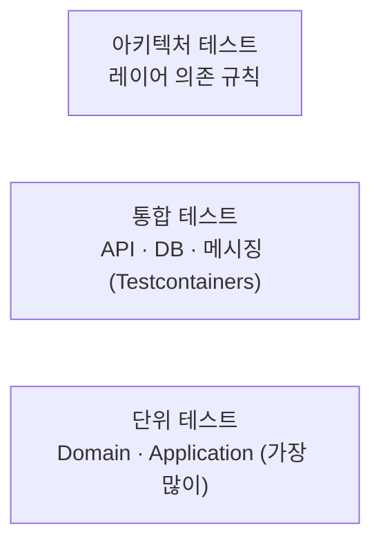

# 테스트 전략

> 테스트 종류별 범위, 도구, 필수 테스트 케이스(성공 / 실패 / 엣지 케이스), 품질 기준을 정의합니다.
> developer(단위 테스트)와 tester(통합 · 인수 테스트) 에이전트가 작업 기준으로, reviewer와 tester가 진입 점검 기준으로 사용합니다.
> 결정 근거: [ADR-0006 TDD](../03-architecture/adr/0006-adopt-tdd.md), [ADR-0021 테스트 도구](../03-architecture/adr/0021-test-tooling-xunit-v3-and-awesomeassertions.md), [ADR-0022 Respawn · 커버리지](../03-architecture/adr/0022-respawn-and-coverage-tooling.md) · 작성 절차: [TDD 가이드](tdd-guide.md)
>
> [위키 홈](../README.md)

## 테스트 피라미드



| 종류 | 대상 | 작성자 | 실행 시점 |
|---|---|---|---|
| 단위 | Aggregate, Value Object, Command / Query Handler, Validator | developer (구현 전에 먼저) | 빌드마다 |
| 통합 | API 엔드포인트, EF Core 매핑 · 마이그레이션, Repository, UnitOfWork(커밋 · 예외 변환) | tester | PR / 스프린트 종료 |
| 인수 | PRD 인수 조건(FR) 시나리오 | tester | 스프린트 종료 |
| 아키텍처 | 레이어 의존 규칙, 명명 규칙 | 기반 구축 때 작성, 이후 유지 | 빌드마다 |
| 계약 | API / 이벤트 스키마 | (서비스 간 연동 시작 시 도입) | - |

## 필수 테스트 케이스: 성공 · 실패 · 엣지 케이스

**테스트 대상 동작(도메인 메서드, Handler, API 엔드포인트) 하나마다** 세 종류를 모두 작성합니다. reviewer는 이 기준으로 누락을 판정합니다.

| 종류 | 기준 | 예: `Employee.Register` |
|---|---|---|
| **성공** | 정상 입력에서 기대 결과와 부수 효과(상태 변경, 도메인 이벤트)를 검증한다. 최소 1개 | 등록 성공, `EmployeeRegisteredDomainEvent` 발생 |
| **실패** | 비즈니스 규칙 · 검증 규칙 **하나마다** 실패 케이스 1개 이상. 반환된 `Error`의 코드까지 검증한다 | 이메일 형식 오류, 중복 이메일, 채널 없음 |
| **엣지 케이스** | 아래 체크리스트 중 해당하는 항목 전부 | 이름 최대 길이 / 최대+1, 공백 이름, 한글 이름, 채널 전체 조합 |

### 엣지 케이스 체크리스트

작업마다 해당 여부를 판단하고, 해당하는 항목은 테스트로 만듭니다. 해당 없다고 본 항목은 판단 근거를 남길 필요가 없지만, reviewer / tester가 누락으로 지적하면 반려 사유가 됩니다.

| 분류 | 확인할 케이스 |
|---|---|
| 경계값 | 최소, 최소-1, 최대, 최대+1, `0`, 음수 |
| 빈 값 | `null`, 빈 문자열, 공백만 있는 문자열, 빈 컬렉션, 빈 `Guid` |
| 문자열 | 최대 길이, 한글 · 이모지(유니코드), 앞뒤 공백, 대소문자 차이(이메일 등) |
| 컬렉션 | 원소 0개, 1개, 대량, 중복 원소 |
| 코드값 | 정의되지 않은 정수, 예약 값 `0`, 폐기된 값 |
| 비트 플래그 | `None`(0), 단일 플래그, 여러 플래그 조합, 전체(`All`), **정의되지 않은 비트**, 추가 / 제거 후 결과 |
| 상태 전이 | 허용되지 않은 전이, 같은 상태로 전이, 종료 상태에서의 변경 |
| 중복 · 멱등 | 같은 Command 두 번, 같은 통합 이벤트 두 번 수신(Inbox) |
| 동시성 | 같은 Aggregate 동시 수정(낙관적 잠금 충돌) |
| 시간 | UTC 변환, 자정 · 월말 · 연말 경계, 타임존이 다른 입력, 과거 / 미래 시각 |
| 권한 | 권한 없음, 일부 권한만 있음, 다른 조직의 리소스 |
| 외부 연동 | 타임아웃, 일시 오류 후 재시도 성공, 영구 실패 |
| 존재하지 않음 | 없는 ID 조회 · 수정 · 삭제 |

엣지 케이스는 `[Theory]` + `[InlineData]` / `[MemberData]`로 묶어 한 테스트에서 여러 입력을 검증합니다.

```csharp
[Theory]
[InlineData(NotificationChannels.Sms)]
[InlineData(NotificationChannels.Sms | NotificationChannels.Email)]
[InlineData(NotificationChannels.All)]
public void Register_WithValidChannels_Succeeds(NotificationChannels channels) { /* ... */ }

[Theory]
[InlineData(NotificationChannels.None)]
[InlineData((NotificationChannels)8)]    // 정의되지 않은 비트
[InlineData((NotificationChannels)(-1))]
public void Register_WithInvalidChannels_ReturnsInvalidChannelsError(NotificationChannels channels) { /* ... */ }
```

## 단위 테스트 (Domain / Application)

- **Domain**: Aggregate와 Value Object의 불변식, 상태 전이, 도메인 이벤트 발생. 외부 의존이 없으므로 Test Double을 쓰지 않는다.
- **Application**: Handler의 흐름(Repository 조회 · 추가, 도메인 호출, `Result` 반환)과 Validator 규칙. Repository · `IIdGenerator` 등 포트는 NSubstitute로 대체한다. Handler는 저장하지 않으므로(`SaveChanges` · `CommitAsync`를 부르지 않음, [ADR-0014](../03-architecture/adr/0014-command-transaction-boundary-and-unit-of-work.md)) Handler 테스트에서 저장 호출을 검증하지 않는다. 성공 시 커밋 · 실패 `Result` 시 미커밋은 트랜잭션 데코레이터 단위 테스트(가짜 `IUnitOfWork`)가 검증한다([ADR-0015](../03-architecture/adr/0015-custom-mediator-pipeline.md)). Query Handler는 DB 프로젝션이 핵심이므로 통합 테스트로 검증한다.
- 시간은 `FakeTimeProvider`(Microsoft.Extensions.TimeProvider.Testing)로 고정한다.
- 테스트끼리 상태를 공유하지 않는다. 실행 순서에 의존하지 않는다.

## 통합 테스트 (Testcontainers)

- DB는 **Testcontainers로 실제 PostgreSQL**을 띄운다. InMemory Provider / SQLite 대체는 쓰지 않는다(PostgreSQL 동작 차이 때문).
- API는 `WebApplicationFactory<Program>`으로 띄우고 HTTP로 호출한다.
- 컨테이너는 테스트 컬렉션 단위로 공유하고(`ICollectionFixture`), 테스트마다 Respawn으로 데이터를 초기화한다([ADR-0022](../03-architecture/adr/0022-respawn-and-coverage-tooling.md)).
  - **컬렉션 fixture에서 한 번**: 컨테이너 시작(이미지 `postgres:17` 명시, 매개변수 없는 생성자 금지, TD-004) → 슈퍼유저 연결로 `employee_app` 롤 · `emergency_hub_employee` DB 생성(명령 하나씩, Npgsql 명령으로 실행) → `MigrateAsync` → `Respawner.CreateAsync`. `CreateAsync`는 테이블 목록을 캐시하므로 반드시 마이그레이션 뒤에 부른다.
  - **테스트마다 시작 전**(`IAsyncLifetime.InitializeAsync`): `ResetAsync`.
  - Respawn 옵션: `DbAdapter.Postgres`, `SchemasToInclude = public`, `TablesToIgnore = public.__EFMigrationsHistory`(스키마를 붙이고 따옴표 없이 대소문자 그대로), `WithReseed = false`.
  - Respawn은 **쓰기 연결**(`employee_app`)로 연 별도 `NpgsqlConnection`을 쓴다. 읽기 연결은 `TRUNCATE`가 `25006`으로 거부된다.
  - 같은 DB를 쓰는 테스트는 한 컬렉션에서 순차 실행한다(`TRUNCATE`의 `ACCESS EXCLUSIVE` 잠금). 컬렉션을 나누면 컨테이너도 따로 둔다.
- 마이그레이션을 실제로 적용한 스키마에서 테스트한다. `EnsureCreated`는 금지하고, 운영 등록 코드(`AddDbContext` + `UseNpgsql(EnableRetryOnFailure)` + `UseSnakeCaseNamingConvention`)로 만든 쓰기 DbContext에서 실행 전략으로 `MigrateAsync`를 fixture당 한 번 적용한다([ADR-0012](../03-architecture/adr/0012-migration-apply-and-pre-production-reset.md)). `WebApplicationFactory` 호스트는 마이그레이션하지 않는다(EF Core 8 잠금 없음, TD-011). 체크 제약(코드값, 비트 플래그 범위)이 동작하는지도 확인한다.
- 연결 문자열은 `NpgsqlConnectionStringBuilder`로 조립해 `ConnectionStrings:Write` / `ConnectionStrings:Read`로 주입한다(Read = Write + `Options=-c default_transaction_read_only=on`). `Include Error Detail` · `Persist Security Info`는 테스트 연결에도 쓰지 않는다.
- 브로커 컨테이너와 Inbox 멱등 테스트는 브로커 도입 토픽에서 추가한다(도입 보류, [ADR-0023](../03-architecture/adr/0023-deferred-adoptions.md)).

## 인수 테스트

- PRD의 FR 인수 조건 하나마다 시나리오 테스트를 하나 이상 둔다. 테스트 이름이나 `Trait`에 FR ID를 남긴다: `[Trait("FR", "PRD-001/FR-03")]`
- tester는 스프린트 종료 전에 FR 충족 여부를 이 테스트로 판단하고, 결과를 [회고의 FR 충족 표](../_templates/retro.md)의 근거로 쓴다.

## 계약 테스트 (API / 이벤트)

> TODO: 서비스 간 연동이 시작되면 도입 여부와 도구를 정합니다. 우선은 이벤트 페이로드 직렬화 스냅숏 테스트로 대신합니다.

## 아키텍처 테스트

NetArchTest.Rules 1.3.2로 검증합니다([ADR-0021](../03-architecture/adr/0021-test-tooling-xunit-v3-and-awesomeassertions.md)). 프로젝트는 `tests/EmergencyHub.ArchitectureTests`이고(S02-T05), 규칙 원본은 [ADR-0024 의존성 규칙 표](../03-architecture/adr/0024-building-blocks-api-for-common-http-handling.md#의존성-규칙-표-초안)와 [Clean Architecture · 의존성 규칙](../03-architecture/clean-architecture.md#의존성-규칙)입니다. 규칙마다 원본 행 · 절을 규칙 정의(`Source`)와 테스트 주석에 적습니다.

- 의존성 규칙(형식 의존): Domain은 System과 Domain 레이어만 의존(직렬화 라이브러리 금지), Application ↛ Infrastructure 계열 · Api 계열 · EF Core · Npgsql · Scrutor · ASP.NET Core, Infrastructure 계열 ↛ Api 계열 · ASP.NET Core(Swashbuckle 포함), BuildingBlocks.Api ↛ Infrastructure 계열 · EF Core · Npgsql.
- 선언 참조: csproj의 프로젝트 · 패키지 참조도 같은 금지 목록을 따른다. **쓰지 않는 참조도 막는다**(컴파일된 어셈블리에는 남지 않으므로 테스트 어셈블리의 deps.json으로 확인).
- 컨벤션: 클래스 sealed(예외 `Error` · `Result`), Command · Query · Request · Response · Dto · 이벤트는 `record`, Repository 인터페이스는 `IRepository` / `IReadRepository` 상속, 구현은 `RepositoryBase` / `ReadRepositoryBase` 파생, `IStronglyTypedId<TSelf>`의 `TSelf`는 자기 자신, Entity 키는 강타입 ID, enum 기반 형식(일반 `short`, `[Flags]` `int` / `long`), Handler · Validator · Repository · 포트 구현은 `internal sealed`, Validator는 `RequestValidator<T>` 파생, 명시 등록 포트(`IUnitOfWork` · `IExceptionClassifier` · `IIdGenerator` · `IPreCommitHook`) 구현은 마커 미구현, `Error` / `Result` 파생 금지, Entity 파생은 `sealed`.
- 주입: Handler ↛ `ISender`, Validator ↛ Repository · 서비스 주입, Query Handler ↛ `IUnitOfWork` · Write Repository · Command Handler 겸용.
- **대상 어셈블리는 `ArchitectureAssemblies` 한곳에서 관리한다.** 서비스를 추가하면 레이어별로 목록에 넣고 csproj에 참조를 더한다. 테스트 어셈블리는 넣지 않는다.
- 규칙마다 제품 대상 형식이 1개 이상임을 단언한다(공허 통과 방지). 대상이 서비스 코드에만 있는 규칙은 서비스 어셈블리가 목록에 없는 동안만 건너뜀(Skip)으로 표시하고, 서비스가 들어오면 대상 0개는 실패다.
- 규칙마다 테스트 어셈블리 안 표본 네임스페이스에 위반 예시와 지킨 예시를 두고, 같은 규칙 객체가 위반 예시만 정확히 잡는지 확인한다.
- 아키텍처 테스트 프로젝트에는 `coverlet.collector`를 넣지 않는다. 수집기가 출력 폴더의 제품 DLL을 계측하면 Coverlet 추적 형식 의존이 생겨 Domain 규칙이 실패한다(S02-T05 실측).
- 한계: `const` 참조는 컴파일러가 인라인해 형식 의존으로 보이지 않는다. enum의 `: int` 명시 여부는 메타데이터로 구별할 수 없어 `[Flags]`의 `: int` 생략은 사람 리뷰로 잡는다.
- 서비스끼리 서로의 프로젝트를 참조하지 않는다, Controller는 Infrastructure 형식 · Repository를 쓰지 않는다(Api는 DI 등록만)는 서비스 어셈블리가 생기면 추가한다(S03).
- Repository에 분기 · 로직이 없는지는 아키텍처 테스트로 잡기 어려우므로 reviewer가 판정한다.

DI 등록 검증(통합 테스트): 마커를 구현한 모든 타입이 `Scoped`로 등록되어 컨테이너에서 해석되는지 확인한다.

## 테스트 네이밍과 구조

- 테스트 프로젝트: `<대상 프로젝트>.UnitTests`, `EmergencyHub.<Service>.IntegrationTests`, `EmergencyHub.ArchitectureTests`
- 테스트 클래스: `<대상 클래스>Tests`
- 테스트 메서드: `<메서드>_<조건>_<기대 결과>` (예: `Register_WithDuplicateEmail_ReturnsConflictError`)
- 본문은 Arrange / Act / Assert로 나누고, Act는 한 줄로 둔다.
- 테스트 데이터는 Test Data Builder로 만든다(`new EmployeeBuilder().WithEmail("...").Build()`). 테스트와 무관한 값은 빌더 기본값에 맡긴다.

## 도구

버전은 `Directory.Packages.props`에서 중앙 관리하고, 출처 · 라이선스는 [패키지 버전 · 라이선스](../03-architecture/package-versions.md#테스트)가 원본입니다.

| 용도 | 도구 | 버전 | 결정 |
|---|---|---|---|
| 테스트 프레임워크 | xUnit v3 (`xunit.v3`) + `xunit.runner.visualstudio` + `Microsoft.NET.Test.Sdk` | 4.0.1 / 4.0.0 / 18.10.1 | [ADR-0021](../03-architecture/adr/0021-test-tooling-xunit-v3-and-awesomeassertions.md) |
| 단언 | AwesomeAssertions (FluentAssertions는 어떤 버전도 쓰지 않음) | 9.6.0 | ADR-0021 |
| Test Double | NSubstitute + NSubstitute.Analyzers.CSharp | 6.2.0 / 1.0.17 | ADR-0021 |
| 통합 DB | Testcontainers.PostgreSql, Respawn | 4.15.0 / 7.0.0 | ADR-0021 / [ADR-0022](../03-architecture/adr/0022-respawn-and-coverage-tooling.md) |
| 시간 | Microsoft.Extensions.TimeProvider.Testing | 10.10.0 | ADR-0021 |
| 아키텍처 | NetArchTest.Rules | 1.3.2 | ADR-0021 |
| 커버리지 | coverlet.collector + ReportGenerator(로컬 도구 매니페스트) | 10.0.1 / 5.5.11 | ADR-0022 |

- xUnit v3는 SDK 8.0.4xx 이상이 필요하고, 테스트 프로젝트는 `OutputType=Exe`다. .NET 8 SDK의 `dotnet test`(VSTest) 경로로 실행한다.
- 비동기 준비 · 정리는 `IAsyncLifetime`(v3는 `ValueTask`)으로 하고, 테스트 안의 취소 토큰은 `TestContext.Current.CancellationToken`을 쓴다.
- 테스트 프로젝트의 `GlobalUsings.cs`에 `using AwesomeAssertions;`를 둔다.

## 커버리지 기준

- BuildingBlocks(Domain · Application)와 서비스 Domain / Application 라인 커버리지 **80% 이상**을 목표로 한다([PRD-001](../10-delivery/prd/PRD-001-foundation.md) NFR-03). CI에서 측정 · 보고만 하고 필수 체크(임계값 실패)는 걸지 않는다. 안정되면 필수 체크로 바꿀지 새로 정한다.
- 측정: `dotnet test --collect "XPlat Code Coverage" --settings coverlet.runsettings` → ReportGenerator로 합산 보고. 대상 어셈블리 · 제외 규칙(테스트, `Migrations/**`, 생성 코드)은 [ADR-0022](../03-architecture/adr/0022-respawn-and-coverage-tooling.md#커버리지)를 따른다.
- 커버리지 숫자보다 **필수 테스트 케이스(성공 / 실패 / 엣지)의 충족**을 우선 판정한다.
- Api / Infrastructure는 커버리지 대신 통합 테스트로 확인한다.

## CI

- 워크플로: [`.github/workflows/ci.yml`](../../.github/workflows/ci.yml). `develop` · `main` 대상 PR(Draft PR 포함)마다 `ubuntu-24.04`에서 실행한다([PRD-001](../10-delivery/prd/PRD-001-foundation.md) FR-10). 권한은 `contents: read`, 비밀은 쓰지 않는다. SDK는 `global.json`으로 설치하고, 액션은 커밋 SHA로 고정한다([패키지 버전 · 라이선스](../03-architecture/package-versions.md#github-actions)).
- 커버리지 설정: 저장소 루트 [`coverlet.runsettings`](../../coverlet.runsettings)(cobertura, NFR-03 대상 4개 어셈블리 `Include` — 아직 없는 어셈블리도 패턴으로 미리 포함, 테스트 어셈블리 · `Migrations/**` · `obj/**` · `*.g.cs` 제외, `GeneratedCode` · `CompilerGenerated` · `ExcludeFromCodeCoverage` 속성 제외, `SkipAutoProps`).
- 같은 순서를 로컬에서 그대로 실행할 수 있다(저장소 루트, Git Bash).

```bash
dotnet tool restore
dotnet restore EmergencyHub.sln
dotnet build EmergencyHub.sln --no-restore --configuration Release
dotnet format EmergencyHub.sln --verify-no-changes --no-restore
dotnet test EmergencyHub.sln --no-build --configuration Release --collect "XPlat Code Coverage" --settings coverlet.runsettings --logger trx --results-directory TestResults
dotnet tool run reportgenerator "-reports:TestResults/*/coverage.cobertura.xml" "-targetdir:coveragereport" "-reporttypes:Html;TextSummary;MarkdownSummaryGithub"
```

- 보고 경로는 한 단계 패턴(`TestResults/*/`)을 쓴다. trx 로거가 커버리지 첨부를 `TestResults/<trx 이름>/In/**` 아래로 한 번 더 복사해 `**` 패턴이면 같은 결과가 두 번 합산된다.
- CI 산출물: 텍스트 요약은 로그에, Markdown 요약은 잡 요약(`GITHUB_STEP_SUMMARY`)에 싣는다. trx(`test-results`)와 HTML 보고서(`coverage-report`)는 아티팩트로 14일 보관한다(실패해도 업로드). 단계별 소요 시간은 Actions 실행 화면의 단계 목록에서 확인한다(NFR-07 10분 이내).
- `TestResults/` · `coveragereport/`는 `.gitignore` 대상이다.

---

## 변경 이력

| 날짜 | 작성자 | 내용 |
|---|---|---|
| 2026-09-27 | - | 문서 생성 |
| 2026-09-27 | - | 기본 전략 초안: 피라미드, 필수 테스트 케이스(성공 / 실패 / 엣지 체크리스트), 단위 · 통합 · 인수 · 아키텍처 테스트, 도구 |
| 2026-09-27 | - | 아키텍처 테스트에 Repository · DI 마커 · record 규칙, DI 등록 검증 추가 |
| 2026-09-27 | developer | ADR 0014 · 0021 · 0022 · 0023 반영: 도구 버전 고정(xUnit v3, AwesomeAssertions), 통합 테스트 Respawn · DB 준비 규칙, 커버리지 대상 · 보고 방식, Handler 테스트의 저장 검증 제외 (S01-T04) |
| 2026-09-27 | developer | CI 절 추가: 워크플로 · runsettings 위치, 로컬 재현 명령, 보고 경로 패턴(중복 합산 방지), 산출물 (S01-T07) |
| 2026-09-27 | developer | 아키텍처 테스트 절을 구현에 맞춰 갱신: 규칙 원본(ADR-0024 표), 규칙 목록, 쓰지 않는 선언 참조 금지, 대상 어셈블리 단일 목록, 공허 통과 방지 · 서비스 전용 규칙 건너뜀, 표본 검증, 한계 (S02-T05) |
