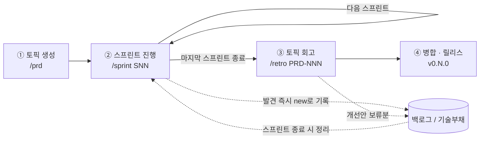
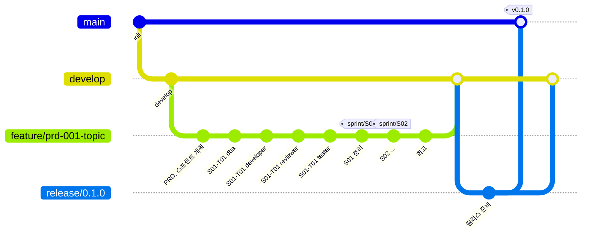

# 개발 관리 (Delivery)

> PRD(토픽)를 받아 스프린트로 개발하고, 그 과정에서 생긴 백로그와 기술부채를 기록하고, 토픽이 끝나면 회고하는 흐름과 문서를 모아 둡니다.
>
> [위키 홈](../README.md)

## 개발 흐름



| 단계 | 스킬 | 하는 일 | 끝나는 상태 |
|---|---|---|---|
| ① 토픽 생성 | `/prd` | 사용자 인터뷰로 PRD를 채우고, orchestrator · dba · developer가 병렬 리뷰한 뒤 orchestrator가 스프린트를 나눈다. **사용자 승인 후** 토픽 브랜치와 Draft PR을 만든다. | PRD `stable`, 스프린트 `planned` |
| ② 스프린트 진행 | `/sprint SNN` | 에이전트별 계획 리뷰 → 작업마다 dba → developer → reviewer → tester(회귀 루프) → orchestrator 결과 리뷰, 백로그 / 기술부채 정리 → 회고 초안 → push | 스프린트 `done` |
| ③ 토픽 회고 | `/retro PRD-NNN` | 에이전트별 회고를 orchestrator가 통합한다(FR 충족 표, 파이프라인 분석, 개선안). | 회고 문서 |
| ④ 병합 · 릴리스 | `/retro` 마지막 단계 | Draft PR → Ready → `develop`에 Merge commit → `release/0.N.0` → `main` `v0.N.0` | PRD `done` |

에이전트 구성, 단계 인계 계약, 회귀 규칙은 [에이전트 워크플로우](agents.md)에 있습니다. 스킬은 모두 사용자가 직접 실행합니다(Claude가 알아서 실행하지 않음).

### 운영 원칙

- **PRD 하나 = 토픽 하나 = 토픽 브랜치 하나 = 릴리스 하나**다. PRD가 크면 스프린트를 여러 개로 나눈다.
- **토픽은 한 번에 하나만** 진행한다. 토픽 브랜치가 오래 살아 있으므로 동시에 진행하면 `develop`과 충돌한다.
- 스프린트는 **범위 고정**이다. 기간을 정하지 않고, 계획한 작업이 끝나면 종료한다.
- 사용자 승인 지점: PRD 초안, 스프린트 분할안, 스프린트 계획 리뷰 결과, 백로그 / 기술부채 정리안, 회고 개선안, 병합 · 릴리스
- 백로그와 기술부채는 **발견 즉시** `new` 상태로 기록하고, 스프린트 종료 때 orchestrator가 정리한다. 기록하지 않은 미룬 일은 없는 것으로 본다.

## Git 운영



| 시점 | Git 동작 |
|---|---|
| 토픽 생성 (`/prd`) | `develop`에서 `feature/prd-NNN-<topic>` 생성, PRD · 스프린트 문서 커밋, push, `develop` 대상 **Draft PR** 생성 |
| 작업자 단계 종료 | 단계마다 **로컬 커밋** (dba, developer, reviewer, tester 각각) |
| 스프린트 종료 | 정리 커밋, **push**, 태그 `sprint/SNN` |
| 토픽 종료 (`/retro`) | 회고 커밋, push, PR Ready → **Merge commit**으로 병합, `release/0.N.0` → `main`, 태그 `v0.N.0` |

- 커밋 제목은 `<type>(<scope>): <내용> (SNN-TNN)`, footer에 `Stage: dba | developer | reviewer | tester`를 적는다.
- 반려 후 재작업은 **새 커밋**으로 쌓는다(reset 금지). 반려와 재작업 과정이 이력에 남는다.
- 세부 규칙은 [Git 워크플로우](../04-development/git-workflow.md)를 따른다.

## ID 체계와 추적성

| 대상 | ID | 예 | 위치 |
|---|---|---|---|
| PRD (토픽) | `PRD-NNN` | `PRD-001` | `prd/PRD-001-kebab-title.md` |
| 요구사항 | `FR-NN`, `NFR-NN` | `PRD-001/FR-03` | PRD 문서 안 |
| 스프린트 | `SNN` | `S01` | `sprints/S01-kebab-title.md` |
| 작업 | `SNN-TNN` | `S01-T02` | 스프린트 문서 안 |
| 백로그 | `BL-NNN` | `BL-004` | [backlog.md](backlog.md) |
| 기술부채 | `TD-NNN` | `TD-002` | [tech-debt.md](tech-debt.md) |
| 회고 | `RETRO-PRD-NNN` | `RETRO-PRD-001` | `retros/RETRO-PRD-001.md` |

- 스프린트 번호(`SNN`)는 토픽과 관계없이 프로젝트 전체에서 이어서 붙인다.
- 추적 사슬: `FR-03` → `S01-T02` → 커밋 `feat(employee): Employee Aggregate 구현 (S01-T02)` → 토픽 PR → 릴리스 `v0.1.0`

## 구성

```
10-delivery/
├── README.md       # 이 문서 (흐름, 목록)
├── agents.md       # 에이전트 워크플로우
├── prd/            # PRD-NNN-kebab-title.md
├── sprints/        # SNN-kebab-title.md
├── retros/         # RETRO-PRD-NNN.md
├── backlog.md      # BL-NNN 표
└── tech-debt.md    # TD-NNN 표
```

- 템플릿: [`prd`](../_templates/prd.md), [`sprint`](../_templates/sprint.md), [`retro`](../_templates/retro.md)
- 스프린트 문서의 `worklogs`와 worklog의 `sprint` 필드로 세션 기록과 연결한다.

## PRD 목록

| ID | 제목 | 상태 | 스프린트 | 브랜치 / PR | 릴리스 |
|---|---|---|---|---|---|
| [PRD-001](prd/PRD-001-foundation.md) | 기반 구축 (인프라 · .NET 8 솔루션 기본 설계) | stable | S01~S04 | `feature/prd-001-foundation` / [#7](https://github.com/thkim-ezabele/task_20260926/pull/7) | `v0.1.0` |

## 스프린트 목록

| ID | 제목 | PRD | 상태 |
|---|---|---|---|
| [S01](sprints/S01-decisions-build-ci.md) | 기술 결정 확정과 빌드 · CI 기반 | PRD-001 | active |
| [S02](sprints/S02-building-blocks.md) | BuildingBlocks Application · Infrastructure와 공통 API 처리 | PRD-001 | planned |
| [S03](sprints/S03-aspire-employee.md) | Aspire와 Employee 샘플 서비스 전 구간 | PRD-001 | planned |
| [S04](sprints/S04-tests-docs-evidence.md) | 테스트 보강 · 문서 · 인수 증빙 | PRD-001 | planned |

---

## 변경 이력

| 날짜 | 작성자 | 내용 |
|---|---|---|
| 2026-09-27 | - | 문서 생성: 개발 흐름, 운영 원칙, ID 체계 |
| 2026-09-27 | - | 토픽 브랜치 방식(토픽 = 릴리스), `/prd` · `/sprint` · `/retro` 흐름, 토픽 회고 추가 |
| 2026-09-27 | - | PRD-001 토픽 생성, 스프린트 S01~S04 계획 |
