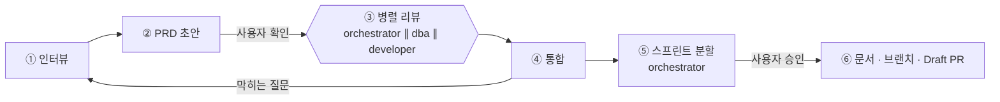
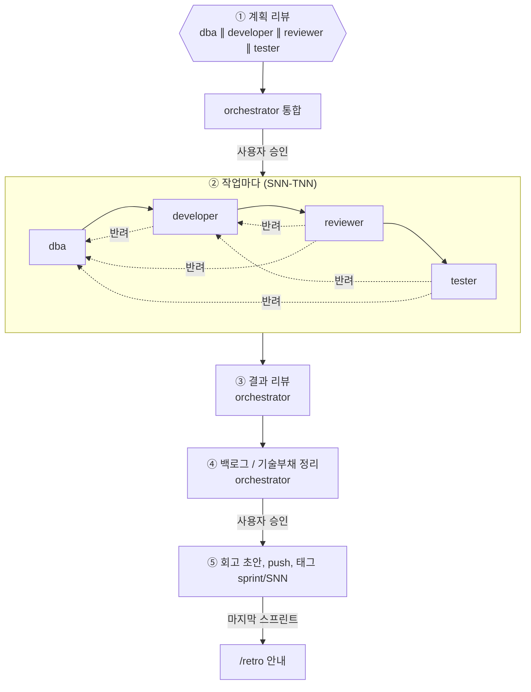
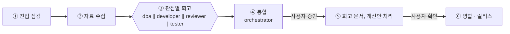
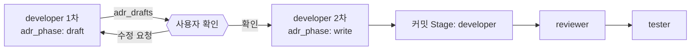

# 에이전트 워크플로우

> `/prd`, `/sprint`, `/retro` 스킬이 서브에이전트(orchestrator, dba, developer, reviewer, tester)를 어떻게 부리는지, 단계 사이에 무엇을 넘기고 언제 되돌리는지 정의합니다.
>
> [개발 관리](README.md)

## 구현 위치

| 구분 | 파일 |
|---|---|
| 에이전트 | [`orchestrator`](../../.claude/agents/orchestrator.md) · [`dba`](../../.claude/agents/dba.md) · [`developer`](../../.claude/agents/developer.md) · [`reviewer`](../../.claude/agents/reviewer.md) · [`tester`](../../.claude/agents/tester.md) |
| 스킬 | [`/prd`](../../.claude/skills/prd/SKILL.md) · [`/sprint`](../../.claude/skills/sprint/SKILL.md) · [`/retro`](../../.claude/skills/retro/SKILL.md) |

에이전트는 호출 프롬프트 첫 줄의 `mode:`(예: `prd-review`, `task-stage`, `retro`)로 할 일을 구분합니다. 이 문서와 구현이 다르면 구현을 이 문서에 맞추고, 규칙을 바꿀 때는 이 문서를 먼저 고칩니다.

## 구조

- **흐름 제어는 스킬(메인 세션)이 한다.** Claude Code의 서브에이전트는 다른 서브에이전트를 실행할 수 없으므로, 병렬 실행, 순차 진행, 회귀 루프는 스킬 절차가 담당한다.
- **orchestrator는 판단을 맡는다.** 기획 관점 리뷰, 리뷰 통합, 스프린트 분할, 결과 리뷰, 백로그 / 기술부채 정리, 회고 통합을 한다.
- **병렬로 도는 에이전트는 결과만 반환**하고, 위키 문서는 메인 세션이 한 번에 쓴다. 같은 파일을 동시에 고쳐 충돌하는 것을 막는다.
- **커밋은 스킬이 한다.** 에이전트는 `git commit` / `push`를 하지 않고, 커밋 메시지(`commit_message`)만 반환한다.
- 에이전트가 반환한 백로그 / 기술부채 후보(`candidates`)는 스킬이 `new` 행으로 기록해 그 단계의 커밋에 넣는다. **후보는 스프린트 밖에서 처리할 것만** 올린다.
- 같은 스프린트의 다음 작업(또는 같은 작업의 다음 단계)에서 반영할 메모는 `handoff`로 반환한다. 스킬은 이를 진행 기록에 적고 대상 작업의 단계 호출 프롬프트("인계 메모")로 넘기며, 백로그로 올리지 않는다. 대상 작업에서 반영되지 않으면 스프린트 종료 전에 후보로 바꾼다.
- **완료 조건에 들어 있는 항목은 작업자가 혼자 스프린트 밖으로 내보내지 않는다.** 이번 작업에서 할 수 없다고 판단하면 `candidates`로 올리지 말고 `status: BLOCKED`와 이유를 반환해 사용자 판단을 받는다(S02 회고).
- 모든 에이전트는 메인 세션의 모델을 상속한다.

## 에이전트

| 에이전트 | `/prd` | `/sprint` | `/retro` | 파일 쓰기 |
|---|---|---|---|---|
| **orchestrator** | 범위 · 우선순위 · 위험 · 의존 관계 리뷰, 리뷰 통합, **스프린트 분할** | 계획 리뷰 통합, **결과 리뷰, 백로그 / 기술부채 정리** | **회고 통합**, 개선안 | ❌ 읽기 전용 (조회 명령만) |
| **dba** | 데이터 모델, 서비스별 DB 경계, 개인정보 · 보존 기간 리뷰 | 계획 리뷰, 스키마 · EF Core 매핑 · 마이그레이션 | DB 관점 회고 | ✅ |
| **developer** | 도메인 모델, 서비스 · 이벤트 영향, 구현 가능성 리뷰 | 계획 리뷰, **단위 테스트 먼저 작성 후 구현(TDD)**, [코딩 컨벤션](../04-development/coding-conventions.md) 준수 필수 | 구현 관점 회고 | ✅ |
| **reviewer** | - | 계획 리뷰, 컨벤션 · 레이어 규칙 · 완료 조건 판정 | 품질 관점 회고 | ❌ 빌드 · 검사 명령만 |
| **tester** | - | 계획 리뷰, 통합 · 인수 테스트(Testcontainers), FR 인수 조건 검증 | 테스트 관점 회고 | ✅ 테스트 코드만 |

> tester가 마지막 단계여도 [ADR-0006](../03-architecture/adr/0006-adopt-tdd.md)(TDD)과 어긋나지 않도록, 단위 테스트는 developer가 구현 전에 먼저 쓰고 tester는 통합 · 인수 테스트와 검증을 맡습니다.

## `/prd`: 토픽 생성



1. **인터뷰**: PRD 원문을 인자로 받으면 빠진 항목만 묻는다. 한 번에 2~4개씩 여러 번에 나눠 묻는다. "모름 / 추후"도 답으로 받고, PRD의 질문 표에 미해결로 남긴다.

   | 영역 | 항목 |
   |---|---|
   | 배경 | 목적, 해결할 문제, 사용자 / 이해관계자 |
   | 기능 | 기능 목록, 우선순위, 인수 조건 |
   | 비기능 | 성능(예: N명 전파 M초 이내), 가용성, 보안 · 권한, 개인정보 |
   | 데이터 | 다루는 데이터, 보존 기간, 민감 정보 |
   | 연동 | 외부 시스템(SMS 사업자, 푸시, 메일), 다른 서비스 |
   | 경계 | 범위 밖, 제약(기한, 기술), 이미 결정된 사항 |

2. **PRD 초안**: 원문 보존, 요구사항 ID(`FR-NN`, `NFR-NN`) 부여. 사용자가 확인한다.
3. **병렬 리뷰**: 세 에이전트가 [리뷰 반환 형식](#리뷰-반환-형식)으로 결과를 낸다.
4. **통합**: 막히는 질문이 있으면 ①로 돌아가 사용자에게 묻는다.
5. **스프린트 분할**: orchestrator가 스프린트별 목표, 작업(`SNN-TNN`, 대응 FR, 완료 조건), 작업 간 의존 순서를 낸다.
6. **승인 후 반영**: PRD `stable`, 스프린트 문서 `planned`, `feature/prd-NNN-<topic>` 생성, 커밋, push, Draft PR

## `/sprint SNN`: 스프린트 진행



0. **사전 점검**: 브랜치 · 스프린트 상태 · 작업 트리와 함께 **실행 환경**(Docker 실행, `global.json`을 만족하는 SDK, `gh` 인증)을 확인한다. 부족하면 사용자에게 알리고 진행 여부를 묻는다. 환경 문제로 미루는 검증은 진행 기록에 남긴다.
1. **계획 리뷰**: 네 에이전트가 병렬로 계획을 리뷰하고 orchestrator가 통합해 계획 수정안을 낸다. 사용자 승인 후 스프린트를 `active`로 바꾼다.
2. **작업 파이프라인**: 작업마다 dba → developer → reviewer → tester 순서로 진행한다. 각 단계는 [진입 점검](#단계-인계-계약)을 먼저 하고, 끝나면 **로컬 커밋**한다([커밋 규칙](#커밋-규칙)). 스프린트 문서의 작업별 파이프라인 표에서 dba 열이 "해당 없음"인 작업은 **dba를 호출하지 않고** 진행 기록에 "해당 없음" 한 줄만 남긴다(그 줄은 developer 단계 커밋에 포함). 테스트 작성 범위는 [테스트 범위](#테스트-범위)를 따른다. 문서 · ADR 작업은 [문서 작업과 ADR 확인](#문서-작업과-adr-확인)을 따른다.
3. **결과 리뷰** (orchestrator): 계획 대비 실제(완료 · 이관 · 추가 작업), 완료 조건과 FR 충족, 반려 이력 분석
4. **백로그 / 기술부채 정리** (orchestrator): 스프린트 동안 `new`로 쌓인 항목의 중복 병합, 기존 항목 갱신, 우선순위, 다음 스프린트 편입(`planned:SNN`), 상환 계획. 사용자 승인 후 반영하며, 끝나면 `new` 항목이 남지 않는다.
5. **마무리**: 스프린트 문서의 회고 초안, DoD 점검, frontmatter(`status: done`, `finished`, `adrs`) 갱신, 정리 커밋, **push → 토픽 PR의 CI 통과 확인 → DoD 결과(CI 실행 · 소요 시간) 기록 커밋 · push → 태그 `sprint/SNN`**. CI가 실패하면 원인 작업을 재작업하고 통과할 때까지 태그를 붙이지 않는다. PRD의 마지막 스프린트면 `/retro PRD-NNN` 실행을 안내한다.

## `/retro PRD-NNN`: 토픽 회고



1. **진입 점검**: PRD의 모든 스프린트가 `done`인지 확인한다. 아니면 중단한다.
2. **자료 수집** (메인 세션): PRD, 스프린트 문서(진행 기록 포함), 백로그 / 기술부채, 토픽 PR과 커밋, worklog, 스프린트 태그
3. **관점별 회고**: 네 에이전트가 각자의 관점에서 잘된 점, 문제, 반려 원인, 부족했던 기준 문서를 낸다.
4. **통합** (orchestrator): [회고 템플릿](../_templates/retro.md)의 구성(FR 충족 표, 계획 대비 실제, 파이프라인 분석, BL / TD 추이, 개선안, ADR 후보)으로 정리한다.
5. **반영**: 회고 문서 작성. 승인된 개선안은 별도 브랜치(`feature/retro-prd-NNN-*`)에서 반영하고, 보류한 개선안은 백로그에 올린다. 장기기억을 갱신한다.
6. **병합 · 릴리스**: Draft PR → Ready → `develop`에 Merge commit → `release/0.N.0` → `main`, 태그 `v0.N.0`. PRD를 `done`으로 바꾼다.

## 리뷰 반환 형식

`/prd` 리뷰, `/sprint` 계획 리뷰, `/retro` 회고에서 병렬 에이전트가 공통으로 반환한다.

```yaml
agent: dba
findings:            # 문제, 모호함, 위험
  - { severity: high | medium | low, item: "...", detail: "..." }
questions:
  - { blocking: true, question: "..." }
suggestions: ["..."] # 요구사항 / 계획 보완
adr_candidates: ["..."]
tasks: ["..."]       # 이 관점에서 필요한 작업 (/prd, /sprint)
```

## 단계 인계 계약

`/sprint` 작업 파이프라인의 각 단계는 시작하자마자 앞 단계 산출물을 점검하고, 끝나면 다음 형식으로 반환한다.

```yaml
agent: developer
status: PASS | REJECT | BLOCKED   # BLOCKED = 사용자 판단 필요
entry_check:
  - { item: "마이그레이션 적용 가능", ok: true }
reject_to: dba                    # REJECT일 때 되돌릴 단계 (바로 앞보다 더 앞도 가능)
reasons: ["..."]
changed_files: ["..."]
candidates:                       # 스프린트 밖에서 처리할 백로그 / 기술부채 (new로 기록)
  backlog: ["..."]
  tech_debt: ["..."]
handoff:                          # 같은 스프린트 안에서 반영할 메모 (백로그 아님)
  - { to: "SNN-TNN", note: "..." }
```

| 진입 단계 | 진입 점검 (실패하면 반려) | 기준 문서 |
|---|---|---|
| **developer** (← dba) | 마이그레이션이 있고 적용되는가, 매핑이 도메인 모델과 맞는가, DB 명명 규칙을 지켰는가 | [데이터베이스](../04-development/database.md) |
| **reviewer** (← developer) | 빌드 성공, 단위 테스트(성공 / 실패 / 엣지)가 있고 통과, 아키텍처 테스트 통과, 코딩 컨벤션(모델 `record`, Repository는 람다 쿼리만, DI 마커 상속, CQRS 읽기 / 쓰기 분리), 로그 규칙(메시지 템플릿, 개인정보 금지)과 `dotnet format`, 완료 조건 대비 누락 없음 | [코딩 컨벤션](../04-development/coding-conventions.md), [Clean Architecture](../03-architecture/clean-architecture.md), [로깅](../04-development/logging-observability.md) |
| **tester** (← reviewer) | reviewer PASS, 인수 조건을 테스트할 수 있는 구현인가. 테스트 실패는 원인에 따라 developer나 dba로 반려 | [테스트 전략](../04-development/testing-strategy.md) |

## 완료 조건 작성

orchestrator가 스프린트를 나누거나(`sprint-split`) 계획 리뷰를 통합할 때(`sprint-plan-integrate`) 지키는 규칙이다(S02 회고).

- 작업의 완료 조건은 **검증 가능한 문장 5~7개 안쪽**으로 쓴다. 하위 항목이 10개를 넘으면 작업을 나눈다.
- 세부 단언 목록(메타데이터 항목, 변환 규칙표, 로그 필드 등)은 완료 조건에 넣지 않고, 계획 리뷰 결과나 앞 단계(dba 등)의 `handoff`로 넘긴다.

## 테스트 범위

developer와 tester가 테스트를 어디까지 쓸지 정한다(S02 회고, 사용자 결정). 원본 기준은 [테스트 전략](../04-development/testing-strategy.md#필수-테스트-케이스-성공--실패--엣지-케이스)이다.

| 작업 종류 | developer 단위 테스트 | tester |
|---|---|---|
| **도메인 로직** (Aggregate, Value Object, Handler의 비즈니스 규칙) | TDD 전체 적용: 동작마다 성공 / 실패(규칙마다) / 엣지 체크리스트 전부 | 완료 조건 대조에서 빈 곳만 보강 |
| **기반 · 셋팅** (BuildingBlocks, DI 등록, 공통 규칙, 빌드 · CI 설정) | 완료 조건 **항목마다** 성공 / 실패 / 엣지를 **최소 1개씩**. 그 밖의 엣지는 tester가 판단 | 완료 조건 대조에서 빈 곳만 보강 |

- tester는 **완료 조건 · FR 인수 조건과 대조해 빈 곳이 있을 때만** 테스트를 추가한다. developer 테스트와 같은 시나리오를 다른 조립으로 다시 확인하는 테스트는 만들지 않는다.
- 작업 종류는 스프린트 문서 작업 표의 작업 성격으로 판단하고, 애매하면 계획 리뷰에서 정한다.

## 회귀 규칙

- 반려되면 **반려된 단계부터 뒤 단계를 모두 다시** 거친다. 예: tester → dba 반려면 dba → developer → reviewer → tester.
- 재작업은 **새 커밋**으로 쌓는다(reset 금지).
- 작업 하나에서 반려가 **총 3회**에 이르면 멈추고 사용자에게 보고한다(BLOCKED).
- 반려 이력(단계, 되돌린 곳, 사유)은 스프린트 문서의 "진행 기록"에 남긴다.

## 문서 작업과 ADR 확인

조사 · ADR · 기준 문서처럼 코드가 없는 작업(스프린트 작업 표에서 문서 작업으로 표시)은 다음과 같이 운영한다.



- **developer 1차** (`adr_phase: draft`): ADR 파일을 만들지 않고 초안을 `adr_drafts: [{ number, title, body }]`로 반환한다. ADR이 아닌 조사 기록 · 기준 문서 수정은 이 호출에서 파일로 작성해도 된다.
- **사용자 확인**: 스킬이 작업 단위로 초안을 한 번에 보여 주고 확인받는다. 수정 요청은 developer 1차를 다시 호출해 반영한다.
- **developer 2차** (`adr_phase: write`): 확인된 본문으로 `accepted` ADR 파일을 만들고 ADR 목록 · 관련 문서를 갱신한다. 스킬이 `Stage: developer`로 커밋한다.
- **reviewer · tester**는 커밋된 `accepted` 파일만 판정한다.
- **반려**: 형식(템플릿, frontmatter, 링크, 오탈자) 반려는 사용자에게 다시 묻지 않고 developer 2차에서 새 커밋으로 고친다. 결정 내용이 바뀌는 반려는 developer 1차로 돌아가 다시 확인받는다. 둘 다 반려 3회 한도에 포함한다.
- push 전 토픽 브랜치 안의 수정은 ADR 불변 규칙 위반으로 보지 않는다. 불변 규칙은 push된 `accepted` ADR부터 적용한다.
- **단계별 판정**: dba는 DB 관련 내용이 있을 때만 검토한다(없으면 "해당 없음" PASS). developer는 TDD · 빌드 전제를 적용하지 않는다. reviewer는 코드 점검표 대신 스프린트 파이프라인 표의 reviewer 열과 문서 규칙(템플릿, frontmatter 필수 키, 상대경로 링크, wikilink 금지, 기존 ADR 불변)으로 판정한다. tester는 테스트 코드 대신 명령 기반 점검표로 검증하고 명령과 출력을 남긴다.
- ADR과 draft 기준 문서가 충돌하면 ADR을 따르고, 같은 스프린트 안에서 기준 문서를 고친다.

## 커밋 규칙

```
<type>(<scope>): <내용> (SNN-TNN)

<본문>

Stage: dba | developer | reviewer | tester
```

- 단계마다 커밋한다. 다만 **reviewer PASS는 따로 커밋하지 않고** 진행 기록에 적어 두었다가 tester 단계 커밋에 함께 넣는다. reviewer REJECT · BLOCKED는 바로 커밋한다. 작업 하나의 커밋은 보통 developer · tester · 완료 처리 3개가 된다(dba가 파일을 바꾼 작업은 dba 커밋 추가).
- **커밋 타입**: 제품 파일(코드 · 설정 · 기준 문서 · ADR)이 바뀐 단계는 에이전트의 `commit_message`(`feat` · `fix` · `test` · `build` · `ci` · `docs(<scope>)` 등)를 쓴다. 판정 · 기록만 남는 단계(스프린트 문서 · 백로그 · 기술부채만 바뀜)는 에이전트와 관계없이 `docs(sprint): SNN-TNN <단계> 판정 (SNN-TNN)`으로 통일한다.
- 문서를 바꾼 단계는 커밋 전에 `node scripts/check-docs.js`로 결함이 늘지 않았는지 확인한다.
- push는 스프린트 종료 때 한 번 한다.

---

## 변경 이력

| 날짜 | 작성자 | 내용 |
|---|---|---|
| 2026-09-27 | - | 문서 생성: 에이전트 구성, `/prd` · `/sprint` · `/retro` 흐름, 인계 계약, 회귀 규칙 |
| 2026-09-27 | - | developer 코딩 컨벤션 준수 필수, reviewer 진입 점검 항목 구체화 |
| 2026-09-27 | - | 에이전트 5개 · 스킬 3개 구현, 구현 위치 추가, 커밋 · 후보 기록 주체(스킬) 명시 → `stable` |
| 2026-09-27 | - | 문서 작업과 ADR 확인 흐름 추가(S01 계획 리뷰 N1) |
| 2026-09-27 | - | S01 회고 반영: 사전 환경 점검, `handoff`(같은 스프린트 인계 메모는 백로그 아님), 커밋 타입 규칙, 종료 frontmatter 갱신, CI 통과 후 태그 |
| 2026-09-27 | - | S02 회고 반영: dba "해당 없음" 호출 생략, reviewer PASS 커밋을 tester 커밋에 병합, 완료 조건 작성 규칙(5~7문장), 테스트 범위(기반 · 셋팅은 항목당 최소 1개, tester는 빈 곳만), 완료 조건 항목 임의 이관 금지 |
