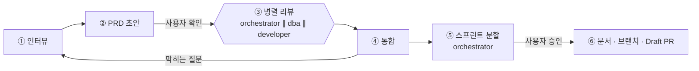
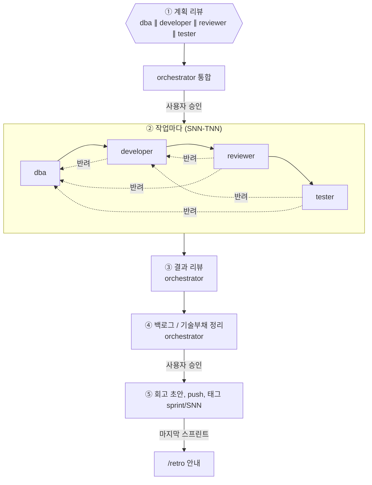
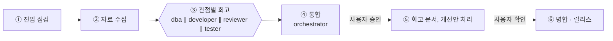

# 에이전트 워크플로우

> `/prd`, `/sprint`, `/retro` 스킬이 서브에이전트(orchestrator, dba, developer, reviewer, tester)를 어떻게 부리는지, 단계 사이에 무엇을 넘기고 언제 되돌리는지 정의합니다.
>
> [개발 관리](README.md)

> 🟡 설계 확정, 구현 전입니다. 에이전트(`.claude/agents/`)와 스킬(`.claude/skills/`)을 만들면 `stable`로 바꿉니다.

## 구조

- **흐름 제어는 스킬(메인 세션)이 한다.** Claude Code의 서브에이전트는 다른 서브에이전트를 실행할 수 없으므로, 병렬 실행, 순차 진행, 회귀 루프는 스킬 절차가 담당한다.
- **orchestrator는 판단을 맡는다.** 기획 관점 리뷰, 리뷰 통합, 스프린트 분할, 결과 리뷰, 백로그 / 기술부채 정리, 회고 통합을 한다.
- **병렬로 도는 에이전트는 결과만 반환**하고, 위키 문서는 메인 세션이 한 번에 쓴다. 같은 파일을 동시에 고쳐 충돌하는 것을 막는다.
- 모든 에이전트는 메인 세션의 모델을 상속한다.

## 에이전트

| 에이전트 | `/prd` | `/sprint` | `/retro` | 파일 쓰기 |
|---|---|---|---|---|
| **orchestrator** | 범위 · 우선순위 · 위험 · 의존 관계 리뷰, 리뷰 통합, **스프린트 분할** | 계획 리뷰 통합, **결과 리뷰, 백로그 / 기술부채 정리** | **회고 통합**, 개선안 | ❌ 읽기 전용 |
| **dba** | 데이터 모델, 서비스별 DB 경계, 개인정보 · 보존 기간 리뷰 | 계획 리뷰, 스키마 · EF Core 매핑 · 마이그레이션 | DB 관점 회고 | ✅ |
| **developer** | 도메인 모델, 서비스 · 이벤트 영향, 구현 가능성 리뷰 | 계획 리뷰, **단위 테스트 먼저 작성 후 구현(TDD)**, [코딩 컨벤션](../04-development/coding-conventions.md) 준수 필수 | 구현 관점 회고 | ✅ |
| **reviewer** | - | 계획 리뷰, 컨벤션 · 레이어 규칙 · 완료 조건 판정 | 품질 관점 회고 | ❌ 빌드 · 검사 명령만 |
| **tester** | - | 계획 리뷰, 통합 · 인수 테스트(Testcontainers), FR 인수 조건 검증 | 테스트 관점 회고 | ✅ 테스트 코드만 |

> tester가 마지막 단계여도 [ADR-0006](../03-architecture/adr/0006-adopt-tdd.md)(TDD)과 어긋나지 않도록, 단위 테스트는 developer가 구현 전에 먼저 쓰고 tester는 통합 · 인수 테스트와 검증을 맡습니다.

## `/prd`: 토픽 생성



1. **인터뷰**: PRD 원문을 인자로 받으면 빠진 항목만 묻는다. 한 번에 2~4개씩 여러 번에 나눠 묻는다. "모름 / 추후"도 답으로 받고, PRD의 질문 표에 미해결로 남긴다.

   | 영역 | 항목 |
   |---|---|
   | 배경 | 목적, 해결할 문제, 사용자 / 이해관계자 |
   | 기능 | 기능 목록, 우선순위, 인수 조건 |
   | 비기능 | 성능(예: N명 전파 M초 이내), 가용성, 보안 · 권한, 개인정보 |
   | 데이터 | 다루는 데이터, 보존 기간, 민감 정보 |
   | 연동 | 외부 시스템(SMS 사업자, 푸시, 메일), 다른 서비스 |
   | 경계 | 범위 밖, 제약(기한, 기술), 이미 결정된 사항 |

2. **PRD 초안**: 원문 보존, 요구사항 ID(`FR-NN`, `NFR-NN`) 부여. 사용자가 확인한다.
3. **병렬 리뷰**: 세 에이전트가 [리뷰 반환 형식](#리뷰-반환-형식)으로 결과를 낸다.
4. **통합**: 막히는 질문이 있으면 ①로 돌아가 사용자에게 묻는다.
5. **스프린트 분할**: orchestrator가 스프린트별 목표, 작업(`SNN-TNN`, 대응 FR, 완료 조건), 작업 간 의존 순서를 낸다.
6. **승인 후 반영**: PRD `stable`, 스프린트 문서 `planned`, `feature/prd-NNN-<topic>` 생성, 커밋, push, Draft PR

## `/sprint SNN`: 스프린트 진행



1. **계획 리뷰**: 네 에이전트가 병렬로 계획을 리뷰하고 orchestrator가 통합해 계획 수정안을 낸다. 사용자 승인 후 스프린트를 `active`로 바꾼다.
2. **작업 파이프라인**: 작업마다 dba → developer → reviewer → tester 순서로 진행한다. 각 단계는 [진입 점검](#단계-인계-계약)을 먼저 하고, 끝나면 **로컬 커밋**한다. DB 변경이 없는 작업은 dba가 "해당 없음"으로 PASS한다.
3. **결과 리뷰** (orchestrator): 계획 대비 실제(완료 · 이관 · 추가 작업), 완료 조건과 FR 충족, 반려 이력 분석
4. **백로그 / 기술부채 정리** (orchestrator): 스프린트 동안 `new`로 쌓인 항목의 중복 병합, 기존 항목 갱신, 우선순위, 다음 스프린트 편입(`planned:SNN`), 상환 계획. 사용자 승인 후 반영하며, 끝나면 `new` 항목이 남지 않는다.
5. **마무리**: 스프린트 문서의 회고 초안, DoD 점검, 정리 커밋, **push**, 태그 `sprint/SNN`. PRD의 마지막 스프린트면 `/retro PRD-NNN` 실행을 안내한다.

## `/retro PRD-NNN`: 토픽 회고



1. **진입 점검**: PRD의 모든 스프린트가 `done`인지 확인한다. 아니면 중단한다.
2. **자료 수집** (메인 세션): PRD, 스프린트 문서(진행 기록 포함), 백로그 / 기술부채, 토픽 PR과 커밋, worklog, 스프린트 태그
3. **관점별 회고**: 네 에이전트가 각자의 관점에서 잘된 점, 문제, 반려 원인, 부족했던 기준 문서를 낸다.
4. **통합** (orchestrator): [회고 템플릿](../_templates/retro.md)의 구성(FR 충족 표, 계획 대비 실제, 파이프라인 분석, BL / TD 추이, 개선안, ADR 후보)으로 정리한다.
5. **반영**: 회고 문서 작성. 승인된 개선안은 별도 브랜치(`feature/retro-prd-NNN-*`)에서 반영하고, 보류한 개선안은 백로그에 올린다. 장기기억을 갱신한다.
6. **병합 · 릴리스**: Draft PR → Ready → `develop`에 Merge commit → `release/0.N.0` → `main`, 태그 `v0.N.0`. PRD를 `done`으로 바꾼다.

## 리뷰 반환 형식

`/prd` 리뷰, `/sprint` 계획 리뷰, `/retro` 회고에서 병렬 에이전트가 공통으로 반환한다.

```yaml
agent: dba
findings:            # 문제, 모호함, 위험
  - { severity: high | medium | low, item: "...", detail: "..." }
questions:
  - { blocking: true, question: "..." }
suggestions: ["..."] # 요구사항 / 계획 보완
adr_candidates: ["..."]
tasks: ["..."]       # 이 관점에서 필요한 작업 (/prd, /sprint)
```

## 단계 인계 계약

`/sprint` 작업 파이프라인의 각 단계는 시작하자마자 앞 단계 산출물을 점검하고, 끝나면 다음 형식으로 반환한다.

```yaml
agent: developer
status: PASS | REJECT | BLOCKED   # BLOCKED = 사용자 판단 필요
entry_check:
  - { item: "마이그레이션 적용 가능", ok: true }
reject_to: dba                    # REJECT일 때 되돌릴 단계 (바로 앞보다 더 앞도 가능)
reasons: ["..."]
changed_files: ["..."]
candidates:                       # 발견한 백로그 / 기술부채 (new로 기록)
  backlog: ["..."]
  tech_debt: ["..."]
```

| 진입 단계 | 진입 점검 (실패하면 반려) | 기준 문서 |
|---|---|---|
| **developer** (← dba) | 마이그레이션이 있고 적용되는가, 매핑이 도메인 모델과 맞는가, DB 명명 규칙을 지켰는가 | [데이터베이스](../04-development/database.md) |
| **reviewer** (← developer) | 빌드 성공, 단위 테스트(성공 / 실패 / 엣지)가 있고 통과, 아키텍처 테스트 통과, 코딩 컨벤션(모델 `record`, Repository는 람다 쿼리만, DI 마커 상속, CQRS 읽기 / 쓰기 분리), 로그 규칙(메시지 템플릿, 개인정보 금지)과 `dotnet format`, 완료 조건 대비 누락 없음 | [코딩 컨벤션](../04-development/coding-conventions.md), [Clean Architecture](../03-architecture/clean-architecture.md), [로깅](../04-development/logging-observability.md) |
| **tester** (← reviewer) | reviewer PASS, 인수 조건을 테스트할 수 있는 구현인가. 테스트 실패는 원인에 따라 developer나 dba로 반려 | [테스트 전략](../04-development/testing-strategy.md) |

## 회귀 규칙

- 반려되면 **반려된 단계부터 뒤 단계를 모두 다시** 거친다. 예: tester → dba 반려면 dba → developer → reviewer → tester.
- 재작업은 **새 커밋**으로 쌓는다(reset 금지).
- 작업 하나에서 반려가 **총 3회**에 이르면 멈추고 사용자에게 보고한다(BLOCKED).
- 반려 이력(단계, 되돌린 곳, 사유)은 스프린트 문서의 "진행 기록"에 남긴다.

## 커밋 규칙

```
<type>(<scope>): <내용> (SNN-TNN)

<본문>

Stage: dba | developer | reviewer | tester
```

- 단계마다 커밋한다. reviewer는 코드를 바꾸지 않으므로 판정 결과를 스프린트 문서 진행 기록에 적어 커밋한다.
- push는 스프린트 종료 때 한 번 한다.

---

## 변경 이력

| 날짜 | 작성자 | 내용 |
|---|---|---|
| 2026-09-27 | - | 문서 생성: 에이전트 구성, `/prd` · `/sprint` · `/retro` 흐름, 인계 계약, 회귀 규칙 |
| 2026-09-27 | - | developer 코딩 컨벤션 준수 필수, reviewer 진입 점검 항목 구체화 |
